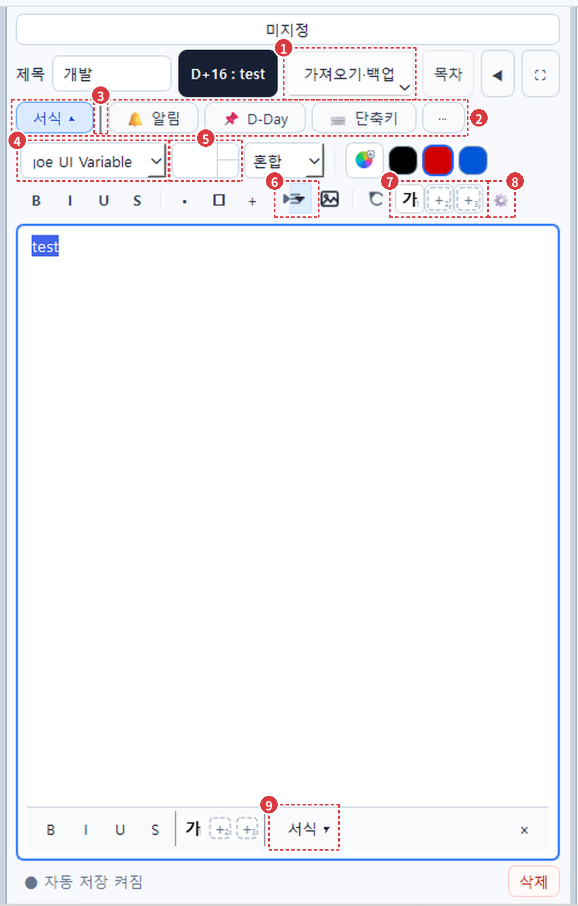
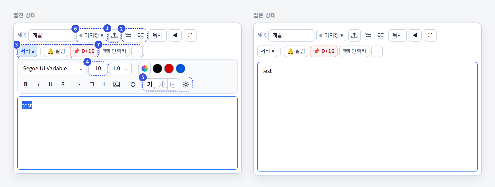
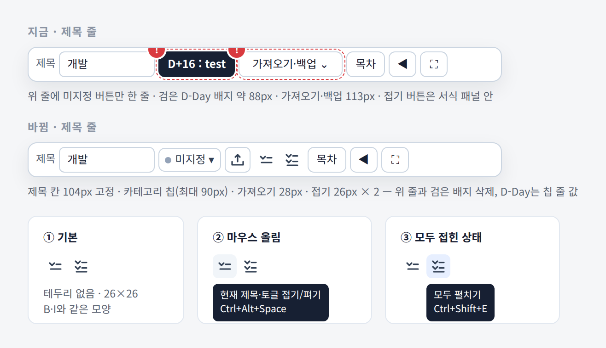
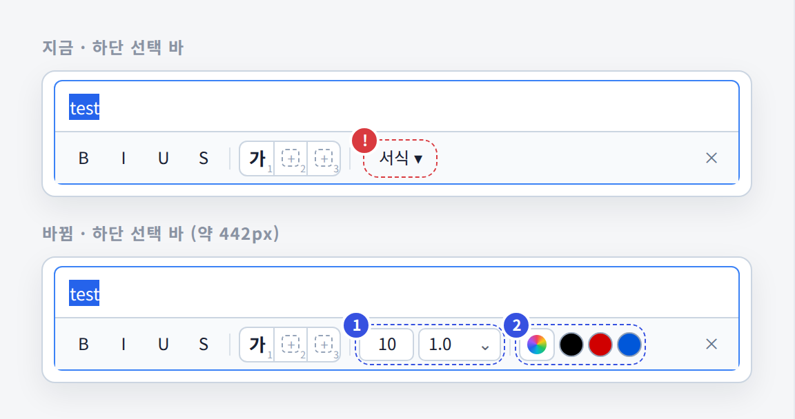
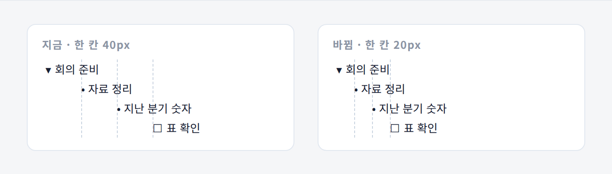
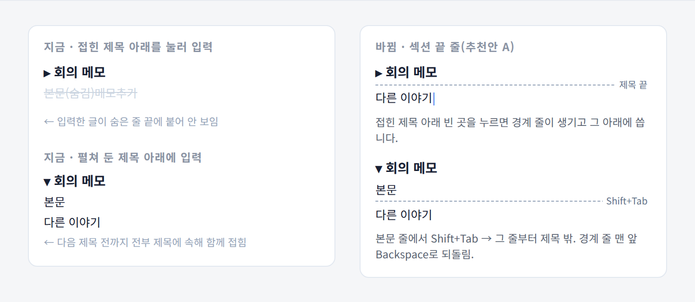

`● TOMADESK · 편집기 머리 영역 2차 수정 계획`

# 편집기 머리 영역 2차 수정 계획
### 실제 창에서 드러난 결함을 고치고, 접기 버튼·가져오기·하단 바·들여쓰기·제목 밖 쓰기를 함께 정리한다

1차 구현([9._서식프리셋_토글_구현계획](../9._서식프리셋_토글_구현계획/서식프리셋_토글_구현계획.md))으로 **서식 토글은 칩 줄로, 서식 1~3은 샘플 버튼으로** 옮겨졌습니다. 그런데 Windows 실제 창에서는 **크기 칸이 비어 보이고**, 글꼴 이름이 잘리고, 구분선·아이콘이 설계와 다르게 보였습니다. 이 문서는 1차 검증에서 나온 결함 13건과 추가 요청 6건(R1~R6)을 **한 순서로** 합쳐 정리합니다. 줄 번호는 2026-09-16에 받은 코드 기준입니다. 저장 형식은 R6(제목 끝 표시)만 추가하고 나머지는 바꾸지 않습니다.

| 대상 | 근거 | 스택 | 작성일 |
|---|---|---|---|
| 메모 편집기 › 제목 줄 · 칩 줄 · 서식 패널 · 하단 선택 바 · 본문 | 실제 창 캡처 · 코드 확인 · 오프스크린 재현(토글/제목 입력) | Python · PyQt6 | 2026-09-16 |

**목차** — [00 확정한 것과 추가 요청](#00--확정한-것과-추가-요청) · [01 실제 창 진단](#01--실제-창-진단) · [02 목표 화면](#02--목표-화면) · [03 단계별 구현](#03--단계별-구현) · [04 테스트](#04--테스트) · [05 보존·제외](#05--보존제외) · [06 결정할 것](#06--결정할-것)

---

## 00 — 확정한 것과 추가 요청

**1차에서 확정·구현된 것 (유지)**

| # | 항목 | 상태 |
|---|---|---|
| Q1 | 서식 1~3 샘플 버튼 | 구현됨 · 모양 결함 있음(01의 ⑦⑧) |
| Q2 | 서식 토글 칩 줄 맨 왼쪽 | 구현됨 · 칩 여백·구분선 결함(②③) |
| Q3 | 선택 서식 창에 서식 1~3 | 구현됨 → **R1로 구성 변경** |
| Q4 | 빈 칸 클릭 시 저장 메뉴 | 구현됨 · 선택 창에서 눌림 상태 남음 |
| Q5 | 자리 없으면 하단 고정 줄 | 구현됨 |

**이번 추가 요청**

| # | 요청 | 이 문서의 단계 |
|---|---|---|
| R1 | 하단 바 `서식 ▾` 삭제, 크기·줄 간격·색 선택·색 견본 3개 추가 | 단계 D |
| R2 | 들여쓰기 한 칸 간격을 절반으로 | 단계 E |
| R3 | 접기 버튼을 **현재 제목·토글 접기** / **모두 접기·펼치기** 두 개로 분리, 누르면 바로 동작, 샘플 버튼 크기·B/I 버튼 모양, 위치는 `가져오기·백업` 오른쪽 | 단계 A |
| R4 | `가져오기·백업`을 작은 아이콘으로 | 단계 A |
| R5 | 칩 줄 버튼 좌우 빈 공간 제거 | 단계 B |
| R6 | 제목 토글 밖에서도 글을 쓸 수 있게 | 단계 F |
| R7 | 제목 칸 104px 고정(늘리지 않음) | 단계 A |

**이번에 확정한 배치 (2026-09-16)**

| # | 항목 | 확정안 |
|---|---|---|
| Q9 | 카테고리·D-Day 배치 | **A.** 카테고리는 제목 칸 바로 옆 `● 이름 ▾` 칩(최대 90px, 말줄임). 위쪽 `미지정` 한 줄과 검은 D-Day 배지는 삭제. D-Day는 칩 줄 `📌 D-Day` 칩에 값으로 표시 |
| Q10 | D-Day 칩 글자 | **A.** `📌 D+16`만 표시, 기한 이름은 툴팁. 좁은 폭에서도 값 유지 |

---

## 01 — 실제 창 진단

사용자가 보낸 Windows 실제 창(폭 약 512px, 서식 펼침)에 번호를 붙였습니다.

1. **`가져오기·백업`이 113px** — 제목 칸이 약 104px로 줄었습니다. `editor.py` 211–231행 `QToolButton` 텍스트 버튼(R4).
2. **칩 좌우 여백이 큼** — `ui_theme.py` 546–548행 `#memoEditorPane QToolButton { padding: 4px 9px; }`와 `note_property_bar.py` 20–25행 `padding:0 8px`이 겹쳐, `🔔 알림` 한 칩이 약 79px입니다(R5).
3. **서식 칩 뒤 구분선이 굵고 진함** — `note_property_bar.py` 40–46행 `memoChipSeparator`에 테마 규칙이 없어 기본 `VLine` 그림자가 그대로 나옵니다.
4. **글꼴 이름 앞이 잘림** — `Segoe UI Variable` → `joe UI Variable`. 130px 편집 칸에서 커서가 끝에 있어 앞부분이 밀립니다. 화살표 옆에 진한 세로·아래선도 생깁니다(콤보 `::drop-down` 테두리).
5. **크기 칸이 비어 보임** — 폭 60px에서 테마 `padding-right:23px`(642행) + 좌우 7px + 위아래 화살표를 빼면 숫자 칸이 약 8px입니다. `10`에는 17px이 필요합니다.
6. **접기 버튼이 뜻을 알 수 없음** — 아이콘과 `▾`가 겹치고, 누르면 메뉴를 거쳐야 할 때가 있습니다. `text_format_toolbar.py` 152–165행 `MenuButtonPopup`(R3).
7. **샘플 버튼이 한 묶음으로 안 보임** — 버튼마다 테두리가 따로 있고 번호 `1`이 `가`에 붙습니다. `⟲` 뒤 구분선도 없습니다. 흰색 계열 서식은 테두리만 보이고 `가`가 안 보입니다(1차 검증).
8. **`⚙`가 컬러 이모지** — 옅은 보라색이라 꺼진 버튼처럼 보입니다. `QToolButton.setText("⚙")`(191행).
9. **하단 바 `서식 ▾`** — 누르면 위쪽 서식 패널이 열릴 뿐이라, 하단 바에서 바로 크기·색을 바꿀 수 없습니다(R1).

**그림에 없는 결함 (1차 검증에서 확인)**

| # | 결함 | 위치 |
|---|---|---|
| V1 | 선택 창에서 빈 칸을 누르면 눌림 상태가 남음 | `text_format_range_bar.py` 112–119행 `_apply_preset()`이 체크를 되돌리지 않음 |
| V2 | 앱 확대(Ctrl+휠) 125%·150%에서 서식 둘째 줄이 넘침(523·616px > 491px) | 버튼은 고정 크기인데 테마 여백만 `scaled_stylesheet()`로 커짐 |
| V3 | `⚙` 하위 메뉴 이름이 이름을 바꿔도 `서식 1` 그대로 | `text_format_toolbar.py` 197–199행, 메뉴를 한 번만 만듦 |
| V4 | 사용성 스크립트가 삭제된 `shortcut_settings_button`을 씀 | `8._메모편집_보완계획/test/memo_usability_test.py` 210행 |

**R6 재현 결과 (오프스크린에서 키·클릭 입력)**

| 시나리오 | 결과 |
|---|---|
| 토글 안 빈 줄에서 Enter | 들여쓰기 0으로 **밖으로 나옴** — 정상 |
| 접힌 토글 아래 빈 곳 클릭 | 밖에 새 줄 생성 — 정상(`_place_caret_outside_toggles()`) |
| **접힌 제목 아래 빈 곳 클릭 후 입력** | 숨은 본문 끝에 글이 붙어 **입력한 글이 보이지 않음** |
| **접힌 제목에서 Ctrl+End 후 Enter·입력** | 숨은 줄에 입력됨 |
| **펼친 제목 아래에 계속 입력 후 접기** | 다음 제목 전까지 전부 제목에 속해 **함께 접힘** — 제목 밖으로 나갈 방법이 없음 |

원인은 두 가지입니다. `rich_memo_edit.py` 4118행 `_place_caret_outside_toggles()`가 **들여쓴 줄·토글만** 보고 제목 구간은 보지 않습니다. 또 1708행 `_refresh_toggle_visibility()`의 제목 구간이 "**다음 같은·상위 제목까지**"로만 정의되어, 끝을 표시할 수단이 없습니다.

---

## 02 — 목표 화면

폭 515px 기준 목표 화면. 파란 번호는 바뀐 지점입니다. 위쪽 `미지정` 줄이 없어져 본문이 약 36px 길어집니다.

1. **가져오기·백업** — 28px 아이콘, 누르면 기존 메뉴(R4)
2. **접기 버튼 2개** — 26px, 테두리 없음, 누르면 바로 동작(R3)
3. **칩 줄** — 좌우 여백 6px, 연한 1px 구분선(R5)
4. **크기 칸** — 화살표를 없앤 44px 숫자 칸, 휠·↑↓키로 조절(결정 Q6)
5. **샘플 묶음** — 테두리를 공유한 한 묶음, 흰색 서식은 글자에 회색 외곽선, `⚙`는 단색 아이콘
6. **카테고리 칩** — 제목 칸(104px 고정) 바로 옆 `● 미지정 ▾`. 위쪽 한 줄 삭제(Q9)
7. **D-Day 칩 값** — `📌 D+16`, 3일 이내·지난 기한은 빨간색. 검은 배지 삭제(Q9·Q10)

| 줄 | 지금(실제 창) | 목표 | 사용 가능 폭 |
|---|---|---|---|
| 위치 줄 | `미지정` 버튼 한 줄(약 36px) | **상위 메모에서는 줄 없음** · 하위 메모만 `개발 › 새 메모` | — |
| 제목 줄 | 제목 칸 약 104px(늘어남) + 검은 배지 약 88px | **제목 칸 104px 고정** + 카테고리 칩 ≤ 90px + 아이콘을 빈틈 없이 붙임, 약 410px | 약 499px |
| 칩 줄 | 칩 합계 약 400px | 약 300px(D-Day 칩 값 포함) | 약 499px |
| 서식 첫 줄 | 약 395px(크기·글꼴 잘림) | 약 386px(글꼴 150 · 크기 44 · 줄 간격 50) | 약 491px |
| 서식 둘째 줄 | 약 426px | 약 390px(접기 36px 빠짐) | 약 491px |
| 하단 선택 바 | 약 333px | 약 442px | 약 477px |

> **머리 영역이 1줄 줄고(접힘: 제목 줄 + 칩 줄)**, 제목 칸은 104px로 고정하고, 칩 줄은 약 110px 짧아지고, 하단 바에서 크기·줄 간격·색을 바로 바꿀 수 있습니다.

---

## 03 — 단계별 구현

단계마다 **해당 테스트 + 전체 회귀 + 실제 창 캡처 1장**을 통과해야 다음으로 넘어갑니다. A·B·C는 화면 배치, D는 하단 바, E·F는 본문 동작이라 E·F는 A~D와 병렬로 진행해도 됩니다.

### 단계 A — 제목 줄: 카테고리 칩 · 가져오기 아이콘 · 접기 버튼 분리 · D-Day 값 `R3 · R4 · R7 · Q9 · Q10`

지금과 바뀐 제목 줄(제목 칸 104px 고정, 카테고리 칩, 검은 배지 삭제), 접기 버튼의 기본·마우스 올림·모두 접힌 상태입니다.

| 파일 · 위치 | 변경 |
|---|---|
| `alert_notes/editor.py` 211–231행 `import_backup_button` | 글자 제거 → `setIcon(_import_backup_icon())`(상자 + 위 화살표, 18px), `setFixedSize(28, 28)`, 툴팁·접근성 이름 `가져오기·백업`. `InstantPopup`과 메뉴 항목은 그대로 |
| `ui_theme.py` | `QToolButton#compactUtilityButton::menu-indicator { image:none; width:0; }` 추가(아이콘 버튼에 ▾ 안 붙게) |
| `editor.py` 231행 바로 뒤 | 새 버튼 `self.fold_current_button`, `self.fold_all_button` 추가. `QToolButton`, objectName `titleFoldButton`, `setFixedSize(26, 26)`, `setAutoRaise(True)`, `setFocusPolicy(Qt.NoFocus)` — 누른 뒤에도 본문 커서 유지 |
| 같은 곳 · 동작 | `fold_current_button.clicked` → `content_edit.toggle_current_fold()` 결과가 `False`면 `_fold_nearest_parent()`(결정 Q8). `fold_all_button.clicked` → `content_edit.toggle_all_folds()`. **메뉴 없음, 누르면 바로 동작** |
| 같은 곳 · 상태 | `content_edit.cursorPositionChanged`·`textChanged`에서 `_sync_fold_buttons()` — 문서에 제목·토글이 없으면 두 버튼 비활성, 모두 접혀 있으면 `fold_all_button` 체크 표시 + 툴팁 `모두 펼치기` |
| 같은 곳 · 툴팁 | `현재 제목·토글 접기/펴기 (Ctrl+Alt+Space)` · `모두 접기/펼치기 (Ctrl+Shift+E)` — `STRUCTURE_SHORTCUTS` 값을 읽어 표시 |
| `editor.py` 182행 `title_row.addWidget(self.title_edit, 1)` | `title_edit.setFixedWidth(104)`, 늘어남 인자 제거 |
| `editor.py` 167–175행 `category_button` | 위치 줄(`location_row`)에서 빼서 **제목 칸 바로 뒤**에 넣음. objectName `memoCategoryChip` 유지, `setMaximumWidth(90)`, `QSizePolicy.Maximum`. 글자는 `fontMetrics().elidedText(...)`로 말줄임, 전체 이름은 툴팁 |
| `editor.py` 829–834행 `_refresh_category_button()` | 글자 `● 이름 ▾`, 점 색은 카테고리 색(미지정 `#94a3b8`) — 16px 원 아이콘을 `setIcon()`으로 그림 |
| `editor.py` 제목 줄 끝(`⛶` 뒤) | `title_row.addStretch(1)` — 카테고리 칩 바로 뒤에 가져오기·접기·목차·◀·⛶가 **빈틈 없이** 이어지고, 남는 폭은 줄 맨 오른쪽에만 생김 |
| `editor.py` 155–176행 `location_host` | 위치 표시(`breadcrumb`)만 남김. `breadcrumb`가 숨겨지면 `location_host.hide()`(상위 메모는 줄 없음), 하위 메모면 표시 |
| `editor.py` 183–187행 `deadline_badge` | 제목 줄에서 제거. 위젯은 레이아웃 밖에 숨긴 채 텍스트 계산용으로만 유지(기존 테스트 호환) |
| `editor.py` 1445행 `_refresh_property_chips()` D-Day 칩 | 값이 있으면 `📌 D+16`처럼 **남은 날만**(기한 이름 제외), 툴팁은 `deadline_badge_text()` 전체. 칩 속성 `deadlineState = soon`(3일 이내) · `past`(지남) · `normal` |
| `note_property_bar.py` `set_narrow()` | `deadline` 칩도 `format`처럼 좁은 폭에서 요약값 유지 |
| `ui_theme.py` | `QToolButton#memoPropertyChip[deadlineState="soon"], [deadlineState="past"] { color:#b91c1c; border-color:#fca5a5; background:#fff5f5; font-weight:600; }` |
| 새 함수 `_fold_icon_current()` · `_fold_icon_all()` | `text_format_toolbar.py` 582행 `_fold_icon()` 자리를 대체. 꺾쇠 1개+가로줄 / 꺾쇠 2개+가로줄 2개, 선 색 `#334155` |
| `text_format_toolbar.py` 152–165행 `fold_button` | **삭제**. `_sync_character_range_mode()`(228행) 목록에서도 제거 |
| `ui_theme.py` | `QToolButton#titleFoldButton` — `formatToggleButton`과 같게: 테두리 0, 배경 투명, `:hover #f1f5f9`, `:checked #e7efff / @blue-dark`, `min/max 26px`, `padding 0` |

**완료 기준**
- 제목 줄 순서: `제목 칸(104)` · `● 카테고리 ▾` · `⇪` · `현재 접기` · `모두 접기` · `목차` · `◀` · `⛶`
- 상위 메모에서 제목 줄 위에 줄이 없음, 하위 메모에서는 위치 표시 한 줄만
- 카테고리 이름 `프로젝트 정기 회의 자료`도 90px 안에서 말줄임, 누르면 기존 카테고리 메뉴
- D-Day 설정 시 칩 글자 `📌 D+16`, 제목 줄에 검은 배지 없음, 기한 3일 이내·지남은 빨간색
- 515px·좁은 폭(760px 미만) 모두 D-Day 칩에 값 표시
- 제목 칸 폭이 창 폭과 상관없이 **104px**(515·620·780px 모두), 제목 줄 버튼 잘림 0
- 제목·토글 줄에서 `현재 접기` 한 번 클릭 → 즉시 접힘, 본문에 포커스 유지(`content_edit.hasFocus()`)
- `모두 접기` 한 번 → 모든 제목·토글 접힘, 다시 한 번 → 모두 펼침

### 단계 B — 칩 줄 여백·구분선 `R5`

| 파일 · 위치 | 변경 |
|---|---|
| `alert_notes/note_property_bar.py` 20–25행 스타일 | 칩 버튼에 objectName `memoPropertyChip` 부여, 스타일은 `ui_theme.py`로 옮김 |
| `ui_theme.py` (546행 규칙보다 뒤) | `#memoEditorPane QToolButton#memoPropertyChip { padding: 0 6px; min-width: 0; min-height: 26px; max-height: 26px; }` — 선택자 구체도가 높아 546행 `padding 4px 9px`을 이김 |
| `note_property_bar.py` `LABELS` | 이모지와 글자 사이 공백을 **좁은 공백(U+2009)** 으로: `🔔 알림` 등 |
| `note_property_bar.py` `⋯` 칩 | `setFixedWidth(26)` |
| `ui_theme.py` | `QFrame#memoChipSeparator { border:0; background:#dbe2ea; min-width:1px; max-width:1px; margin:6px 3px; }` |

**완료 기준**
- 칩 줄 전체 `sizeHint().width()` ≤ 300px(100%)
- 칩 안 글자·이모지 잘림 0, 높이 28px 유지
- 구분선 픽셀 색이 `#dbe2ea` 근처(진한 검정 아님)

### 단계 C — 서식 패널 결함 수정 `④ ⑤ ⑦ ⑧ · V2 · V3`

| 파일 · 위치 | 변경 |
|---|---|
| `text_format_toolbar.py` 70–75행 `size_box` | `setButtonSymbols(QAbstractSpinBox.ButtonSymbols.NoButtons)`, `setFixedWidth(44)`, 가운데 정렬. 휠·↑↓키 조절은 Qt 기본 동작으로 유지(결정 Q6) |
| `ui_theme.py` 642행 | `#memoEditorPane QSpinBox#formatSizeBox { padding: 0 4px; }` 추가(화살표 여백 23px 제거) |
| 65–69행 `font_box` | 폭 130 → **150**. `currentFontChanged` 뒤 `lineEdit().setCursorPosition(0)` — 긴 이름은 앞부터 보이게. 툴팁에 전체 이름 |
| `ui_theme.py` 콤보 규칙 | `#memoEditorPane QComboBox::drop-down { border:0; width:18px; }` — 화살표 옆 진한 선 제거 |
| 76–79행 `line_spacing_box` | 72 → **50**. `::drop-down` 폭 14px, 좌우 여백 4px — `1.0`과 화살표 사이 빈 곳 제거(`1.15`까지 잘림 없이) |
| `format_preset_strip.py` 67–90행 `PresetStrip` | 버튼 사이 간격 0 유지 + 묶음 바깥에만 1px 테두리·7px 둥근 모서리(`QWidget#formatPresetStrip`), 버튼 사이는 왼쪽 1px 선. 버튼 자체 테두리 제거 |
| `format_preset_strip.py` 16–60행 아이콘 | 흰색 계열(`_is_light`)이면 **글자 외곽선**: `QPainterPath.addText()` → `#94a3b8` 1.2px `strokePath` 후 채움. 사각 테두리 그리기 삭제. 번호는 오른쪽 아래 1px 더 바깥으로 |
| 190–195행 `preset_settings_button` | 텍스트 `⚙` → `setIcon(_gear_icon())` 단색 `#475569` 18px |
| 185행 앞 | `second.addWidget(self._group_separator())` — `⟲`와 샘플 묶음 사이 |
| 197–199행 `⚙` 메뉴 | `aboutToShow`에서 하위 메뉴 제목을 `load_preset_name() or 서식 N`으로 갱신(V3) |
| `ui_theme.py` `scaled_stylesheet()` 대상 | 도구 줄 버튼의 `min-width/min-height` 규칙을 `setFixedSize()`와 같은 값으로 두지 않고 **삭제**하고, 크기는 코드의 `TOOL_BUTTON_WIDTH × ui_scale`로 한 곳에서 계산(V2). `TextFormatToolbar.set_ui_scale(scale)` 추가, `main_window.py` 1980행 `_set_ui_scale()`에서 호출 |

**완료 기준**
- 줄 간격 칸에 `1.15`·`혼합`이 잘리지 않고, 글자와 화살표 사이 빈 곳이 6px 이하
- 크기 칸에 `8`·`10`·`72`가 모두 잘리지 않음(`lineEdit().width() ≥ horizontalAdvance("72") + 4`)
- 글꼴 `Segoe UI Variable`·`Malgun Gothic` 선택 시 첫 글자부터 보임
- 흰색 `#ffffff` 서식 아이콘에 외곽선 픽셀이 `가` 글자 영역 안에 존재
- 앱 확대 100·125·150%, 폭 515px에서 서식 두 줄 `sizeHint` ≤ 가용 폭

### 단계 D — 하단 선택 바 재구성 `R1 · V1`

`서식 ▾`를 없애고 크기·줄 간격·색을 바로 둡니다. 515px 편집기의 하단 바(약 477px) 안에 들어갑니다.

| 파일 · 위치 | 변경 |
|---|---|
| `alert_notes/text_format_range_bar.py` 53–59행 `more_button` | **삭제**. `bind()`의 `open_more` 인자는 호환용으로 받되 쓰지 않음 |
| 같은 파일 `__init__` 샘플 묶음 뒤 | 구분선 → `self.size_box`(`QSpinBox`, NoButtons, 40px) → `self.line_spacing_box`(`QComboBox`, 60px, 항목은 툴바와 같음) → 구분선 → `self.color_button`(26px, 툴바와 같은 팔레트 메뉴) → 견본 3개(18px) |
| 같은 파일 `bind()` | 값 변경은 **툴바 메서드를 그대로 호출**: `size_box.valueChanged → toolbar.apply_size`, `line_spacing_box.activated → toolbar._apply_line_spacing_index`, 견본 → `toolbar.apply_color`, 색 버튼 → `toolbar.color_menu.popup(...)` |
| 같은 파일 · 동기화 | `TextFormatToolbar`에 `format_synced = pyqtSignal(dict)` 추가(`_sync_from_format()` 끝에서 크기·줄 간격·색 전달). 선택 바는 `blockSignals`로 값만 맞춤 |
| 같은 파일 · 글자 범위 선택 모드 | `toolbar._sync_character_range_mode()`와 같게 줄 간격 칸 비활성 |
| 112–119행 `_apply_preset()` | 빈 슬롯이면 메뉴를 열기 전에 `preset_strip.set_active(toolbar._active_preset_slot)`(V1) |
| 133–149행 `_style()` | 떠 있는 어두운 창: 숫자·콤보 칸은 흰 바탕 유지, 견본 테두리 `#e2e8f0`, 구분선 `#3b475c`. 고정 줄: 구분선 `#dbe2ea`. `textFormatRangeSeparator` 규칙 추가 |
| `editor.py` 1382행 `set_format_toolbar(...)` | 두 번째 인자 제거 가능(호환 유지 시 `None`) |

**완료 기준**
- 선택 바에 `서식 ▾` 없음, 크기·줄 간격·색 선택·견본 3개 표시
- 515px 편집기에서 `×`까지 잘림 0
- 선택 바에서 크기 14로 바꾸면 선택 글자 14pt, 위쪽 서식 패널 크기 칸도 14
- 위쪽 패널에서 빨강을 누르면 선택 바 빨강 견본도 선택 표시
- 빈 슬롯 클릭 후 모든 샘플 체크 해제 상태

### 단계 E — 들여쓰기 절반 `R2`

Tab 한 번의 들여쓰기를 40px에서 20px로 줄입니다. 토글·목록·체크리스트 모두 같은 폭을 씁니다.

| 파일 · 위치 | 변경 |
|---|---|
| `alert_notes/rich_memo_edit.py` `RichMemoTextEdit.__init__` (133행 이후) | `INDENT_WIDTH = 20` 상수, `self.document().setIndentWidth(INDENT_WIDTH)`. 지금은 설정이 없어 Qt 기본값 40px |
| 같은 파일 · 문서 교체 지점 | `setDocument()`·`set_note()` 등 새 문서를 붙이는 곳마다 같은 값 적용(`_watched_document` 갱신부) |
| `postit.py` · `standalone_editor.py` | 같은 `RichMemoTextEdit`를 쓰므로 자동 반영 — 캡처로만 확인 |
| 저장 데이터 | 변경 없음. HTML에는 `-qt-block-indent:N`(칸 수)만 저장되어 기존 메모도 새 폭으로 보임 |

**완료 기준**
- `document().indentWidth() == 20`
- 들여쓰기 1칸 줄의 글자 x좌표가 0칸 줄보다 20px(±1) 오른쪽
- 토글 접기·펼치기, 블록 끌어 옮기기, 체크박스 클릭 위치가 들여쓰기 1~3칸에서 정상(기존 `test_memo_toggle.py`·`test_memo_drag_stage6.py` 통과)

### 단계 F — 제목 밖에서 쓰기 `R6`

왼쪽은 지금 동작, 오른쪽은 추천안 A(제목 끝 줄)입니다.

**F-1 숨은 줄에 입력되는 버그 (결정과 무관하게 먼저)**

| 파일 · 위치 | 변경 |
|---|---|
| `rich_memo_edit.py` 4118행 `_place_caret_outside_toggles()` | 조건에 "**마지막 보이는 줄 이후가 접힌 제목 구간**"을 추가. 해당하면 문서 끝에 새 줄을 만들고 F-2의 제목 끝 표시를 붙임 |
| 새 함수 `_ensure_caret_visible_block()` | `cursorPositionChanged`에서 커서 블록이 `isVisible() == False`면 가장 가까운 위쪽 보이는 줄(접힌 제목·토글 줄) 끝으로 옮김. Ctrl+End·↓·PageDown 모두 해당 |

**F-2 제목 구간의 끝 표시 (추천안 A)**

| 파일 · 위치 | 변경 |
|---|---|
| `alert_notes/block_identity.py` | 제목 접힘 목록(`heading_folded_ids`)과 같은 방식으로 `section_break_ids` 목록을 HTML `<meta>`에 저장·복원. DECISIONS.md의 "블록 속성은 toHtml 왕복에서 사라짐" 결정에 맞춤 |
| `rich_memo_edit.py` 1708행 `_refresh_toggle_visibility()` | `folded_heading`을 끝내는 조건에 "**제목 끝 표시가 있는 줄**" 추가. 접기 판정(`fold_heading()` 1614행, `enter_current_fold()` 1649행)도 같은 경계 사용 |
| 같은 파일 3790–3795행 Shift+Tab | 들여쓰기 0이고 제목 구간 안에 있는 줄이면 **그 줄에 제목 끝 표시**(들여쓰기가 1 이상이면 기존대로 내어쓰기) |
| 같은 파일 Backspace 처리 | 제목 끝 표시가 있는 줄의 맨 앞에서 Backspace → 표시만 제거(글자 병합 전 1회) |
| 같은 파일 `paintEvent` 계열 | 표시 줄 위에 `#cbd5e1` 1px 점선, 마우스를 올리면 툴팁 `여기서 제목 구간이 끝납니다 · Backspace로 되돌리기` |
| `memo_clipboard.py` · `memo_archive.py` · `structured_import.py` | 복사·백업은 표시 유지. Markdown 내보내기에서는 빈 줄 하나로 변환(표시 정보 없음) |

**완료 기준**
- 접힌 제목 아래 빈 곳 클릭 → 입력한 글이 **보이는 새 줄**에 들어감
- Ctrl+End로 숨은 줄에 커서가 머무는 경우 0
- 본문 줄에서 Shift+Tab → 제목을 접어도 그 줄부터는 보임, 저장 후 다시 열어도 유지
- 제목 끝 줄 맨 앞 Backspace → 다시 제목 구간에 포함
- 기존 메모(표시 없음)의 접기 결과는 지금과 같음

### 단계 G — 문서·테스트 정리 `V4`

| 파일 | 변경 |
|---|---|
| `8._메모편집_보완계획/test/memo_usability_test.py` 181–233행 | `shortcut_settings_button` → `format_toolbar.preset_settings_menu`의 `편집 단축키 설정…` 액션, `fold_button` → `editor.fold_current_button` |
| `user_manual_content.py` 152–157·170–190행 | 제목 줄 아이콘 2개·가져오기 아이콘, 하단 바 구성, Shift+Tab 제목 끝 설명 추가. 설명서 그림 다시 캡처 |
| `3._TODO.md` | 실제 창 확인 항목을 이 문서의 체크리스트로 교체 |

---

## 04 — 테스트

### 고쳐야 하는 기존 테스트

| 파일 | 지금 검사 | 바꿀 내용 |
|---|---|---|
| `test_format_toolbar_compact.py` | `fold_button` 36×28, 크기 칸 60px | `fold_button` 없음 · `editor.fold_current_button`/`fold_all_button` 26×26 · 크기 칸 44px |
| `test_alert_notes.py` 327–331행 | `기본값` 바로 다음 칸이 샘플 묶음 | `⟲` 다음 칸은 구분선, 그다음 샘플 묶음 · `⚙` |
| `test_text_format_range_presets.py` | 샘플 동기·빈 슬롯 메뉴 | 유지 + 빈 슬롯 클릭 후 체크 해제 검사 추가(V1) |
| `test_memo_remediation_ui_c1.py` | 칩 순서·서랍 배타·Esc | 변경 없이 통과해야 함(칩 objectName만 바뀜) |

### 새 테스트

| 파일 | 시나리오 | 확인 |
|---|---|---|
| `test_title_row_fold_buttons.py` | 제목·토글 3개 문서에서 두 버튼 클릭 | 즉시 접힘·펼침, 메뉴 호출 0회, 본문 포커스 유지, 제목 없는 문서에서 비활성 |
| 같은 파일 | 515·620·780px 제목 줄 | 제목 칸 = 104px, 카테고리 칩 ≤ 90px, 잘림 0 |
| `test_category_dday_layout.py` | 상위·하위 메모 전환 | 상위: `location_host` 숨김 · 하위: 위치 표시만 |
| 같은 파일 | D-Day 없음·D+16·D-2·지난 기한 | 칩 글자 `📌 D-Day`/`📌 D+16`, `deadlineState` 값, `deadline_badge` 레이아웃 밖 |
| 같은 파일 | 긴 카테고리 이름 | 칩 폭 ≤ 90px, 툴팁에 전체 이름, 클릭 시 메뉴 |
| `test_range_bar_format_controls.py` | 선택 바에서 크기·줄 간격·색 변경 | 선택 글자 서식 적용, 위쪽 패널 값 동기, 반대 방향 동기 |
| 같은 파일 | 빈 슬롯 클릭 | 체크 해제 상태 유지(V1) |
| `test_indent_width.py` | 들여쓰기 0·1·2칸 줄 | x좌표 차이 20px, 토글 클릭 영역 정상 |
| `test_heading_section_break.py` | 접힌 제목 아래 클릭·Ctrl+End·Shift+Tab·Backspace·저장 후 재열기 | F-1·F-2 완료 기준 전부 |
| `test_editor_zoom_layout.py` | 앱 확대 100·125·150% × 폭 515·620·780 | 제목 줄·칩 줄·서식 두 줄·하단 바 `sizeHint` ≤ 가용 폭, 크기 칸 숫자 잘림 0 |
| `test_theme_render_contract.py` | 테마 적용 후 `grab()` | 칩 구분선·콤보 화살표 옆 픽셀이 `#1f2937`보다 밝음, `⚙` 아이콘 비어 있지 않음 |

> **1차 검증에서 테스트는 통과했지만 실제 창에서 깨진 원인은 "위젯 폭만 검사하고 테마를 입히지 않은 것"이었습니다.** 새 배치 테스트는 모두 `scaled_stylesheet()`를 적용한 상태에서 실행합니다.

### 실제 창 체크리스트 (Windows, 앱 확대 100·125·150%)

- [ ] 크기 칸에 `10`이 보이고, 휠로 11·12로 바뀜
- [ ] 글꼴 칸이 `Segoe UI Variable` 첫 글자부터 보임, 화살표 옆 진한 선 없음
- [ ] 제목 줄 `현재 접기`·`모두 접기`가 한 번 클릭으로 바로 동작
- [ ] 가져오기 아이콘을 누르면 기존 메뉴 그대로
- [ ] 상위 메모에서 `미지정` 줄이 사라지고 카테고리가 제목 옆에 보임, 창을 넓혀도 제목 칸 104px
- [ ] D-Day 칩에 `📌 D+N`이 보이고 마우스를 올리면 기한 이름이 보임
- [ ] 칩 줄 구분선이 연한 회색, 칩 좌우 빈 공간이 좁음
- [ ] 흰색으로 저장한 서식 `가`가 보임, `⚙`가 회색 단색
- [ ] 하단 바에서 크기·줄 간격·색 변경이 바로 적용
- [ ] Tab 한 번 들여쓰기가 이전의 절반
- [ ] 접힌 제목 아래 클릭 후 입력한 글이 보임, Shift+Tab 제목 끝 줄이 저장 후에도 유지

---

## 05 — 보존·제외

**보존**
- 서식 1~3 저장 형식, 이름 12자 제한, `PRESET_COUNT = 4`
- 가져오기·백업 메뉴 항목과 동작, 접기 단축키(`Ctrl+Alt+Space`, `Ctrl+Shift+E`)
- 카테고리 메뉴 동작(`_show_category_menu`), D-Day 계산(`deadline_badge_text`)
- 기존 메모의 들여쓰기 칸 수(표시 폭만 바뀜), 표시 없는 기존 제목의 접기 범위
- classic 배치

**제외**
- `목차`·`◀`·`⛶`의 아이콘화(요청 범위 밖, 필요하면 다음 단계)
- 들여쓰기 폭을 사용자 설정으로 바꾸는 기능
- 어두운 테마

---

## 06 — 결정할 것

| # | 질문 | 선택지 |
|---|---|---|
| Q6 | 크기 칸 | **A. 화살표 없앤 44px 숫자 칸 (추천)** — 휠·↑↓키로 조절, 하단 바에도 같은 모양으로 들어감   B. 화살표 유지 76px — 서식 첫 줄은 들어가지만 하단 바가 약 478px로 515px 창에서 넘칠 수 있음 |
| Q7 | 제목 밖으로 나가는 방식(R6) | **A. 제목 끝 줄 (추천)** — Shift+Tab·접힌 제목 아래 클릭으로 경계 표시. 기존 메모 접기 결과는 그대로   B. 들여쓰기 기준 — 제목 아래 **들여쓴 줄만** 접힘(토글과 같음). 단순하지만 기존 메모·Markdown 가져오기의 접기 범위가 전부 달라짐   C. 접힌 제목 아래 클릭만 개선 — 버그는 사라지지만 펼친 제목 아래 글은 여전히 함께 접힘 |
| Q8 | 제목·토글이 아닌 줄에서 `현재 접기`를 누르면 | **A. 커서를 품은 가장 가까운 제목·토글을 접음 (추천)** — 본문을 쓰다가 바로 접을 수 있음   B. 버튼 비활성 — 제목·토글 줄에 커서가 있을 때만 동작 |

> Q9(카테고리·D-Day 배치)·Q10(D-Day 칩 글자)은 추천안 A로 **확정**했고, 02·03 그림에 반영했습니다.

Q6~Q8도 추천안(A)으로 진행할까요? 다른 선택이 있는 항목만 알려 주시면 반영해서 **단계 A(제목 줄)** 부터 시작하겠습니다.
