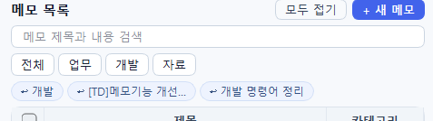
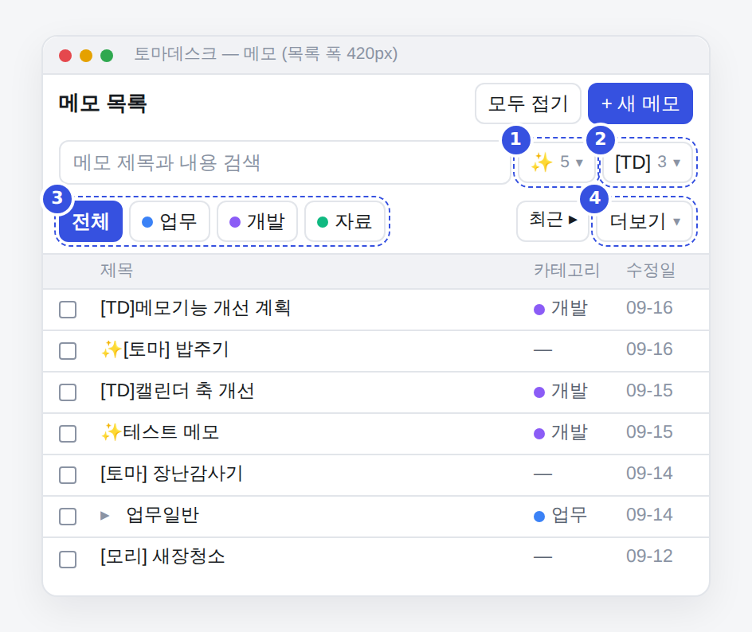
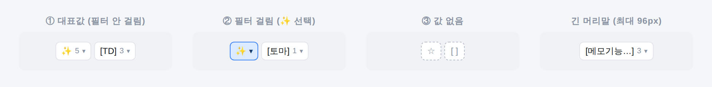
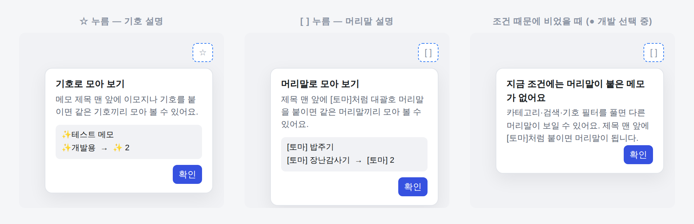
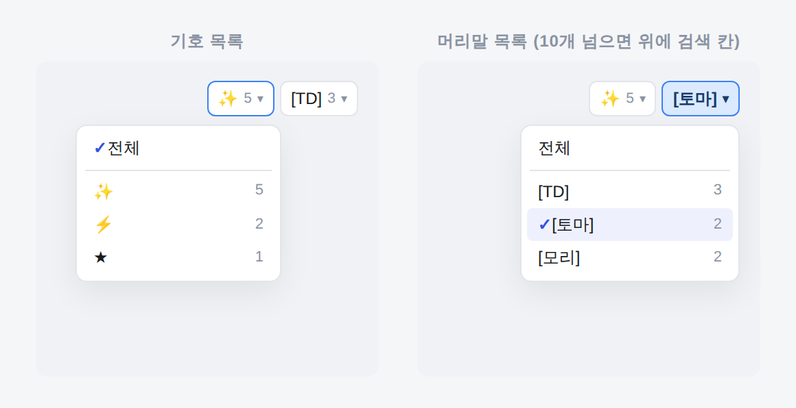
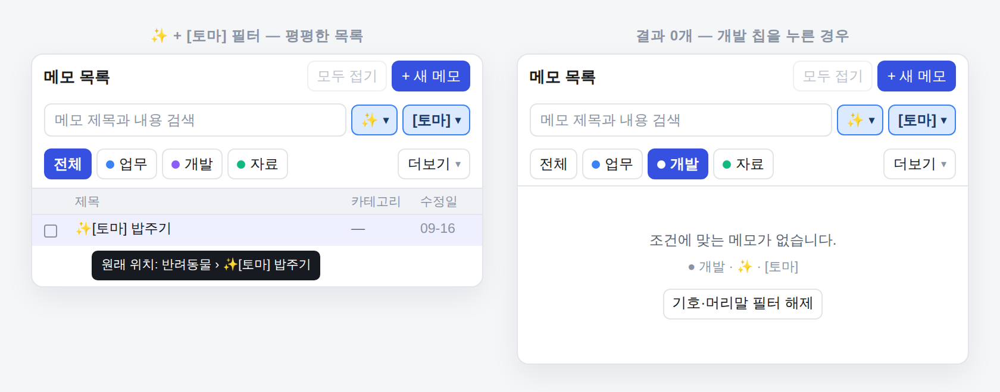
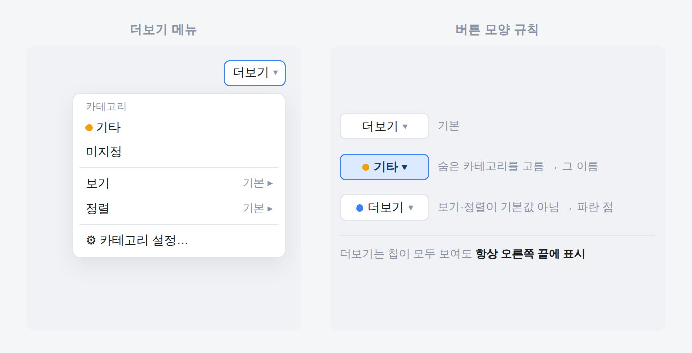
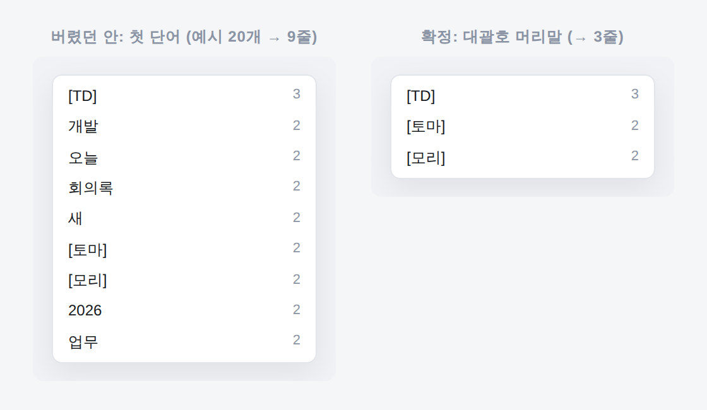
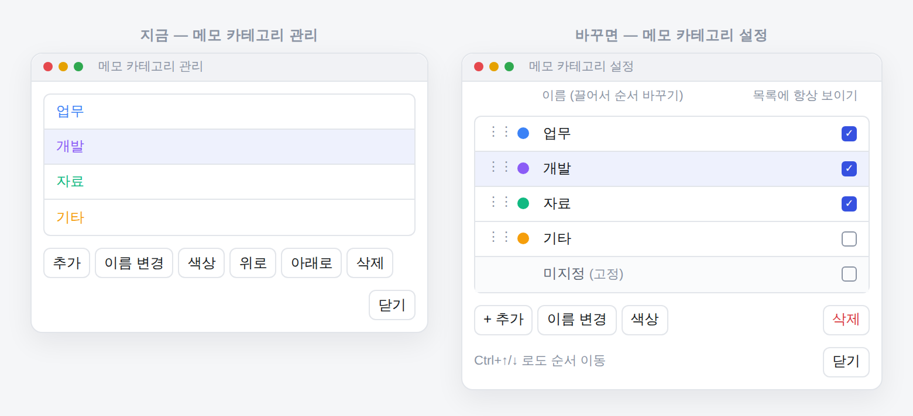
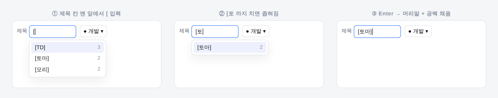

`● TOMADESK · 메모 목록 제목 분류 필터 구현 계획`

# 메모 목록 제목 분류 필터 구현 계획
### 제목 앞 기호·[머리말]로 모아 보고, 필터 줄을 "칩 + 항상 보이는 더보기"로 정리한다

보완계획 단계 D에서 **제목 첫 기호 필터(`기호 ▾`)**, `미지정` 칩, 색 점, 보기·정렬의 더보기 이동(480px 미만)이 이미 들어갔습니다. 이 문서는 그 위에 **대괄호 머리말 필터**, 버튼 **대표값·빈 상태·설명 말풍선**, **더보기 상시 표시**, 사용자가 고르는 **"항상 보이는 카테고리"**, 제목 칸 **머리말 자동완성**을 더합니다. 기호 규칙에서 합의와 다른 두 곳(01의 D1·D2)도 함께 고칩니다.

줄 번호와 이름은 **2026-09-16 받은 코드 기준**입니다(`memo_list.py` 73,127 bytes · `title_symbols.py` 1,644 bytes · `panel.py` 70,001 bytes · `editor.py` 86,294 bytes · `category_dialog.py` 4,658 bytes). 착수 전에 다시 확인하고, 다르면 이름 기준으로 찾으세요. **DB 표 구조·동기화·백업 계약은 바꾸지 않습니다.**

| 대상 | 근거 | 스택 | 작성일 |
|---|---|---|---|
| 메모 목록 필터 줄 · 검색 줄 · 카테고리 설정 창 · 편집기 제목 칸 | 사용자 결정(Q1~Q4) · 코드 확인 · 규칙 파이썬 실행 | Python · PyQt6 | 2026-09-16 |

**목차** — [00 확정한 것](#00--확정한-것) · [01 현재 코드 진단](#01--현재-코드-진단) · [02 목표 화면](#02--목표-화면) · [03 규칙](#03--규칙) · [04 단계별 구현](#04--단계별-구현) · [05 테스트](#05--테스트) · [06 보존·제외](#06--보존제외) · [07 완료 보고 형식](#07--완료-보고-형식)

---

## 00 — 확정한 것

사용자와 대화로 정한 내용입니다. **여기 적힌 결정은 구현 중에 바꾸지 말고, 막히면 멈추고 물어 주세요.**

| # | 결정 | 이유(사용자 의도) |
|---|---|---|
| D-1 | 두 번째 분류 버튼은 **첫 단어가 아니라 제목 맨 앞의 `[대괄호 머리말]`만** 인식한다. `[토마] 밥주기` → `[토마]` | 첫 단어로 잡으면 "오늘", "새", "2026"처럼 우연히 겹친 단어까지 올라와 메모가 늘수록 목록이 끝없이 길어진다. **사용자가 일부러 붙인 것만 분류가 된다.** |
| D-2 | 제목 칸 머리말 **자동완성을 이번에 같이** 만든다 | `[토마]`/`[토미]` 오타로 머리말이 갈라지는 것을 막는다 |
| D-3 | 보기·정렬은 **폭과 상관없이 항상 더보기 메뉴 안**에 둔다 | 필터 줄을 "카테고리 칩 + 더보기" 두 덩어리로 단순하게 |
| D-4 | 처음 설치 시 **항상 보이는 카테고리 칩은 앞에서 3개**(업무·개발·자료) | 사용자가 보는 지금 화면과 같게 시작 |
| D-5 | 더보기는 **필터 줄 오른쪽 끝, 항상 표시** | 칩이 모두 보여도 보기·정렬·설정 입구가 사라지면 안 된다 |
| D-6 | 기호·머리말 버튼은 **가장 많이 쓴 값을 대표로** 보여 준다. 값이 없으면 **빈 아이콘 하나만** 보이고, 누르면 **기능 설명 말풍선** | 기능이 있다는 걸 알게 하되 자리는 적게 |
| D-7 | "항상 보이기"는 **기존 카테고리 관리 창에 체크 칸을 더해** 설정한다. 창은 더보기 맨 아래 `⚙ 카테고리 설정…`에서도 연다 | 카테고리 추가·이름·색·순서·삭제는 이미 있다. 새 창을 만들지 않는다 |
| 유지 | 기호·머리말 필터는 **DB·설정에 저장하지 않고** 앱을 다시 켜면 풀린다. 카테고리 필터(`memo_category_filter`)는 지금처럼 기억한다 | 켰을 때 메모가 적게 보여 헷갈리는 일 방지 |
| 유지 | 카테고리·검색·기호·머리말은 **모두 AND**. 기호나 머리말이 걸리면 **평평한 목록**(끌어 옮기기·모두 접기 끔, 툴팁에 원래 위치) | 1판 확정 |
| 유지 | 기호는 **보이는 한 글자 단위**, **첫 기호만**, 보이지 않는 변형 문자·피부색은 무시하고 비교 | 1판 확정 |

---

## 01 — 현재 코드 진단


<sub>사용자 제공 캡처(2026-09-16). 칩 `전체 · 업무 · 개발 · 자료` 아래에 최근 메모 칩 줄이 보입니다. 보기·정렬 드롭다운은 좁은 폭이라 보이지 않습니다.</sub>

**이미 구현된 것 (재사용)**

| 위치 | 내용 |
|---|---|
| `alert_notes/title_symbols.py` `leading_title_symbol()` | 앞 공백을 뺀 첫 기호 한 글자(국기·ZWJ·피부색 결합 유지) |
| `memo_list.py` 검색 줄 `title_symbol_button` (`#memoTitleSymbolFilter`) | `기호 ▾` / 대표값 `✨ 2 ▾` / 걸리면 checked. `_show_title_symbol_menu()`는 `QMenu.exec` |
| `memo_list.py` `set_rows()` 1149행~ | 카테고리 필터 → 기호 개수 집계 → 기호 필터 → `_set_flat_rows()` |
| `memo_list.py` `_set_flat_rows()` 1250행~ | 평평한 목록, 원래 위치 툴팁, `setDragEnabled(False)` |
| `memo_list.py` `refresh_category_filters()` · `_layout_category_filters()` · `_show_more_categories()` | 칩(`전체`·카테고리·`미지정`), 폭이 모자라면 더보기로. 480px 미만이면 보기·정렬도 더보기 하위 메뉴 |
| `category_dialog.py` `CategoryManagerDialog` | 추가·이름 변경·색상·위로·아래로·삭제, 끌어서 순서, `changed` 신호 |
| `editor.py` 940행 `카테고리 관리` → `_manage_categories()` | 편집기 카테고리 칩 메뉴에서 창을 엶. `category_changed` → `panel.py` `_categories_changed()` → 목록 칩 다시 그림 |

**합의와 다른 곳 / 새로 필요한 곳**

| # | 문제 | 원인 | 단계 |
|---|---|---|---|
| D1 | `✨`와 `✨️`, `👍`와 `👍🏻`가 **다른 필터로 따로 셈** | `set_rows()`가 `leading_title_symbol()` 반환 문자열을 그대로 `Counter` 키로 씀. 변형 문자(U+FE0F)·피부색이 키에 남음 | A |
| D2 | `+ 할 일`, `$ 가계부`, `^^ 웃음`, `→ 다음`이 **기호로 잡힘** | `unicodedata.category(...).startswith("S")` — Sm(수학)·Sc(통화)·Sk(수식)까지 포함. 합의는 **So(기타 기호)만** | A |
| D3 | 대표값 동률이면 **문자 코드 순**으로 고름 | `min(..., key=(-count, symbol))` | C |
| D4 | 값이 없을 때 `기호 ▾` 글자 버튼 + 누르면 비활성 메뉴 항목 | `_update_title_symbol_button()`, `_show_title_symbol_menu()` | C |
| D5 | 걸린 상태와 대표값 상태가 **글자가 같음**(`✨ 2 ▾`) | 둘 다 개수 포함 | C |
| D6 | 머리말 필터 없음 | — | B · C |
| D7 | 더보기가 **숨은 칩이 없으면 사라짐**, 480px 이상이면 보기·정렬이 검색 줄에 나옴 | `_layout_category_filters()` 끝 `setVisible(bool(hidden) or _controls_in_more)`, `_sync_responsive_filter_controls()` | D |
| D8 | "항상 보이기" 설정 없음 · 목록에서 카테고리 창을 못 엶 | — | D · E |
| D9 | 결과 0개일 때 "메모가 없습니다. 편집 구역에 바로 입력하거나…" 안내가 그대로 나옴 | `empty_label` 문구 고정 | B |
| D10 | 제목 칸 자동완성 없음 | — | F |

규칙 확인(파이썬 실행 결과, 현재 `title_symbols.py` 복사본):

```
'✨️개발용' → '✨️'   (✨와 다른 키)      '👍🏻 좋아요' → '👍🏻' (👍와 다른 키)
'→ 다음'   → '→' (Sm)                  '+ 할 일'   → '+' (Sm)
'$ 가계부' → '$' (Sc)                  '^^ 웃음'   → '^' (Sk)
'※ 참고'   → None (Po)                 '[TD]메모'  → None (Ps)
```

---

## 02 — 목표 화면


<sub>목록 폭 420px 기준 목표 화면. 파란 번호는 이번에 바뀌는 지점입니다.</sub>

1. **기호 버튼** — 대표값 `✨ 5 ▾`(개수는 흐린 색). 규칙 D1·D2 수정 (단계 A·C)
2. **머리말 버튼** — 새로 추가, 기호 버튼 바로 오른쪽. 대표값 `[TD] 3 ▾` (단계 B·C)
3. **항상 보이는 칩** — `전체`는 늘 첫 자리, 그 뒤는 "항상 보이기"로 체크한 카테고리만. 기본은 앞 3개 (단계 E)
4. **더보기** — 늘 오른쪽 끝에 보임. 숨은 카테고리·`미지정`·보기·정렬·`⚙ 카테고리 설정…` (단계 D)

검색 줄은 `검색칸(늘어남) · 기호 버튼 · 머리말 버튼`만 남습니다. 보기·정렬 콤보는 **어떤 폭에서도 검색 줄에 나오지 않습니다**(D-3).

### 버튼 세 가지 상태


<sub>왼쪽부터 대표값 · 필터 걸림 · 값 없음 · 긴 머리말 말줄임.</sub>

| 상태 | 기호 버튼 글자 | 머리말 버튼 글자 | 모양 | 누르면 |
|---|---|---|---|---|
| ① 대표값 | `✨ 5 ▾` | `[TD] 3 ▾` | 기본 테두리, `checked=False` | 값 목록 메뉴 |
| ② 걸림 | `✨ ▾` (개수 없음) | `[토마] ▾` | 기존 `:checked` 채움색 | 값 목록 메뉴 |
| ③ 값 없음 | `기호` (▾ 없음) | `머리말` (▾ 없음) | 점선 테두리 + 흐린 글자 (`empty="true"`) | **설명 말풍선** |

- 툴팁: ① `제목이 ✨로 시작하는 메모 5개 · 눌러서 고르기` ② `✨ 필터 적용 중 · 5개` ③ `제목 앞 기호로 모아 보기`/`제목 앞 [머리말]로 모아 보기`
- **③ 글자 확정(2026-09-17)**: `☆`·`[ ]` 안은 폐기합니다. `☆`는 제목 맨 앞에 쓸 수 있는 기호라 값이 걸린 상태로 읽히고, 글꼴에 따라 빈 사각형으로 보일 위험도 있습니다. 점선 테두리·흐린 글자·`▾` 없음만으로 상태를 나타냅니다.
- **③ 상태의 눌림 해제**: 두 버튼은 `setCheckable(True)`이므로 말풍선을 띄우는 경로에서도 `_update_title_symbol_button()`·`_update_title_prefix_button()`을 다시 불러 `checked=False`로 되돌립니다. 메뉴 경로와 같은 모양을 유지합니다.
- 머리말 글자 폭은 **96px 안에서** `fontMetrics().elidedText(안쪽, Qt.TextElideMode.ElideRight, 남는 폭)`으로 안쪽 이름만 줄입니다: `[메모기능…] 3 ▾`. 기호 버튼은 줄이지 않습니다.
- **폭 숫자와 화면 배율(2026-09-17 확정)**: 96px(글자)·120px(머리말 버튼 최대)·240px(말풍선)·120px(검색 칸 최소)은 모두 기존 `scaled_stylesheet()` 배율 계산과 같은 방식으로 곱합니다. 125%면 120·150·300·150px, 150%면 144·180·360·180px입니다. 고정값으로 두면 150%에서 머리말이 두세 글자만 남습니다.
- **120px과 96px의 관계**: 120px은 버튼 전체 폭, 96px은 그 안의 글자 폭입니다(양옆 테두리 1px + 여백 10px). 폭이 모자라면 머리말 버튼이 먼저 줄고, 검색 칸은 배율을 곱한 120px 아래로 내려가지 않습니다.
- 대표값 = **개수가 가장 많은 값**. 동률이면 **그 값을 가진 메모 중 가장 최근 `updated_at`이 더 늦은 값**. 그래도 같으면 키 문자열 순.
- 대표값·개수는 **다른 필터(카테고리·검색·상대 버튼)가 걸린 뒤의 행**에서 셉니다. 자기 필터는 빼고 셉니다(아래 03 집계 규칙).

### 값이 없을 때 — 설명 말풍선


<sub>③ 상태에서 누르면 뜨는 말풍선. 오른쪽은 카테고리·검색·상대 필터 때문에 비었을 때의 문구입니다.</sub>

| 경우 | 제목 | 본문 | 예시 박스 |
|---|---|---|---|
| 기호 · 전체 메모에 없음 | `기호로 모아 보기` | `메모 제목 맨 앞에 이모지나 기호를 붙이면 같은 기호끼리 모아 볼 수 있어요.` | `✨테스트 메모` / `✨개발용 → ✨ 2` |
| 머리말 · 전체 메모에 없음 | `머리말로 모아 보기` | `제목 맨 앞에 [토마]처럼 대괄호 머리말을 붙이면 같은 머리말끼리 모아 볼 수 있어요.` | `[토마] 밥주기` / `[토마] 장난감사기 → [토마] 2` |
| 다른 조건 때문에 비었음 | `지금 조건에는 기호가(머리말이) 붙은 메모가 없어요` | `카테고리·검색·기호(머리말) 필터를 풀면 다른 값이 보일 수 있어요. …` | 없음 |

- "전체 메모에 없음"과 "조건 때문에 비었음"은 **카테고리 필터·검색어·상대 필터가 하나라도 걸려 있는지**로 구분합니다.
- 위젯: `QFrame(self, Qt.WindowType.Popup)`, `objectName="memoTitleFilterHelp"`, 폭 240px, `QLabel`(wordWrap) + 예시 `QLabel`(`#memoTitleFilterHelpExample`, 옅은 회색 배경) + `확인` 버튼. **`exec()`가 아니라 `show()`** — 버튼 왼쪽 아래 정렬, 화면 밖이면 오른쪽 끝을 버튼 오른쪽에 맞춤. 바깥 클릭·Esc·확인으로 닫힘. 테스트에서 보이도록 `self.title_filter_help`에 보관.

### 값 목록 메뉴


<sub>개수 많은 순. 걸린 값에는 체크. 머리말이 10개를 넘으면 목록 위에 검색 칸이 생깁니다.</sub>

- 항목: `전체`(체크 = 필터 없음) · 구분선 · `값 ␣␣ 개수`… (개수 내림차순, 동률은 대표값 규칙)
- **걸린 값의 개수가 0이 되어도 목록 맨 위에 남깁니다**(지금 코드와 같음).
- 메뉴를 만드는 부분과 띄우는 부분을 나눕니다: `_build_title_symbol_menu() -> QMenu`, `_build_title_prefix_menu() -> QMenu`. 테스트는 build 결과의 action만 검사합니다.
- 머리말 값이 **10개 초과**면 `QWidgetAction`으로 맨 위에 `QLineEdit`(placeholder `머리말 찾기`)를 넣고, 입력에 따라 action `setVisible()`로 좁힙니다. 기호 메뉴에는 넣지 않습니다.
- **검색 칸의 예외(2026-09-17 추가)**: 무엇을 입력해도 `전체`·구분선·지금 걸린 값은 숨기지 않습니다. 나머지가 모두 숨으면 `맞는 머리말이 없습니다`를 `setEnabled(False)` action 한 줄로 보입니다(입력을 지우면 사라짐).

### 필터가 걸렸을 때 · 결과가 없을 때


<sub>왼쪽: 기호·머리말이 걸리면 평평한 목록(모두 접기 흐림, 원래 위치 툴팁). 오른쪽: 필터를 건 뒤 개발 칩을 눌러 0개가 된 경우.</sub>

- 기호 **또는** 머리말이 걸리면 기존 `_set_flat_rows()`를 씁니다. `보기: 카테고리별`이어도 평평한 목록이 우선입니다(지금 동작 유지).
- 모두 접기 버튼은 평평한 목록에서 `setEnabled(False)`.
- **결과 0개이고 기호·머리말·카테고리·검색 중 하나라도 걸려 있으면** `empty_label` 문구를 `조건에 맞는 메모가 없습니다.`로 바꾸고, 그 아래 걸린 조건 요약(`● 개발 · ✨ · [토마]`, 흐린 11px)과 `기호·머리말 필터 해제` 버튼(`memoClearTitleFiltersButton`)을 보입니다. 버튼은 **기호·머리말 필터만** 풉니다(카테고리·검색은 그대로). 기호·머리말이 둘 다 안 걸렸으면 버튼은 숨깁니다.
- 필터가 하나도 없는데 0개면 지금 문구(`메모가 없습니다.…`)를 그대로 씁니다.

### 더보기


<sub>왼쪽: 메뉴 구성. 오른쪽: 버튼 글자 규칙.</sub>

메뉴 순서:

1. `카테고리` 머리글(비활성 action) — **칩으로 안 보이는 카테고리**(항상 보이기 해제 + 폭이 모자라 밀린 것) + `미지정`이 칩이 아니면 `미지정`. 하나도 없으면 머리글·구분선 생략
2. `보기 ▸` 하위 메뉴(기본 · 카테고리별) · `정렬 ▸` 하위 메뉴(기존 5개) — 현재 값에 체크, 오른쪽에 현재 값 이름 표시는 하위 메뉴 제목 `보기: 기본` 형태로 대신해도 됨
3. 구분선 · `⚙ 카테고리 설정…` → `category_settings_requested` 신호

### 필터 초기화 버튼 (2026-09-17 추가 · 단계 C에서 구현)

칩 줄의 오른쪽 끝, `더보기` **바로 왼쪽**에 둡니다. 줄을 새로 만들지 않아 세로 공간을 쓰지 않고, 걸린 조건(칩·검색·기호·머리말)과 같은 눈높이에 놓여 "여기까지가 지금 걸린 것"으로 읽힙니다.

| 항목 | 값 |
|---|---|
| 글자 | `↺ 필터 초기화` |
| 보이는 때 | 카테고리·검색·기호·머리말 중 하나라도 걸렸을 때만. 그 외에는 `setVisible(False)`로 자리도 비우지 않음 |
| 누르면 | 네 가지를 한 번에 풀고 `filters_changed`를 **한 번만** emit. 목록은 원래 계층 보기로 복귀. 보기·정렬·핀 설정은 건드리지 않음 |
| 크기 | 카테고리 칩과 같은 높이 26px, 글자 12px. 배율을 곱한 300px 미만에서는 글자를 떼고 정사각 28px 아이콘(`↺`)만 |
| 모양 | 일반 칩과 같은 테두리, 흐린 회색 글자. 카테고리 칩과 헷갈리지 않게 색 점 없음 |
| 이름 | `memoResetFiltersButton` · `accessibleName="필터 초기화"` · 툴팁 `카테고리·검색·기호·머리말 필터를 모두 풉니다` |
| 밀림 순서 | 폭이 모자라면 카테고리 칩이 먼저 `더보기`로 밀립니다. 초기화와 `더보기`는 항상 남습니다 |

결과 0개 안내 속 `기호·머리말 필터 해제`(`memoClearTitleFiltersButton`)는 **그대로 둡니다**(2026-09-17 사용자 확인). 푸는 범위가 다르고(제목 필터만 vs 전부), 글자도 이미 구분됩니다. 0개일 때 조건을 하나씩 풀어 가며 좁히는 쓰임이라 없애지 않습니다.

버튼 글자·모양 우선순위:

| 조건 | 글자 | 모양 |
|---|---|---|
| 숨은 카테고리(또는 칩이 아닌 `미지정`)가 선택됨 | 그 이름 + 색 점 아이콘 | checked (지금 동작) |
| 보기 또는 정렬이 기본값이 아님 | `더보기` + 파란 점 아이콘(`color_dot_icon("#3b82f6", 8)`) | 기본, 툴팁 `보기·정렬이 기본값이 아닙니다` |
| 그 외 | `더보기` | 기본 |

---

## 03 — 규칙

### A. 기호 (고침)

1. 제목 앞 공백을 뺀 **첫 글자의 유니코드 분류가 `So`**일 때만 기호입니다. `Sm`·`Sc`·`Sk`·문장부호·숫자·글자는 아닙니다.
2. 결합 규칙(국기 2글자, ZWJ, 변형 문자, 피부색, 태그 문자)은 **지금 `leading_title_symbol()`의 묶는 방식을 유지**합니다.
3. **비교 키** = 묶은 글자에서 `U+FE0E`, `U+FE0F`, `U+1F3FB~U+1F3FF`를 뺀 문자열. **표시** = 그 키로 처음 본(가장 최근 수정 메모의) 원래 모양.

| 제목 | 표시 | 키 | 비고 |
|---|---|---|---|
| `  ✨테스트` | ✨ | ✨ | 앞 공백 무시 |
| `✨️개발용` | ✨️ | ✨ | 위와 같은 필터 |
| `❤️ 마음` / `❤ 마음` | ❤️ / ❤ | ❤ | 같은 필터 |
| `👍🏻 좋아요` | 👍🏻 | 👍 | 피부색 무시 |
| `👩🏽‍💻 개발` | 👩🏽‍💻 | 👩‍💻 | ZWJ 유지, 피부색만 제거 |
| `🇰🇷 출장` | 🇰🇷 | 🇰🇷 | 국기 |
| `★중요` · `〒 우편` · `©️ 저작권` | ★ · 〒 · ©️ | ★ · 〒 · © | So |
| `+ 할 일` · `$ 가계부` · `^^ 웃음` · `→ 다음` | — | — | Sm·Sc·Sk (**지금은 잡힘 → 고침**) |
| `※ 참고` · `- 일반` · `# 제목` · `1️⃣ 첫째` · `[TD]메모` | — | — | 문장부호·숫자·괄호 |
| `✨⚡토마` | ✨ | ✨ | 첫 기호만 |

### B. 대괄호 머리말 (새로)

1. 제목 앞의 **공백과 기호(So 묶음, 여러 개 가능)를 모두 건너뛴 뒤**, 그 자리에서 `[`로 시작해야 합니다.
2. 정규식 `^\[\s*([^\[\]\r\n]{1,20}?)\s*\]` — 안쪽 **1~20자**, 첫 `]`까지만. 잡힌 안쪽을 `strip()`해서 **비면 머리말 없음**(`[   ]`).
3. 비교 키 = `unicodedata.normalize("NFC", 안쪽).casefold()`. 표시 = `[` + 처음 본(가장 최근 수정 메모의) 안쪽 원래 모양 + `]`.
4. **1개뿐인 머리말도 목록에 보입니다**(일부러 붙인 것이므로). 제목이 `새 메모`여도 규칙대로(머리말 없음) 처리하면 됩니다.

| 제목 | 기호 | 머리말 | 왜 |
|---|---|---|---|
| `[토마] 밥주기` | — | `[토마]` | 기본 |
| `✨[토마] 밥주기` | ✨ | `[토마]` | 앞 기호 건너뜀 |
| `✨⚡ [업무] 보고` | ✨ | `[업무]` | 기호 여러 개 + 공백 건너뜀 |
| `[ 토마 ]장난감` | — | `[토마]` | 안쪽 공백 무시 |
| `[td] 정리` · `[TD]메모기능` | — | 같은 키 `td` | 대소문자 무시, 표시는 최근 메모 모양 |
| `[토마][병원] 예약` | — | `[토마]` | 첫 머리말만 |
| `밥주기 [토마]` | — | — | 맨 앞이 아님 |
| `[토마 밥주기` | — | — | 닫는 괄호 없음 |
| `[] 빈칸` · `[   ] 빈칸` | — | — | 안쪽이 비었음 |
| `[가나다라마바사아자차카타파하가나다라마바사] x` | — | — | 안쪽 21자(20자 초과) |
| `※ [토마]` | — | — | ※는 So가 아니라 건너뛰지 않음 |


<sub>왜 첫 단어를 버렸는지 — 흔한 제목 20개에서 첫 단어는 9줄, 머리말은 3줄(파이썬 실행 결과). 이 20개는 05 테스트의 고정 입력으로 씁니다.</sub>

고정 입력 20개:

```python
EXAMPLE_TITLES = [
    "[TD]메모기능 개선 계획", "[TD]캘린더 축 개선", "[TD]서식 프리셋",
    "개발 명령어 정리", "개발 환경 설정", "오늘 할 일", "오늘 장보기",
    "회의록 9월", "회의록 10월", "새 기능 아이디어", "새 폴더 정리",
    "[토마] 밥주기", "[토마] 장난감사기", "[모리] 새장청소", "[모리] 밥주기",
    "선풍기 사기", "2026 목표", "2026 여행", "업무 정리", "업무 인수인계",
]
# 머리말 개수 → {"td": 3, "토마": 2, "모리": 2}
```

### C. 집계와 거르기 순서 (`set_rows()`)

```
rows(검색은 panel.refresh()에서 이미 적용됨)
 → 본문 페이지 제외(검색 중이 아닐 때, 지금 코드)
 → 카테고리 필터                         = base
 symbol_rows = base 중 머리말 필터 통과     → 기호 개수·대표값 집계
 prefix_rows = base 중 기호 필터 통과       → 머리말 개수·대표값 집계
 result      = base 중 기호·머리말 필터 모두 통과
 → 기호/머리말 중 하나라도 걸림: _set_flat_rows(result)
   아니면 기존 계층/카테고리별 보기
```

"조건 때문에 비었음" 판정: `category_filter_id is not None or searching() or 상대 필터 is not None`.

---

## 04 — 단계별 구현

**진행 규칙**: 단계마다 **해당 집중 테스트 + 전체 회귀 + `py_compile` + `git diff --check`**를 통과해야 다음 단계로 갑니다. 지금까지처럼 **각 단계가 끝나면 결과를 보고하고 사용자 승인 후 다음 단계**를 시작합니다. 테스트·캡처는 `TemporaryDirectory` 임시 DB만 씁니다. 기록은 `1._PROJECT_PLAN.md`·`2._WORK_LOG.md`·`3._TODO.md`의 기존 형식을 따릅니다.

### 단계 A — 규칙 모듈 `D1 · D2 · 머리말 규칙`

| 파일 · 위치 | 변경 |
|---|---|
| `alert_notes/title_symbols.py` | `leading_title_symbol()` 첫 글자 판정을 `startswith("S")` → `== "So"`. 모듈 설명 문구도 "So만" |
| 같은 파일 | `title_symbol_key(symbol: str) -> str` 추가 — FE0E·FE0F·1F3FB~1F3FF 제거 |
| 같은 파일 | `leading_title_prefix(title: str) -> str \| None` 추가 — 03-B 규칙. 반환은 **안쪽 원래 글자**(괄호 없음, 앞뒤 공백 제거) |
| 같은 파일 | `title_prefix_key(inner: str) -> str` 추가 — NFC + casefold |
| 같은 파일 | `TitleValueCount` (dataclass: `key`, `display`, `count`, `latest_updated_at`) 와 `count_title_values(rows, extractor, key_func) -> list[TitleValueCount]` 추가 — 개수 내림차순 · 최근 수정 늦은 순 · 키 순으로 정렬. `display`는 `latest_updated_at` 메모의 원래 모양 |
| `test_memo_remediation_stage_d.py` `TitleSymbolRuleTest` | `❤️` 기대값은 그대로 두고, `title_symbol_key("❤️") == "❤"` 추가 |

- 새 라이브러리 없음(`unicodedata`, `re`, `dataclasses`).
- 완료 기준: 03-A·03-B 표 전 사례 통과, `EXAMPLE_TITLES` 머리말 개수 `{"td":3,"토마":2,"모리":2}`.

### 단계 B — 목록 거르기 `D6 · D9`

| 파일 · 위치 | 변경 |
|---|---|
| `memo_list.py` `__init__` | `self.title_prefix_filter: str \| None = None`(**키**를 보관), `self._title_prefix_counts: list[TitleValueCount] = []`. 기호도 `self.title_symbol_filter`에 **키**를 보관하도록 바꾸고 `_title_symbol_counts`를 `list[TitleValueCount]`로 |
| `memo_list.py` `set_rows()` | 03-C 순서로 재작성. 행의 `updated_at`을 `count_title_values`에 넘김 |
| 같은 파일 | `_set_title_prefix_filter(key: str \| None)` 추가(기호와 같은 모양, `filters_changed.emit()`) · `clear_title_filters()` 추가(둘 다 None → 한 번만 emit) |
| 같은 파일 | `_set_flat_rows()` 뒤에 `self.fold_button.setEnabled(False)`, 계층 보기로 돌아가면 `_sync_fold_button()`이 다시 켬 |
| 같은 파일 · `empty_label` 주변 | 결과 없음 안내 위젯 묶음(`memoFilteredEmptyState`): 문구 · 조건 요약 · `기호·머리말 필터 해제`(`memoClearTitleFiltersButton`). `set_rows()`가 필터 유무에 따라 이 묶음과 기존 `empty_label` 중 하나만 보임 |

- 기존 테스트 `test_title_symbol_button_filters_dynamically_and_combines_with_category`는 `_set_title_symbol_filter("✨")`를 부릅니다. **키와 표시가 같은 기호는 그대로 동작**해야 합니다.
- 완료 기준: ✨ + [토마] + 카테고리 AND, 자기 필터를 뺀 개수, 0개 안내와 해제 버튼 동작.

### 단계 C — 버튼 두 개 `D3 · D4 · D5`

| 파일 · 위치 | 변경 |
|---|---|
| `memo_list.py` 검색 줄 | `title_prefix_button = QPushButton()` 추가, `objectName="memoTitlePrefixFilter"`, `setCheckable(True)`, 높이 `BUTTON_HEIGHT`, `setMaximumWidth(120)`, `accessibleName="제목 머리말 필터"`, 기호 버튼 **바로 오른쪽** |
| 같은 파일 | `_update_title_symbol_button()` 재작성 + `_update_title_prefix_button()` 추가 — 02의 세 상태 표. ③에서는 `setProperty("empty", True)` 후 `style().unpolish/polish` |
| 같은 파일 | `_show_title_symbol_menu()` → 값이 없으면 `_show_title_filter_help("symbol")`, 있으면 `_build_title_symbol_menu().exec(...)`. 머리말도 같은 구조 |
| 같은 파일 | `_show_title_filter_help(kind)` — 02 말풍선 표. `self.title_filter_help` 보관, `show()` |
| 같은 파일 | 머리말 메뉴 10개 초과 시 검색 칸(`QWidgetAction`) |
| `memo_list.py` `_show_title_symbol_menu()` · `_update_title_symbol_button()` | **재정렬 제거**: 두 곳의 `sorted(..., key=lambda v: (-v.count, v.key))`를 없애고 `count_title_values()`가 돌려준 순서를 그대로 씁니다. 지금은 이 재정렬이 "동률이면 최근 수정" 규칙을 덮어써 가나다순이 됩니다 |
| `memo_list.py` 칩 줄 (`_layout_category_filters()`) | `reset_filters_button` 추가 — 02 `필터 초기화 버튼` 표. `더보기` 바로 왼쪽, 필터가 걸렸을 때만 보임. 배치 함수는 원래 단계 D 범위지만 마지막 한 줄만 쓰므로 C에서 함께 넣습니다 |
| `memo_list.py` | `reset_all_filters()` 추가 — 카테고리·검색·기호·머리말을 풀고 `filters_changed`를 한 번만 emit |
| `ui_theme.py` 499행 부근 | `QPushButton#memoTitlePrefixFilter:checked`를 기존 checked 규칙에 추가. `QPushButton#memoTitleSymbolFilter[empty="true"], QPushButton#memoTitlePrefixFilter[empty="true"] { border-style: dashed; border-color: #b8c0cc; color: #8a93a3; }` · `QFrame#memoTitleFilterHelp` (흰 배경, 1px `#e2e5ea`, 반경 10px, 안쪽 12px) · `QLabel#memoTitleFilterHelpExample` (배경 `#f1f2f5`, 반경 6px). 기존 `scaled_stylesheet()` 배율 계산에 포함 |

- 버튼 글자 속 개수를 흐리게 하는 것은 Qt 기본 버튼으로 어렵습니다. **흐린 색은 선택 사항**이며, 안 되면 같은 색으로 둡니다(모양 규칙은 글자 형식이 우선).
- `_build_..._menu()`로 나눈 뒤에도 **`title_symbol_menu`·`title_prefix_menu` 속성 보관은 유지**합니다. 기존 검사가 이 속성으로 메뉴 항목을 확인합니다.
- 완료 기준: 세 상태 글자·속성, 동률 대표값(최근 수정 우선), 말풍선 두 종류 문구(전체 없음 쪽은 예시 상자 포함), 배율을 곱한 96px 말줄임.
- 완료 기준 추가: **300px에서 검색 칸 최소 폭이 남고 버튼 글자가 잘리지 않음**. 버튼이 하나 늘어나는 단계이므로 D로 미루지 않고 여기서 확인합니다.
- 완료 기준 추가: **필터 초기화 버튼**의 표시 조건·해제 범위·`더보기` 왼쪽 위치·좁은 폭 아이콘 전환.

### 단계 D — 필터 줄 정리 `D7`

| 파일 · 위치 | 변경 |
|---|---|
| `memo_list.py` `__init__` 548~561행(콤보 생성 · `search_row.addWidget(combo)`) | 보기·정렬 콤보를 **검색 줄에 넣지 않음**. 콤보 객체는 설정 저장·복원·`_filter_controls_changed` 때문에 **숨긴 채 유지**(부모만 패널, `hide()`) |
| 같은 파일 | `_sync_responsive_filter_controls()`·`FILTER_CONTROLS_INLINE_WIDTH`·`resize()` 재정의를 제거하거나 "항상 더보기" 한 가지로 단순화 |
| 같은 파일 `_layout_category_filters()` | 마지막 줄을 `self.more_categories_button.setVisible(True)`. 버튼 글자 우선순위(02 더보기 표) 적용 |
| 같은 파일 `_show_more_categories()` | 메뉴 구성을 02 순서로. 보기·정렬 하위 메뉴는 폭과 관계없이 항상 |
| 같은 파일 | `category_settings_requested = pyqtSignal()` 추가, `⚙ 카테고리 설정…` action이 emit |
| `panel.py` | `self.list_panel.category_settings_requested.connect(self.editor._manage_categories)` — 기존 흐름(`category_changed` → `_categories_changed`)을 그대로 탐 |

- 완료 기준: 폭 300·420·800px 모두 더보기 보임, 더보기 버튼 오른쪽 끝 x = 필터 줄 오른쪽 끝(±1px), 검색 줄에 콤보 없음, 보기·정렬 변경 시 목록 반영과 파란 점.

### 단계 E — 항상 보이는 카테고리 `D8 · D-4 · D-7`


<sub>왼쪽: 지금 창. 오른쪽: 체크 칸이 더해진 창. `미지정`은 이름·색·순서·삭제가 안 되는 고정 줄입니다.</sub>

| 파일 · 위치 | 변경 |
|---|---|
| `alert_notes/memo_category_pins.py` (새) | `PINNED_SETTING = "memo_category_pinned"`, `DEFAULT_PINNED_COUNT = 3`, `UNASSIGNED_KEY = "none"`. `pinned_category_keys(store) -> list[int \| str]`: 설정이 **없으면** 순서상 앞 3개 카테고리 ID, 있으면 JSON 목록에서 **지금 존재하는 ID와 `"none"`만** 남김. `set_pinned_category_keys(store, keys)`: JSON 문자열로 저장 |
| `category_dialog.py` | 창 제목 `메모 카테고리 설정`. 목록 줄마다 오른쪽 체크(`QListWidgetItem` 체크 상태 사용, 머리글 `QLabel` `이름 (끌어서 순서 바꾸기) · 목록에 항상 보이기`). 맨 아래 `미지정` 고정 줄(드래그·선택 편집 불가, 체크만 가능). 체크 변경 즉시 `set_pinned_category_keys` + `changed.emit()` |
| 같은 파일 | `위로`·`아래로` 버튼 삭제, 대신 목록에서 `Ctrl+↑`/`Ctrl+↓` 단축키로 같은 `_move()` 실행. 버튼 줄: `+ 추가 · 이름 변경 · 색상 · (늘어남) · 삭제`(삭제는 `dangerButton`) |
| 같은 파일 `_add()` | 새 카테고리는 **체크 안 됨**. 설정이 아직 없던 상태에서 추가하면, 추가 **전**의 기본값(앞 3개)을 먼저 명시 저장한 뒤 추가(그래야 새 카테고리가 앞 3개 안에 끼어도 칩이 갑자기 바뀌지 않음) |
| 같은 파일 `_delete()` · `_save_order()` | 삭제된 ID는 핀 목록에서도 제거. 순서 변경은 핀 목록에 영향 없음. 단 **설정이 없는 상태에서 순서를 바꾸면** 바꾸기 전 앞 3개를 먼저 명시 저장 |
| `memo_list.py` `refresh_category_filters()` · `_layout_category_filters()` | 칩 후보 = `전체` + 카테고리 순서대로 **핀된 것** + (`"none"`이 핀이면) `미지정`. 핀 안 된 것은 **폭이 남아도 칩으로 만들지 않고** 더보기에만. 핀된 칩도 폭이 모자라면 뒤에서부터 더보기로(지금 로직) |

- 저장은 기존 `store.setting/set_setting`만 씁니다. **`memo_categories` 표에 열을 추가하지 않습니다.**
- 사용자 기존 DB에는 설정이 없으므로 **업무·개발·자료 칩 + 미지정은 더보기**로 시작합니다. 이 변화는 완료 보고에 명시하세요.
- 완료 기준: 기본 3개, 해제한 카테고리는 800px에서도 칩 없음, 미지정 체크 시 칩 표시, 삭제 후 핀 정리, 편집기·더보기 두 입구가 같은 창.

### 단계 F — 제목 칸 머리말 자동완성 `D10 · D-2`


<sub>제목 칸(104px 고정) 맨 앞에서 `[`를 치면 기존 머리말이 많이 쓴 순으로 뜨고, 고르면 `[토마] `까지 채워집니다.</sub>

| 파일 · 위치 | 변경 |
|---|---|
| `editor.py` 195행 `title_edit` 생성 뒤 | `QCompleter` + `QStringListModel`. `caseSensitivity=CaseInsensitive`, `completionMode=PopupCompletion`, `filterMode=MatchStartsWith`. `completer.popup().setMinimumWidth(170)` (제목 칸 104px보다 넓게) |
| 같은 파일 | **`title_edit.setCompleter()`는 쓰지 않습니다**(제목 전체를 대상으로 완성해 버림). `completer.setWidget(self.title_edit)` 후 `textEdited`에서 직접 판단 |
| 같은 파일 `_title_prefix_context()` | 커서 앞 텍스트가 `앞공백·기호들` + `[` + `]`·`[` 없는 0~20자 이고 커서가 그 안에 있을 때만 `(시작 위치, 입력한 안쪽)` 반환. 아니면 None → 팝업 닫기 |
| 같은 파일 `_refresh_title_prefix_model()` | `title_edit` 포커스 들어올 때 `count_title_values(self.store.notes(), leading_title_prefix, title_prefix_key)`로 `[표시]` 목록 갱신. 지금 편집 중 메모도 포함(자기 머리말도 제안) |
| 같은 파일 `activated(str)` | 머리말 구간(`[`부터 기존 `]`와 뒤 공백 1개가 있으면 그것까지)을 `[선택] `로 바꾸고 커서를 공백 뒤로. 기호·나머지 제목 보존. 기존 `textChanged → _queue_save` 흐름 그대로 |
| 같은 파일 | 제안 목록이 비었으면 팝업을 띄우지 않음. 새 이름은 그냥 계속 치면 됨 |

- `Enter`로 고를 때 제목 칸 `returnPressed`가 다른 동작을 하면 팝업이 열려 있는 동안은 막습니다(팝업이 먼저 먹도록 `completer.popup().isVisible()` 확인).
- 완료 기준: `[` → `[TD]` 첫 제안, `[토` → `[토마]`만, 선택 결과 `✨[토마] 밥주기` 형태 보존, `밥[` 처럼 맨 앞이 아니면 팝업 없음.

### 단계 G — 설명서·문서·실제 창

| 파일 | 변경 |
|---|---|
| 프로그램 내 설명서 · `4. TomaDesk_설명서.md` | 메모 목록 절에 기호·머리말 버튼, 설명 말풍선, 더보기(보기·정렬·카테고리 설정), 항상 보이기, 제목 칸 `[` 자동완성 설명. 폐기 문구(`기호 ▾`, 검색 줄 보기·정렬) 부재를 설명서 검사에 추가 |
| `1._PROJECT_PLAN.md` | 단계 D 항목의 "대괄호 머리말·첫 단어·자동완성은 이번 단계에서 제외" 문장 옆에 이 계획 링크와 "첫 단어는 폐기, 머리말·자동완성은 11번 계획에서 구현" 기록 |
| 캡처 | 임시 DB로 목록 폭 380·480px × 배율 100·125%, 카테고리 8개 넘침 상태 |

---

## 05 — 테스트

새 파일 **`test_memo_title_filters.py`** (기존 `test_memo_remediation_stage_d.py`와 같은 준비 코드: `QApplication`, `scaled_stylesheet(1.0)`, `NoteReminderStore(임시경로, "새 메모")`, `destroy_widget`).

### 고쳐야 하는 기존 테스트

| 파일 · 테스트 | 이유 | 바꿀 내용 |
|---|---|---|
| `test_memo_remediation_stage_d.py` `test_480_width_keeps_four_columns_and_view_controls` | D-3으로 480px에서도 콤보가 검색 줄에 없음 | 콤보 폭 단언 삭제 → `view_combo.isVisible() is False`, 더보기 메뉴 build 결과에 `보기`·`정렬` 하위 메뉴 존재. 네 열·가로 스크롤 단언은 유지 |
| 같은 파일 `test_title_symbol_button_filters_dynamically_and_combines_with_category` | 걸림 상태 글자에서 개수가 빠짐(D5) | 필터 전 `"✨ 2 ▾"` 유지, 필터 후 `title_symbol_button.text() == "✨ ▾"` 추가 |
| `test_memo_title_filters.py` `test_active_symbol_key_survives_zero_count_and_is_not_saved` | 같은 이유(D5). 238행에서 버튼 글자에 `"✨ 0"`이 있는지 봅니다 | 버튼 기대값을 `"✨ ▾"`로 바꾸고, 메뉴 항목에 개수 `0`이 남는지 보는 부분은 그대로 둡니다 |
| `test_memo_remediation_stage_d.py` `test_category_chips_unassigned_filter_color_and_compact_cells` | D-4로 `미지정`이 기본 칩이 아님 | `미지정` 버튼을 `category_filter_buttons`가 아니라 더보기 메뉴 action에서 찾거나, 테스트 시작 시 `set_pinned_category_keys(store, [업무, "none"])` |

### 새 테스트

| 묶음 | 테스트 | 확인 |
|---|---|---|
| 규칙 | `test_symbol_is_so_only` | 03-A 표의 Sm·Sc·Sk·문장부호 None, So 유지 |
| 규칙 | `test_symbol_key_merges_variation_and_skin_tone` | ✨/✨️, ❤/❤️, 👍/👍🏻, 👩🏽‍💻/👩‍💻 키 같음 |
| 규칙 | `test_prefix_rules_table` | 03-B 표 11개 |
| 규칙 | `test_example_titles_prefix_counts` | `EXAMPLE_TITLES` → td 3 · 토마 2 · 모리 2, 순서 td → 토마/모리(동률은 최근 수정) |
| 규칙 | `test_display_uses_latest_updated_form` | `[td] 정리`(나중 수정)와 `[TD]메모` → 표시 `[td]` |
| 목록 | `test_prefix_filter_and_symbol_and_category_are_and` | ✨[토마]·[토마]·✨ 조합에서 행 수 |
| 목록 | `test_counts_exclude_own_filter` | ✨ 선택 후 기호 메뉴에 ⚡ 남음, 머리말 개수는 ✨ 안에서 |
| 목록 | `test_active_value_kept_when_count_drops_to_zero` | 필터 걸고 제목 변경 → 메뉴 맨 위 유지, 개수 0 |
| 목록 | `test_flat_rows_disable_drag_and_fold` | `dragEnabled False`, `fold_button.isEnabled() False`, 해제 후 복구 |
| 목록 | `test_filtered_empty_state_and_clear_button` | 0개 문구·요약·해제 버튼 → 기호·머리말만 풀리고 카테고리 유지 |
| 목록 | `test_title_filters_not_persisted` | 새 `MemoListPanel(store)`에서 두 필터 None, 설정 키 없음 |
| 버튼 | `test_three_button_states` | ① `✨ 5 ▾` ② `✨ ▾`+checked ③ `☆`·`[ ]`+`empty` 속성 |
| 버튼 | `test_representative_tie_breaks_by_recent_update` | 동률 두 값 중 최근 수정 쪽 |
| 버튼 | `test_long_prefix_elided_within_96px` | `fontMetrics().horizontalAdvance(text) <= 96` 근사, `…` 포함 |
| 버튼 | `test_empty_click_opens_help_not_menu` | `title_filter_help.isVisible()`, 전체 없음 문구 / 카테고리 걸림 문구 |
| 버튼 | `test_prefix_menu_has_search_over_ten` | 머리말 11개 → 첫 action이 `QWidgetAction` |
| 버튼 | `test_prefix_menu_search_keeps_all_and_active` | 검색어 입력 → `전체`·구분선·걸린 값은 계속 보임, 나머지 0개면 `맞는 머리말이 없습니다` 비활성 항목 |
| 버튼 | `test_empty_state_button_unchecks_after_help` | ③에서 눌러 말풍선을 띄운 뒤 `isChecked() is False` |
| 버튼 | `test_scaled_widths_follow_dpi` | 배율 1.0·1.25·1.5에서 96·120·240·120px이 각각 곱해진 값 |
| 초기화 | `test_reset_button_hidden_without_filters` | 필터 없음 → `isVisible() False`, 칩 배치에 자리 없음 |
| 초기화 | `test_reset_button_clears_four_filters_once` | 카테고리+검색+기호+머리말 → 한 번 눌러 전부 해제, `filters_changed` 1회, 계층 보기 복귀 |
| 초기화 | `test_reset_button_left_of_more_and_icon_when_narrow` | `더보기` 바로 왼쪽, 300px에서 글자 없는 28px 아이콘, 칩이 먼저 밀림 |
| 초기화 | `test_reset_keeps_view_sort_and_pins` | 보기·정렬·핀 설정은 그대로 |
| 더보기 | `test_more_button_always_visible_and_rightmost` | 300·420·800px |
| 더보기 | `test_more_menu_sections` | 카테고리(숨은 것) · 보기 · 정렬 · `⚙ 카테고리 설정…` 순서, 설정 action이 신호 emit |
| 더보기 | `test_more_button_dot_when_view_or_sort_changed` | 정렬 변경 → 아이콘 있음, 기본 복귀 → 없음 |
| 핀 | `test_default_pins_first_three` | 설정 없음 → 업무·개발·자료 칩, 미지정 칩 없음 |
| 핀 | `test_unpinned_category_not_chip_even_when_wide` | 800px에서도 없음, 더보기 메뉴에 있음 |
| 핀 | `test_pin_unassigned_shows_chip` | `"none"` 핀 → 미지정 칩 |
| 핀 | `test_add_category_keeps_existing_chips` | 설정 없음 → 추가 → 앞 3개 칩 그대로, 새 것 미체크 |
| 핀 | `test_delete_category_removes_pin` | |
| 창 | `test_dialog_checkbox_saves_and_emits` | 체크 변경 → 설정 JSON · `changed` |
| 창 | `test_dialog_unassigned_row_is_fixed` | 미지정 줄 선택 시 이름 변경·색상·삭제 무반응, 드래그 불가 |
| 창 | `test_dialog_ctrl_arrow_moves_order` | `Ctrl+↓` → `reorder_categories` 반영 |
| 입구 | `test_more_menu_opens_same_dialog` | `panel.py` 연결 확인(`_manage_categories` 호출을 패치해 검사) |
| 자동완성 | `test_bracket_opens_completer_with_counts_order` | `[` 입력 → 팝업 보임, 첫 항목 `[TD]` |
| 자동완성 | `test_completer_filters_and_replaces_prefix` | `✨[토` → `[토마]`만 → 선택 → `✨[토마] ` |
| 자동완성 | `test_completer_only_at_title_start` | `밥[` → 팝업 없음 |

**전체 회귀**와 **Windows Qt 100·125·150%** 자동 검사를 지금까지처럼 실행합니다.

### 실제 창 체크리스트 (Windows, 임시 DB)

- [ ] 목록 폭을 300 → 800px로 늘려도 더보기가 오른쪽 끝에 붙어 있음
- [ ] 흐린 `기호` · `머리말` 누르면 말풍선(예시 상자 포함), 바깥 클릭·Esc로 닫히고 버튼이 눌린 채 남지 않음
- [ ] 필터를 걸면 `↺ 필터 초기화`가 `더보기` 왼쪽에 나타나고, 누르면 네 가지가 한 번에 풀림
- [ ] 폭을 300px로 줄이면 초기화가 아이콘만 남고 카테고리 칩이 먼저 `더보기`로 밀림
- [ ] **G-B에서 미룬 확인**(머리말 버튼이 붙은 뒤 수행): 기호+머리말+카테고리+검색 동시 적용, 0개 조건 요약, 제목 필터만 해제, 계층 보기 복귀를 100·125·150%에서 확인
- [ ] ✨ 고른 뒤 `[토마]` 고르고, 개발 칩 → 0개 안내 → 해제 버튼
- [ ] 더보기 → 정렬 바꾸기 → 파란 점 → 기본으로 → 점 사라짐
- [ ] 더보기 → `⚙ 카테고리 설정…` → 자료 해제 → 칩 즉시 사라짐, 닫고 다시 열어도 유지
- [ ] 제목 칸에 `[` → 제안 팝업이 제목 칸보다 넓게, 방향키·Enter로 선택
- [ ] 앱 재실행 → 기호·머리말 필터 풀림, 카테고리 필터와 핀은 유지
- [ ] 이모지 글꼴에서 `☆`가 빈 사각형으로 보이지 않음(보이면 `★` 흐린 색으로 대체하고 보고)

---

## 06 — 보존·제외

**보존**

- DB 표 구조, UUID·revision·UTC·tombstone, `.tomamemo` v1/v2, 동기화·병합 규칙(DECISIONS 2026-09-15)
- 검색 의미(제목+본문), 카테고리 필터 기억(`memo_category_filter`), 보기·정렬 설정 키(`memo_category_view`·`memo_category_sort`)
- 계층 보기의 끌어 옮기기·펼침 기억(평평한 목록일 때만 끔)
- 카테고리 일괄 지정, 선택 작업줄, 충돌 표시, 네 열 폭 규칙(단계 D 결과)
- 편집기 카테고리 칩의 `카테고리 관리` 입구(창 이름만 `설정`으로 바뀜)

**제외**

- 첫 단어 분류(폐기)
- 본문 속 머리말, 제목 중간·끝의 대괄호
- 머리말 이름 일괄 변경·병합 기능
- 핀 설정의 기기 간 동기화(PC마다 따로)
- 카테고리 표에 "항상 보이기" 열 추가

---

## 07 — 완료 보고 형식

단계마다 아래를 보고해 주세요.

1. **바뀐 것** — 파일·함수 단위
2. **계획과 다른 점** — 없으면 "없음". 있으면 이유와 사용자에게 보이는 차이
3. **테스트** — 집중 N개 · 전체 N개 · 배율별 N개 · 실패/건너뜀
4. **실제 창** — 확인한 항목 / 못 한 항목(TODO에 기록)
5. **사용자에게 보이는 변화** — 특히 단계 E의 "미지정 칩이 더보기로 이동"
