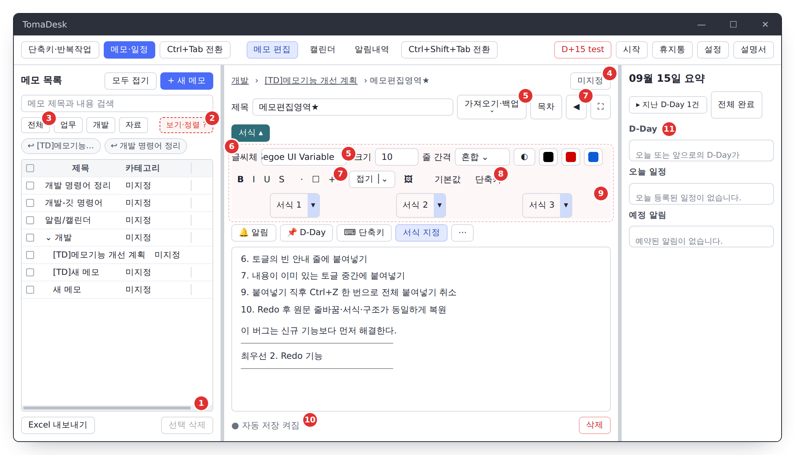
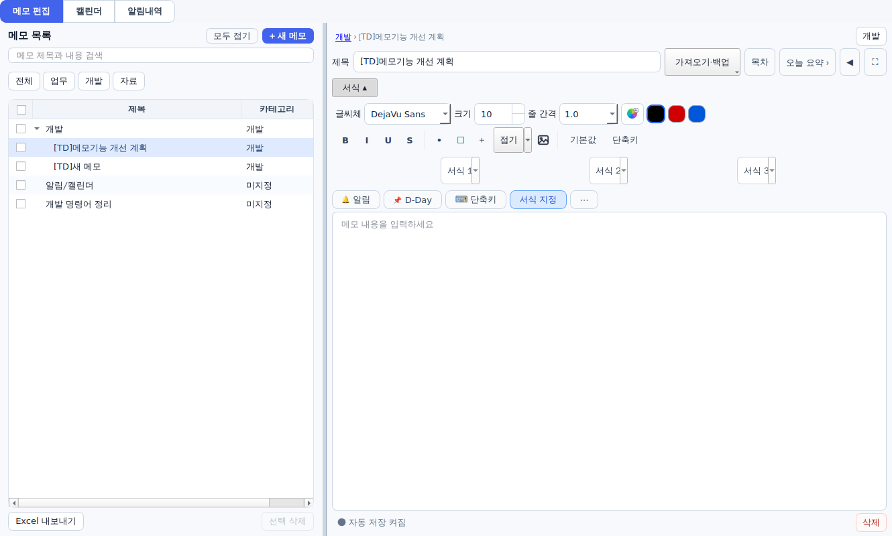
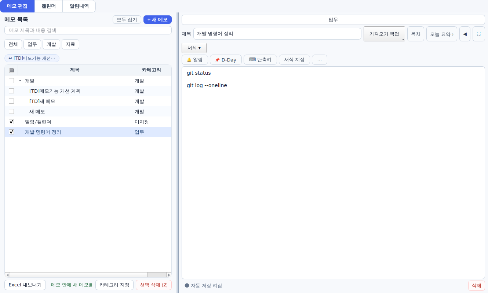
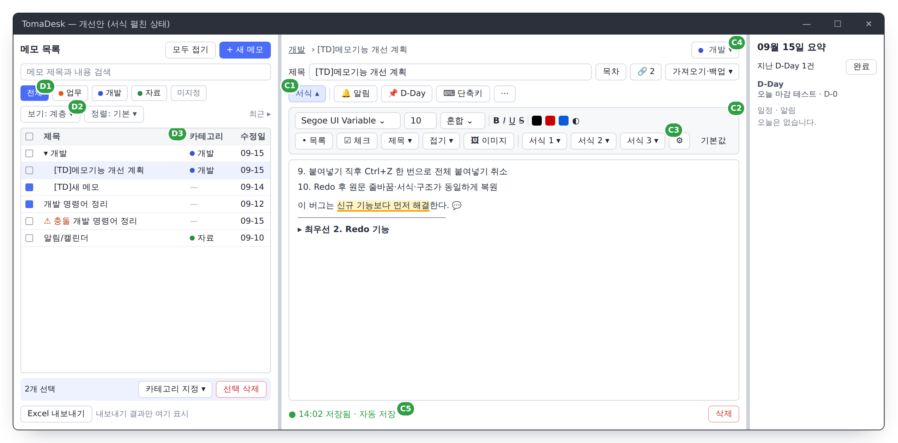
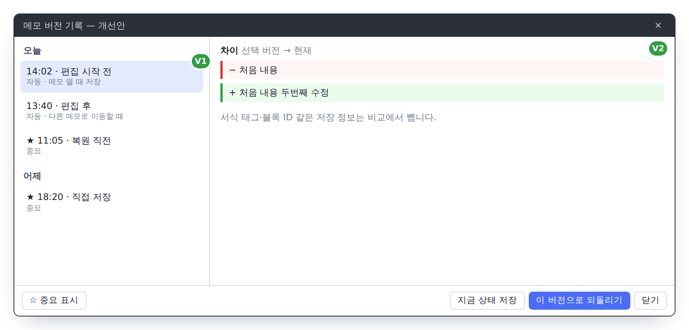

`● TOMADESK · Phase 4–7 결과물 보완 계획`

# 메모 편집 UI·기능 보완 계획
### 앱 종료 버그 2건부터 막고, 머리 영역·목록을 추천안대로 다시 배치한다

Phase 4–7 구현 보고서에는 **815개 테스트 통과**로 적혀 있습니다. 하지만 격리된 임시 DB로 실제 위젯을 직접 눌러 본 결과, **73개 확인 항목 중 25개가 의도와 달랐습니다.** 그중 **2건은 누르는 순간 프로그램이 꺼질 수 있는 오류**입니다. 이 문서는 사용성 테스트 결과와 지난 검토에서 확정한 추천안 4개를 합쳐, 파일별 수정 내용과 완료 기준을 순서대로 정리합니다.

| 대상 | 근거 | 스택 | 작성일 |
|---|---|---|---|
| 메모·일정 탭 › 메모 편집 | 실행 화면 캡처 · 코드 확인 · 오프스크린 사용성 테스트 | Python · PyQt6 · SQLite | 2026-09-15 |

**목차** — [00 확정한 결정](#00--확정한-결정) · [01 사용성 테스트 결과](#01--사용성-테스트-결과) · [02 단계별 수정 계획](#02--단계별-수정-계획) · [03 검증 계획](#03--검증-계획) · [04 보존·제외](#04--보존제외) · [05 결정할 것](#05--결정할-것)

---

## 00 — 확정한 결정

지난 검토 문서의 추천안 4개로 진행합니다.

| # | 항목 | 확정안 |
|---|---|---|
| D-1 | 서식 토글 위치 | `서식 ▾`를 **속성 칩 줄 맨 왼쪽**으로 합친다. 펼친 도구는 칩 줄 **아래**에 최대 2줄로 연다. |
| D-2 | 저장 안내 위치 | 메모 저장·카테고리 변경 안내는 **편집기 하단 한 곳**에만 표시한다. 목록 하단에는 Excel 내보내기·일괄 작업 결과만 둔다. |
| D-3 | 서식 지정 진입 | `서식 지정` 칩을 없애고, 서식 1~3 옆 `⚙`에서 설정을 연다. |
| D-4 | 목록 카테고리 열 | `● 이름` 형태로 색 점과 이름을 함께 표시한다. 미지정은 흐린 `—`, 수정일은 `MM-DD`로 줄인다. |

지난 검토에서 짚은 11곳입니다. 서식 ▴를 펼친 상태이고, 목록 하단 가로 스크롤바 너머에 수정일 열이 숨어 있습니다.

---

## 01 — 사용성 테스트 결과

### 테스트 방법

- 실제 사용자 DB는 열지 않았습니다. 새 임시 DB에 메모 5개(상위 1, 하위 2 포함)를 만들고 시작했습니다.
- `AlertNotesPanel`을 실제 앱과 같은 테마 스타일시트로 띄웠습니다. 버튼 클릭, 글자 입력, 체크, 메뉴 선택을 사람이 누르는 순서대로 실행했습니다.
- 대화상자와 메뉴는 화면을 찍은 뒤 정해 둔 값으로 답했습니다.
- 원래 앱이라면 꺼졌을 오류(PyQt6은 버튼 동작 중 처리되지 않은 오류가 나면 프로그램을 종료함)는 가로채서 기록했습니다.
- 한계: 리눅스 오프스크린 환경이라 글꼴이 Windows(Segoe UI Variable)와 다릅니다. 글자 폭 관련 수치는 실제 창에서 다시 확인해야 합니다.
- 재실행용 스크립트: [test/memo_usability_test.py](test/memo_usability_test.py) · 항목별 결과: [test/테스트결과.json](test/테스트결과.json)

### 시나리오별 결과

| 시나리오 | 통과 | 실패 | 핵심 |
|---|---|---|---|
| S1 첫 화면·목록 | 1 | 4 | 보기·정렬 드롭다운 폭 **0px**, 수정일 열 숨김, 가로 스크롤 |
| S2 편집기 머리 영역 | 5 | 6 | 서식 펼치면 칩 **135px 이동**, `서식 지정`·`단축키` 칩이 설정 화면을 열지 않음 |
| S3 카테고리 | 8 | 1 | 칩 즉시 저장·필터·상속·삭제 후 미지정 전환 **모두 정상**. `미지정` 필터 없음 |
| S4 보기·정렬·일괄 지정 | 6 | 1 | 일괄 지정 직후 **앱 종료 오류** |
| S5 Markdown 가져오기 | 5 | 0 | `1~4` 유지, 코드 고정폭, 접힌 제목 아래 표 숨김, 다시 열어도 표 유지 **모두 정상** |
| S6 링크·백링크 | 4 | 1 | v2 링크·백링크 정상. 백링크까지 2단계, 개수 표시 없음 |
| S7 페이지 포함 메모 복제 | 1 | 1 | 복제본 본문 링크가 **원본의 하위 페이지**를 가리킴 |
| S8 주석 | 2 | 5 | 위치 복구 코드가 **호출되지 않음**, 본문에 표시 없음 |
| S9 템플릿 | 4 | 3 | `/템플릿` 삽입 순간 **앱 종료 오류**, 코드 글자 들어간 템플릿 저장 거부 |
| S10 버전·오늘 요약 | 4 | 2 | 편집 **전** 상태가 저장되지 않음, 메모를 한 번 바꾸면 **오늘 요약이 멈춤** |
| S11 삭제·휴지통·요약 접기 | 4 | 0 | 휴지통·복원·tombstone·요약 접기 **정상** |
| S12 좁은 창(900·780px) | 2 | 0 | 글자 잘린 버튼 없음. 글꼴 차이가 있어 실제 창에서 다시 확인 필요 |
| S13 백업 병합 | 2 | 1 | 충돌 사본은 생기지만 목록에서 일반 사본과 구분 안 됨 |

> **정상 동작 확인:** 카테고리 저장·필터·상속, 카테고리별 보기·정렬, MD 가져오기, v2 링크 생성, 휴지통·tombstone, 병합 충돌 사본 생성
> **의도와 다름:** 25개 항목. 이 중 앱 종료 2건, 데이터·로직 오류 5건

### 발견한 문제 목록

번호는 아래 단계별 계획에서 그대로 씁니다.

| 번호 | 심각도 | 문제 | 원인(코드 확인) |
|---|---|---|---|
| F1 | 🔴 앱 종료 | `/템플릿`에서 템플릿을 고르면 `NameError: json` | `rich_memo_edit.py` 상단에 `import json` 없음 (2310행 `json.loads`) |
| F2 | 🔴 앱 종료 | 여러 메모 체크 → `카테고리 지정` → 저장 직후 `TypeError` | `panel.py` 454행 `self._status(메시지)`에 `level` 인자 누락 |
| F3 | 🟠 데이터·로직 | 메모를 한 번 바꾸면 오늘 요약이 더 이상 갱신되지 않고 캘린더 목록이 비워짐 | `panel.py` `_finish_version_session()` 끝에 `self.calendar.shutdown()`·`self.summary.shutdown()`이 들어가 있음. 원래 `shutdown()`에 있어야 할 두 줄 |
| F4 | 🟠 데이터·로직 | 자동 버전이 **편집 후** 상태만 저장 → 처음 편집 전 내용으로 되돌릴 수 없음 | `_finish_version_session()`이 세션 끝의 현재 상태만 `create_version()` |
| F5 | 🟠 데이터·로직 | 주석 위치 복구가 실제로 안 됨. 앞에 글을 넣어도 위치가 그대로이고, 원문을 지워도 `resolved` | `MemoDataService.resolve_annotation()`을 앱에서 부르는 곳이 없음(테스트에서만 호출) |
| F6 | 🟠 데이터·로직 | 페이지가 들어 있는 메모를 복제하면 본문 링크가 원본의 하위 페이지로 연결됨 | `note_clone_service.py` 14·35행, `memo_clipboard.py` 14행, `memo_archive.py` 474행 정규식이 숫자형 `toma-note://123`만 바꿈. v2 UUID 링크는 그대로 복사됨 |
| F7 | 🟠 데이터·로직 | 본문에 `PyQt`, `QObject`, `file://`, `C:\` 글자가 있으면 템플릿 저장 거부 + 오류 처리 없음 | `memo_data_service.py` `save_template()`이 JSON **문자열 전체**를 정규식으로 검사. `save_selection_as_template()`에 try 없음 |
| F8 | 🟡 계획과 다름 | `서식 지정` 칩은 `서식 ▾`와 같은 서랍만 여닫음. `⌨ 단축키` 칩은 메모 전역 단축키 입력 칸을 엶. 툴바 끝 `단축키`가 `노트 단축키 설정` 창을 엶(중복) | `editor.py` `_toggle_property_page()` |
| F9 | 🟡 UI | 보기·정렬 드롭다운 폭 0px로 사라짐 | `memo_list.py` 486–488행 `setMinimumWidth(0)` + `SizePolicy.Ignored` |
| F10 | 🟡 UI | 기본 목록 폭 480px에서 수정일 열 항상 숨김, 가로 스크롤 62px | `NARROW_WIDTH = 520` > 기본 폭, `COLUMN_WEIGHTS`의 카테고리 100 |
| F11 | 🟡 UI | 서식 펼치면 칩 줄 135px 아래로 이동, 서식 1~3 버튼 41px·흩어짐 | `_install_compact_layout()` 삽입 순서, `preset_layout` 끝 stretch·높이 고정 없음 |
| F12 | 🟡 UI | 필터 칩 선택 표시 없음, `미지정` 필터 없음 | `ui_theme.py`에 해당 `:checked` 규칙 없음, `refresh_category_filters()` |
| F13 | 🟡 UI | 상위 메모(위치 줄 없음)에서 카테고리 칩이 줄 전체 폭으로 늘어남 | `editor.py` 위치 줄: `breadcrumb.hide()` 뒤 버튼만 남아 stretch |
| F14 | 🟡 UI | 목록 하단 안내 잘림(`문서 구조를 현재 커서 위치에 가져왔습니`, `메모 안에 새 메모를`) | `action_status`가 버튼 사이 좁은 칸, 말줄임·툴팁 없음 |
| F15 | 🟡 UI | 버전 목록이 `2026-09-15T05:39:53.196Z · auto`로 표시 | `version_dialog.py` `refresh()`가 UTC 원문·영문 kind 그대로 출력 |
| F16 | 🟡 UI | 충돌 사본이 `제목 (2)`로만 보임 | 목록 `_fill_item()`에서 `conflict_of_sync_id` 미사용 |
| F17 | ⚪ 발견성 | 백링크는 `⋯` → `백링크·주석 ▸` 2단계, 템플릿 저장은 본문 우클릭 블록 메뉴 안에만, 주석 Undo는 본문 `Ctrl+Z`와 따로 | 진입점 배치 |

테스트 캡처(S2). 서식을 펼치면 알림·D-Day 칩이 135px 내려가고, 서식 1~3이 41px 높이로 흩어집니다. `서식 지정` 칩도 눌린 상태로 칠해집니다.

테스트 캡처(S4). 체크 2개 뒤 `카테고리 지정` 버튼이 나타나지만, 이 버튼으로 지정하면 오류가 납니다. 위쪽 카테고리 칩이 줄 전체 폭으로 늘어난 것(F13)과 하단 안내 잘림(F14)도 보입니다.

---

## 02 — 단계별 수정 계획

단계마다 **관련 사용성 시나리오 + 전체 회귀**를 통과해야 다음 단계로 넘어갑니다.

### 단계 A — 앱 종료 막기 `즉시`

| 번호 | 파일 · 위치 | 변경 |
|---|---|---|
| F1 | `alert_notes/rich_memo_edit.py` 상단 | `import json` 추가 |
| F2 | `alert_notes/panel.py` `assign_note_categories()` | `self._status(..., "success")`로 수정 |
| 공통 | `rich_memo_edit.py` `_run_insert_item()`, `save_selection_as_template()` · `editor.py` 주석·버전·템플릿 버튼 슬롯 | `ValueError`는 `QMessageBox.warning`으로 사용자에게 알리고 앱은 유지 |
| 공통 | `A_shortcut_launcher.py` | 마지막 방어선으로 `sys.excepthook`을 설치해 로그 파일 기록 + 경고창 표시. 개별 슬롯 처리를 대신하지 않음 |

**완료 기준**
- S4 일괄 지정, S9 `/템플릿` 삽입을 실행해도 예외 0건
- 템플릿 삽입 → `Ctrl+Z` 한 번으로 전체 취소(테스트에서 임시 보완 후 이미 확인됨)
- `grep`으로 모든 `_status(` 호출에 인자 2개가 있는지 확인하는 테스트 추가

### 단계 B — 데이터·로직 바로잡기

**B-1 오늘 요약 멈춤 (F3)**
- `panel.py` `_finish_version_session()` 마지막 두 줄(`calendar.shutdown()`, `summary.shutdown()`)을 `shutdown()` 끝으로 옮긴다.
- 완료 기준: 메모 3번 전환 → 오늘 D-Day 추가 → `refresh()` 후 요약에 표시. `summary._shutdown`이 False로 남아야 함

**B-2 편집 전 버전 보존 (F4)**
- 메모를 열 때는 해시만 기억한다. **첫 변경이 저장되기 직전**에 한 번 `create_version(kind="session_start")`를 만든다. 편집이 없으면 버전을 만들지 않는다.
- 다른 메모로 이동하거나 종료할 때는 지금처럼 `kind="auto"`로 편집 후 상태를 저장한다.
- 자동 버전 30개 제한은 `session_start`와 `auto`를 합쳐 계산한다.
- 완료 기준: "처음 내용" 메모 편집 → 전환 → 버전 창에서 가장 오래된 버전으로 복원 → 본문이 "처음 내용"

**B-3 주석 위치 복구 연결 (F5)**
- `editor.py` `set_note()` 끝과 저장 직후(`mark_saved`)에서 현재 메모 주석마다 `resolve_annotation(id, 본문 평문)`을 호출한다.
- `resolve_annotation()`을 보완한다. 원문이 한 곳에만 있으면 그 위치로 옮기고, 여러 곳이면 `context_before/after`가 맞는 곳을 고른다. 그래도 모호하면 `needs_review`로 둔다.
- 완료 기준: 앞에 글 추가 → `start_offset` 갱신. 원문 삭제 → `needs_review` + 메뉴에 `위치 확인 필요`

**B-4 복제·복원 시 v2 링크 교체 (F6)**
- `note_clone_service.py`, `memo_clipboard.py`, `memo_archive.py`의 링크 교체를 한 함수로 모은다.
  - 숫자형: `toma-note://<id>`
  - v2형: `toma-note://v2/<uuid>`, `toma-block://v2/<memo uuid>/<block uuid>`
- 복제본 **안에 함께 복제된 메모**를 가리키는 링크만 새 UUID로 바꾼다. 바깥 메모를 가리키는 참조 링크는 그대로 둔다(기존 원칙).
- 완료 기준: S7에서 복제본 링크 UUID가 복제된 하위 페이지 UUID와 일치. S6의 외부 참조 링크는 유지

**B-5 템플릿 안전 검사 (F7)**
- 글자 검색을 없애고 payload **구조**만 검사한다.
  - 허용 키 목록 밖의 키 거부
  - 첨부는 base64 데이터만 허용
  - `href`·`src`에 `file:` 또는 드라이브 경로가 있을 때만 거부
- 본문 텍스트는 검사하지 않는다.
- 완료 기준: `from PyQt6.QtCore import QObject`가 들어간 선택을 템플릿으로 저장·삽입 가능. 로컬 이미지 경로가 든 payload는 경고창으로 거부

### 단계 C — 편집기 머리 영역 재배치 `D-1 · D-3`

개선안(서식 펼친 상태). C1~C5는 편집기, D1~D3은 목록 변경 지점입니다. 서식을 펼쳐도 알림·D-Day·단축키·⋯ 위치는 그대로입니다.

| 표시 | 파일 · 위치 | 변경 |
|---|---|---|
| C1 | `editor.py` `_install_compact_layout()` | `format_header`를 없애고 `서식 ▾` 버튼을 `PropertyChipBar` 첫 자리에 넣는다. 구분선 뒤에 `알림 · D-Day · 단축키 · ⋯` |
| C2 | 같은 곳 | `format_panel`을 `property_chips` **다음**에 삽입. 속성 패널(알림·D-Day·⋯)과 서식 패널은 같은 자리에서 하나만 열린다 |
| C2 | `text_format_toolbar.py` | 2줄로 재구성. 1줄은 글씨체(최소 150px, 말줄임)·크기·줄 간격·B I U S·색. 2줄은 목록·체크·제목·접기·이미지 · 서식 1~3 · ⚙ · 기본값 |
| C3 | `note_property_bar.py` · `editor.py` | `ORDER`에서 `"format"` 삭제. `⚙` 메뉴에 `서식 1~3 설정`, `편집 단축키 설정` 두 항목. 툴바 끝 `단축키` 텍스트 버튼 삭제 |
| C3 | `editor.py` `preset_layout` | 서식 1~3을 28px 고정 높이 분할 버튼으로 바꾸고 끝에 stretch 추가 |
| C4 | `editor.py` 위치 줄 | 카테고리 칩을 `● 이름 ▾` 형태로 표시. `QSizePolicy.Maximum` + 오른쪽 정렬(위치 줄이 없어도 늘어나지 않음, F13) |
| — | `editor.py` 제목 줄 | 백링크가 1개 이상이면 `🔗 N` 버튼 표시. 누르면 백링크 목록 팝업(F17). `◀`는 `요약 닫기` 툴팁 + 뜻이 드러나는 아이콘 |
| — | `note_property_bar.py` | 칩 스타일의 `min/max-height:26px`을 테마 배율 계산에 포함(현재는 고정 문자열) |

**완료 기준**
- 서식 토글 전후 `알림` 칩의 창 기준 y좌표 차이 0px
- 머리 영역(위치 줄~칩 줄) 접힘 약 100px, 펼침 +64px 이하
- 1330×800 창에서 서식을 펼쳐도 본문 높이가 편집 영역의 70% 이상
- 보이는 모든 버튼·콤보에서 `fontMetrics().horizontalAdvance(text)`가 가용 폭 이내
- 서식 1~3 버튼 높이 28px

### 단계 D — 목록 패널 `D-4`

| 표시 | 파일 · 위치 | 변경 |
|---|---|---|
| D1 | `memo_list.py` `refresh_category_filters()` | 칩 줄 끝에 `미지정` 필터 추가(`category_filter_id = "none"`). 카테고리 색 점 표시 |
| D1 | `ui_theme.py` | `QPushButton#memoCategoryFilterChip:checked` 규칙 추가(채움색). 칩에 objectName 부여 |
| D2 | `memo_list.py` 474–494행 | 보기·정렬을 칩과 **다른 줄**로 분리. `SizePolicy.Preferred`, 최소 폭 `sizeHint` 사용. 최근 메모 칩은 `최근 ▸` 접이식으로 |
| D3 | `memo_list.py` `HEADERS`·`COLUMN_WEIGHTS`·`_fill_item()` | 카테고리 칸에 색 점 아이콘 + 이름, 미지정은 `—`. 수정일 `MM-DD`(툴팁에 전체 일시). 가중치 `(28, 300, 72, 48)` |
| D3 | `memo_list.py` `NARROW_WIDTH` | 520 → **380**. 기본 목록 폭에서 4열 모두 보이고 가로 스크롤 없음 |
| — | `memo_list.py` `actions_host` | 체크 1개 이상이면 하단 줄을 `N개 선택 · 카테고리 지정 ▾ · 선택 삭제`로 교체 |
| — | `memo_list.py` `_fill_item()` | `conflict_of_sync_id`가 있으면 제목 앞에 `⚠ 충돌` 표시 + 툴팁 "원본: ○○, 비교 후 정리하세요"(F16) |

**완료 기준**
- 목록 폭 480px에서 보기·정렬 폭 90px 이상, 4열 표시, 가로 스크롤 `maximum() == 0`
- `전체`·카테고리·`미지정` 필터가 각각 맞는 행만 표시
- 일괄 지정 후 예외 없음, 체크 해제, 안내 표시

### 단계 E — 상태·버전·주석 표시 `D-2`

버전 기록 개선안. V1은 날짜별 묶음과 사람이 읽는 시각·종류, V2는 서식 태그를 뺀 평문 비교입니다.

| 번호 | 파일 · 위치 | 변경 |
|---|---|---|
| D-2 | `panel.py` `_status()` · `_sync_status_visibility()` | 메모 편집 안내는 `editor.saved_status`에 `● 14:02 저장됨 · 자동 저장` 형식으로 표시. `list_panel.action_status`는 목록 작업(내보내기·일괄 지정·선택 삭제) 결과만 표시하고, 말줄임 + 전체 문장 툴팁(F14) |
| F15 | `version_dialog.py` `refresh()` | UTC 밀리초를 로컬 시각으로 변환해 `오늘/어제/날짜`로 묶는다. kind는 `편집 시작 전 · 편집 후 · 직접 저장 · 복원 직전`으로 표시 |
| F15 | `memo_data_service.py` `version_diff()` | HTML 대신 `display_plain_text_from_content()` 평문끼리 비교하고, 줄 단위 색 구분 |
| F17 | `rich_memo_edit.py` | 주석 범위를 `extraSelections`로 노란 배경 + 밑줄 표시. 마우스를 올리면 주석 말풍선, 클릭하면 수정·삭제 |
| F17 | `editor.py` | 주석 추가·수정·삭제를 본문 되돌리기(`Ctrl+Z`) 흐름에 넣을지 **05에서 결정** |
| F17 | `rich_memo_edit.py` 블록 메뉴 · `⋯` | `선택을 템플릿으로 저장`을 `⋯ > 기록과 연결` 묶음에도 추가 |

### 단계 F — 같은 일이 반복되지 않게

- `test_memo_layout_contract.py` 신규 작성: 계획 문서의 배치 문장 하나당 검사 하나
  - 칩 y좌표 고정, 버튼 28px, 잘림 0개, 목록 가로 스크롤 0, 보기·정렬 폭, 본문 비율 70%
  - 폭 780·900·1080·1330 × 배율 100·125·150%에서 실행
- [test/memo_usability_test.py](test/memo_usability_test.py)를 `tools/`로 옮겨 정식 회귀에 포함. 대화상자·메뉴를 가로채 끝까지 누르는 방식이라 **슬롯 예외를 잡을 수 있음**
- `window.grab()` 기준 이미지를 폭·배율별로 저장. 차이가 크면 사람이 확인 후 승인
- 완료 보고 기준: "테스트 통과"가 아니라 **"사용성 시나리오 실패 0 + 실제 창 체크리스트 완료"**

---

## 03 — 검증 계획

| 구분 | 방법 | 기준 |
|---|---|---|
| 자동 회귀 | 기존 pytest 전체 | 815개 이상 통과 유지 |
| 사용성 시나리오 | `memo_usability_test.py` S1~S13 | 실패 0, 슬롯 예외 0 |
| 배치 계약 | `test_memo_layout_contract.py` | 폭 4종 × 배율 3종 모두 통과 |
| 데이터 | 임시 DB로 버전 복원·복제·병합 복원 | B-2, B-4 완료 기준 충족 |
| 실제 창 | Windows 실제 앱, 사용자 DB **복사본** | 아래 체크리스트 |

**실제 창 체크리스트 (Windows, 100·125·150%)**
- [ ] 서식 ▾를 5번 여닫아도 알림 칩이 움직이지 않음
- [ ] 창 폭을 780px까지 줄여도 글자 잘린 버튼 없음
- [ ] 카테고리 10개를 추가해도 칩 줄이 넘치면 `더보기`로 이동
- [ ] 메모 3개를 오가며 편집한 뒤 오늘 요약에 새 D-Day 표시
- [ ] 버전 기록에서 "편집 시작 전"으로 되돌리기
- [ ] 주석 원문을 지우면 `위치 확인 필요` 표시
- [ ] `/템플릿` 삽입 → `Ctrl+Z`
- [ ] 여러 메모 카테고리 일괄 지정

---

## 04 — 보존·제외

**보존**
- 사용자 DB, 원본 MD, 기존 메모·계층·수동 순서, 첨부·알림·D-Day·포스트잇
- 정수 ID, 숫자·v1 링크 읽기, `vanilla` 저장값, 구형 `.tomamemo` 읽기, 기존 EXE
- 이미 통과한 동작: 카테고리 저장·필터·상속, MD 가져오기, 휴지통·tombstone, 병합 충돌 사본 생성

**제외**
- 모바일 앱, 서버, 계정, 네트워크 동기화
- 새 EXE 생성
- 충돌 사본 비교·병합 화면(표시만 추가)

---

## 05 — 결정할 것

추천안 4개는 확정했습니다. 수정 중에 정해야 할 것이 두 가지 남았습니다.

| # | 질문 | 선택지 |
|---|---|---|
| Q1 | `⌨ 단축키` 칩이 여는 것 | **A. 이 메모를 여는 전역 단축키 입력 칸 (추천)** — 칩에 `⌨ Ctrl+Alt+1`처럼 값이 보여 속성 칩 역할과 맞음. 편집 단축키 설정은 `⚙`로 이동   B. 계획 원문대로 `노트 단축키 설정` 창 — 이 경우 메모 전역 단축키는 `⋯` 안으로 이동 |
| Q2 | 주석 실행 취소 | **A. 본문 `Ctrl+Z`에 합침 (추천)** — 한 번 되돌리기로 방금 한 일이 취소됨   B. 지금처럼 주석 메뉴에서만 되돌리기 — 본문 되돌리기와 섞이지 않음 |

Q1과 Q2 모두 추천안(A)으로 진행할까요? 다르게 가고 싶은 항목만 알려주시면 반영해서 단계 A부터 시작하겠습니다.
