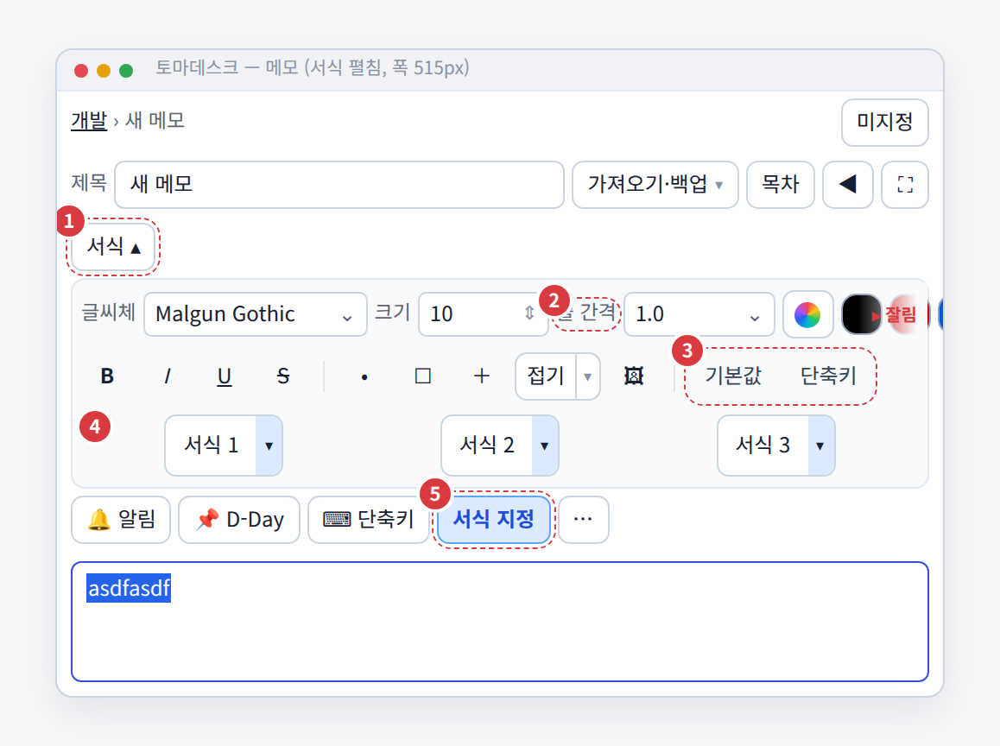
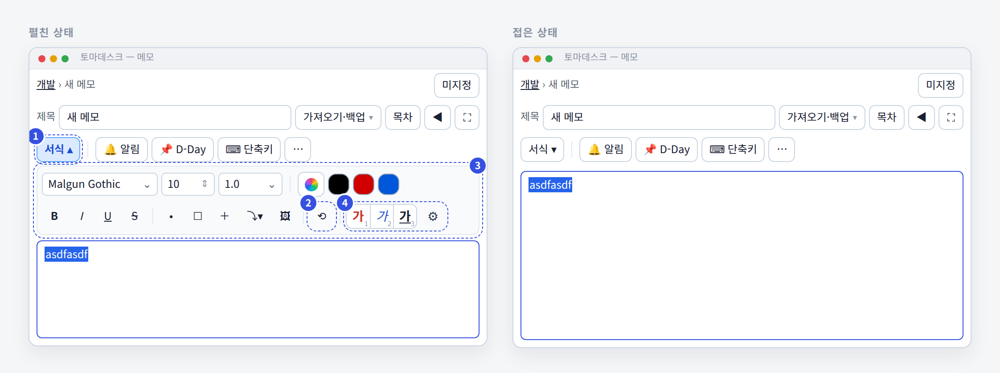
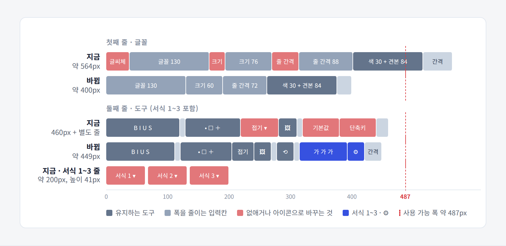
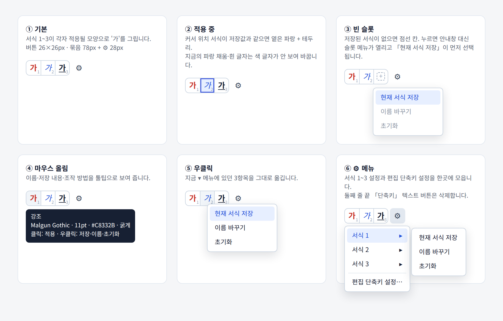
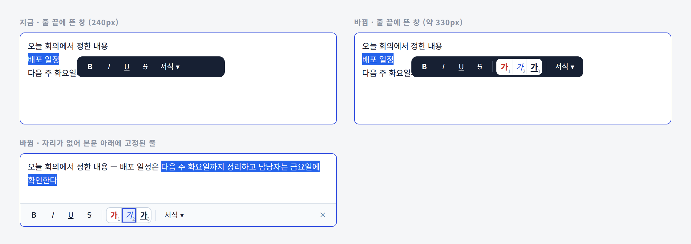

`● TOMADESK · 서식 1~3 샘플 버튼 · 서식 토글 이동 구현 계획`

# 서식 패널 머리 영역 구현 계획

> 2026-09-19 상태 정리: 아래는 당시 설계/검증 이력이다. Q4·Q5는 A로 확정·구현되었으며 재승인 질문이 아니다. 최신 상태는 `../1._PROJECT_PLAN.md` 상단과 `../3._TODO.md`를 따른다.
### 서식 1~3은 '가' 샘플 버튼으로 줄이고, 서식 토글은 칩 줄 맨 왼쪽으로 옮긴다

지금 compact 편집기에서 서식을 펼치면 **머리 영역이 5줄**(서식 헤더 · 글꼴 줄 · 도구 줄 · 서식 1~3 줄 · 칩 줄)이 됩니다. 폭 515px 창에서는 글꼴 줄에 **약 564px**이 필요해 색 견본이 잘립니다. 이 문서는 지난 제안에서 고른 **Q1-A · Q2-A · Q3-A** 조합을 실제 코드에 옮기는 순서를 정리합니다. 파일·함수·줄 번호는 2026-09-15 현재 코드를 직접 읽고 적었습니다. **저장 형식은 바꾸지 않습니다.**

| 대상 | 근거 | 스택 | 작성일 |
|---|---|---|---|
| 메모 편집기 › 서식 패널 · 칩 줄 · 선택 서식 창 | 실행 화면 캡처 · `editor.py` · `text_format_toolbar.py` · `note_property_bar.py` · `text_format_range_bar.py` 코드 확인 | Python · PyQt6 | 2026-09-15 |

**목차** — [00 확정한 결정](#00--확정한-결정) · [01 현재 코드 진단](#01--현재-코드-진단) · [02 목표 화면](#02--목표-화면) · [03 단계별 구현](#03--단계별-구현) · [04 테스트](#04--테스트) · [05 보존·제외](#05--보존제외) · [06 결정할 것](#06--결정할-것)

---

## 00 — 확정한 결정

| # | 항목 | 확정안 |
|---|---|---|
| Q1 | 서식 1~3 줄이는 방식 | **A. 샘플 글자 버튼** — 버튼마다 그 서식이 적용된 `가`를 그린다. 26×26px 3개 + `⚙` |
| Q2 | 서식 토글 위치 | **A. 칩 줄 맨 왼쪽** — `서식 ▾`를 칩 줄 첫 자리에 두고, 패널은 칩 줄 **아래**에서 연다 (보완계획 D-1과 같음) |
| Q3 | 선택 서식 창 | **A. 넣는다** — 글자를 선택했을 때 뜨는 창에도 같은 `가 가 가` 묶음을 둔다 |

> 이 계획은 [메모편집_보완계획](../8._메모편집_보완계획/메모편집_보완계획.md) **단계 C의 C1·C3**(서식 토글 위치, 서식 1~3, `⚙`)을 구체화해 **대체**합니다. C2의 "툴바 2줄" 요구는 이 계획의 단계 C로 함께 처리합니다. C4(카테고리 칩)와 백링크 버튼은 건드리지 않습니다.

---

## 01 — 현재 코드 진단

현재 compact 레이아웃, 서식을 펼친 상태를 515px 폭으로 다시 그린 그림입니다. 번호는 아래 목록과 같습니다.

1. **서식 헤더가 한 줄을 통째로 씀** — `editor.py` `_install_compact_layout()` 1328–1345행이 `format_header` 위젯을 따로 만들고 그 안에 `format_expand_button` 하나만 넣습니다. 패널을 접어도 이 줄은 남습니다.
2. **글꼴 줄 라벨 3개 때문에 폭이 넘침** — `text_format_toolbar.py` 74·76·78행의 `QLabel("글씨체")` `QLabel("크기")` `QLabel("줄 간격")`와 고정 폭(글꼴 130 · 크기 76 · 줄 간격 88)을 더하면 약 564px입니다. 사용할 수 있는 폭은 약 487px이라 파랑 견본이 잘립니다.
3. **도구 줄 끝에 텍스트 버튼 2개** — `기본값`(166행)과 `단축키`(`editor.py` 304–306행, `set_auxiliary_button()`). `단축키`는 `노트 단축키 설정` 창을 열어 칩 줄의 `⌨ 단축키`와 이름이 겹칩니다(보완계획 F8).
4. **서식 1~3이 별도 줄** — 버튼은 `QToolButton` + `MenuButtonPopup`(171행 이후)입니다. `move_presets_to()`로 `preset_host`에 옮겨지고, compact에서는 1352–1353행이 이 `preset_host`를 `format_panel`에 **한 줄로** 추가합니다. 버튼 폭은 `_equalize_preset_widths()`가 가장 긴 이름에 맞추고, 높이는 41px로 흩어져 보입니다(F11).
5. **같은 패널을 여는 토글이 2개** — `note_property_bar.py` `ORDER`의 `"format"`(`서식 지정` 칩)이 `format_expand_button`과 같은 `format_panel`을 여닫습니다. 칩 줄이 `format_panel` **뒤에** 삽입되어(1357–1359행) 펼칠 때마다 칩이 내려갑니다.

**그림에 없는 문제 두 가지**
- `_toggle_property_page()`(1411행)는 알림·D-Day 페이지를 열 때 `format_panel`을 닫지 않습니다. 서식과 알림 서랍이 **동시에 열릴 수 있습니다.**
- 선택 서식 창 `TextFormatRangeBar`는 `B I U S` + `서식 ▾`(72px) + `×`만 있습니다. 줄 끝에 뜰 때 폭은 118행 `width = 240`으로 고정입니다.

**그대로 쓰는 것**

| 항목 | 현재 값 | 이번 계획에서 |
|---|---|---|
| 서식 저장 키 | `text_format_preset_{n}` (JSON: `family` `size` `color` `bold` `italic` `underline` `strike`) | 변경 없음 |
| 이름 저장 키 | `text_format_preset_name_{n}` (최대 12자) | 변경 없음 — 툴팁·메뉴에만 표시 |
| 슬롯 수 | `PRESET_COUNT = 4`, `VISIBLE_PRESET_COUNT = 3` | 변경 없음 (4번 슬롯 숨김 유지) |
| 적용 로직 | `apply_preset()` · `_current_format_matches_preset()` · `_refresh_preset_buttons()` | 그대로 호출 |
| 슬롯 메뉴 | 현재 서식 저장 · 이름 바꾸기 · 초기화 | 항목 그대로, 여는 곳만 우클릭·`⚙`로 이동 |

---

## 02 — 목표 화면

서식을 펼쳐도 알림·D-Day·단축키·⋯ 칩은 같은 자리에 있고, 패널은 칩 줄과 본문 사이에서만 열리고 닫힙니다.

1. **`서식 ▾` 칩** — 칩 줄 첫 자리. 펼치면 `서식 ▴` + 눌린 모양. 알림·D-Day 서랍과 같은 자리를 쓰며 **하나만 열립니다.**
2. **`⟲` 기본값** — 텍스트 버튼을 28px 아이콘으로 바꿉니다. 툴팁 문구는 그대로 둡니다.
3. **패널 위치** — `property_chips` 바로 아래. 서식 헤더 줄이 사라집니다.
4. **`가 가 가` + `⚙`** — 도구 줄 끝. `⚙`에 서식 1~3 설정과 편집 단축키 설정을 모읍니다.

버튼 28px · 줄 간격 2px 기준 추정치입니다. 붉은 점선이 사용 가능한 폭(창 515 − 편집기 여백 16 − 패널 여백 10 − 테두리 2 ≈ 487px)입니다.

> **펼침: 5줄 → 3줄 · 접힘: 2줄 → 1줄**
> 글꼴 줄 약 564px → 약 400px · 도구 줄 약 460px(+서식 1~3 줄) → 약 449px 한 줄

---

## 03 — 단계별 구현

단계마다 **해당 테스트 + 전체 회귀**를 통과해야 다음 단계로 넘어갑니다. 단계 A는 다른 단계와 독립적이라 먼저 합니다.

### 단계 A — 서식 토글을 칩 줄로 옮기기 `Q2`

| 파일 · 위치 | 변경 |
|---|---|
| `alert_notes/note_property_bar.py` `ORDER` · `LABELS` | `ORDER = ("format", "reminder", "deadline", "hotkey", "other")`. `LABELS["format"] = "서식 ▾"` |
| 같은 파일 `__init__` 버튼 루프 | `format` 버튼 뒤에 세로 구분선 `QFrame(VLine)`(objectName `memoChipSeparator`) 하나 추가 |
| 같은 파일 `set_summary()` | `name == "format"`이면 접근성 이름을 `서식 도구 펼치기` / `서식 도구 접기`로 따로 설정(지금은 모든 칩에 "… 설정 열기"를 붙임) |
| `alert_notes/editor.py` `_install_compact_layout()` 1328–1345행 | `format_header`와 별도 `format_expand_button` 생성 코드 **삭제** |
| 같은 함수 · 칩 생성 직후 | `self.format_expand_button = self.property_chips.buttons["format"]` 별칭. 기존 테스트와 사용성 스크립트가 이 이름을 씁니다 |
| 같은 함수 · 삽입 순서 | `property_chips` → `property_panel` → `format_panel` → `body_host` 순서가 되도록 `format_panel` 삽입을 칩·속성 패널 **뒤**로 옮김 |
| `editor.py` `_toggle_property_page()` 1411행 | `format` 분기의 `format_expand_button.setChecked()` 삭제(같은 버튼이 됨). 다른 페이지를 열 때 `format_panel`이 열려 있으면 `_toggle_format_panel(False)`를 먼저 호출 |
| `editor.py` `_toggle_format_panel()` 1432행 | 버튼 글자를 직접 바꾸지 않고 `_refresh_property_chips()` 호출 |
| `editor.py` `_refresh_property_chips()` 1477행 | `set_summary("format", "서식 ▴" if 열림 else "서식 ▾", 열림)` |
| `editor.py` `close_compact_panel()` 1443행 | `format_expand_button.setChecked(False)` → `property_chips.set_active(None)` |

**완료 기준**
- 서식 칩을 5번 여닫아도 `알림` 칩의 창 기준 y좌표 차이 **0px**
- 서식을 연 상태에서 알림 칩을 누르면 `format_panel` 숨김, 반대도 같음
- `Esc`(`close_compact_panel`)로 열린 서랍이 닫히고 모든 칩 체크 해제
- classic 레이아웃(`memo_editor_layout = classic`)은 화면 변화 없음

### 단계 B — 서식 1~3 샘플 버튼 `Q1`

샘플 버튼의 여섯 상태입니다. 우클릭 메뉴는 지금 ▾ 메뉴의 3항목을 그대로 옮기고, ⚙에는 슬롯별 하위 메뉴와 편집 단축키 설정을 둡니다.

**B-1 새 파일 `alert_notes/format_preset_strip.py`**

| 이름 | 역할 |
|---|---|
| `preset_sample_icon(data, slot, size=QSize(22, 22)) -> QIcon` | `QPainter`로 `가`를 그린다. 글자 크기는 **14px 고정**(저장된 pt는 툴팁으로), `family` · `bold` · `italic` · `underline` · `strike` · `color` 반영. 오른쪽 아래에 슬롯 번호 7px `#94a3b8`. 색 휘도가 0.8 이상(흰색 계열)이면 `#94a3b8` 1px 외곽선을 둘러 배경에 묻히지 않게 함. `data is None`이면 점선 사각형 + `+` |
| `class PresetStrip(QWidget)` · `__init__(parent, button_size=26)` | 버튼 3개를 간격 0으로 붙인 묶음. objectName `formatPresetStrip`. `buttons: dict[int, QToolButton]` |
| 시그널 `apply_requested(int)` · `menu_requested(int, QPoint)` | 클릭 → 적용, 우클릭(`CustomContextMenu`) → 슬롯 메뉴 |
| `reload(store)` · `set_active(slot \| None)` | 아이콘·툴팁 갱신, 체크 상태 동기 |
| 버튼 공통 | objectName `formatPresetSample`, `setFixedSize(26, 26)`(선택 창은 24), `setCheckable(True)`, `ToolButtonIconOnly`, `setAutoRaise(True)` |
| 툴팁 | `{이름 또는 서식 N}` / `preset_summary()` 결과 / `클릭: 적용 · 우클릭: 저장·이름·초기화` |

**B-2 `alert_notes/text_format_toolbar.py`**

| 위치 | 변경 |
|---|---|
| `_build_ui()` 171행 이후 서식 버튼 루프 | `QToolButton` + `MenuButtonPopup` 생성 코드 → `self.preset_strip = PresetStrip(self)`. `self.preset_buttons = self.preset_strip.buttons`로 기존 이름 유지 |
| 새 메서드 `slot_menu(slot) -> QMenu` | 현재 서식 저장 · 이름 바꾸기 · 초기화. 우클릭·`⚙`·선택 창이 모두 이 함수를 씀 |
| 새 버튼 `self.preset_settings_button` | `QToolButton` `⚙`, objectName `formatPresetSettings`, `InstantPopup`. 메뉴: `서식 1 ▸` `서식 2 ▸` `서식 3 ▸`(각각 `slot_menu`) · 구분선 · `편집 단축키 설정…` |
| 새 시그널 | `shortcut_settings_requested()` · `presets_changed()` · `active_preset_changed(object)` |
| `apply_preset()` 378행 | 빈 슬롯이면 `QMessageBox.information` 대신 버튼 아래에 `slot_menu(slot)`을 열고 `현재 서식 저장`에 초점 |
| `reload_presets()` 405행 | `setText()` 대신 `preset_strip.reload(store)`. 끝에서 `presets_changed.emit()` |
| `_refresh_preset_buttons()` 418행 | 체크 계산은 그대로. 결과를 `preset_strip.set_active()`와 `active_preset_changed.emit()`으로 전달 |
| `_equalize_preset_widths()` 247행 | **삭제**(고정 26px) |
| `move_presets_to()` 232행 | 개별 버튼 대신 `preset_strip` 통째로 옮김. **classic에서만** 호출 |
| `set_auxiliary_button()` 239행 | **삭제** |

**B-3 `alert_notes/editor.py`**

| 위치 | 변경 |
|---|---|
| 281–286행 `preset_host` · `move_presets_to()` | `layout_mode == "classic"`일 때만 실행. compact에서는 `preset_strip`이 도구 줄에 남음 |
| 304–306행 `shortcut_settings_button` | 버튼 생성·`set_auxiliary_button()` 삭제. `format_toolbar.shortcut_settings_requested.connect(self._open_shortcut_settings)` |
| `_install_compact_layout()` 1352–1353행 | `preset_host`를 `format_panel`에 넣는 두 줄 삭제 |

**B-4 `ui_theme.py`**
- `QToolButton#formatPresetButton` 규칙(575·598–602행) → `#formatPresetSample`로 교체
  - 기본: `background:@surface; border:1px solid #cbd5e1;` 가운데 버튼은 좌우 테두리 공유
  - 눌린 상태 `:checked`: `background:#e7efff; border:1.5px solid @blue;` — **지금의 파랑 채움 + 흰 글자는 색 글자가 안 보여서 바꿈**
  - `::menu-indicator { image:none; width:0; }`
- `QToolButton#formatPresetSettings`는 `formatToolButton`과 같은 크기·모양

**완료 기준**
- 저장된 서식 1~3이 **업데이트 전과 같은 데이터로** 적용됨(기존 사용자 설정 그대로)
- 서식 적용 1클릭, 이탤릭을 누르면 적용 표시 해제(기존 동작)
- 빈 슬롯 클릭 시 안내창이 뜨지 않고 슬롯 메뉴가 열림
- 이름을 12자로 바꿔도 버튼 폭 26px 그대로, 툴팁 첫 줄에 이름 표시
- `⚙ › 편집 단축키 설정…`이 `EditorShortcutSettingsDialog`를 엶

### 단계 C — 서식 도구를 두 줄에 맞추기

| 파일 · 위치 | 변경 |
|---|---|
| `text_format_toolbar.py` 74·76·78행 | `QLabel` 3개 삭제. 대신 `font_box` · `size_box` · `line_spacing_box`에 `setToolTip("글씨체")` 등과 `setAccessibleName()` |
| 66·69행 | `size_box` 76 → **60**, `line_spacing_box` 88 → **72** |
| 첫 줄 색 버튼 앞 | `_group_separator()` 하나 추가 |
| 20행 `TOOL_BUTTON_WIDTH` | 30 → **28** |
| 144행 `fold_button` | 글자 `접기` → 새 `_fold_icon()`(삼각형 + 가로줄) 아이콘, 폭 36px. `MenuButtonPopup`과 메뉴 2항목은 그대로 |
| 166행 `default_button` | 글자 `기본값` → `⟲` 아이콘, objectName `formatToolButton`, 28×28 |
| 둘째 줄 순서 | `B I U S` │ `• ☐ ＋ 접기 🖼` │ `⟲` │ `가 가 가` `⚙` ← stretch |
| `editor.py` 1350행 `format_layout` | 여백 5 → **4**. 툴바 `root.setSpacing(6)` → **4** |

**완료 기준**
- 편집기 폭 515px(compact)에서 두 줄 모두 `sizeHint().width() ≤ format_panel.contentsRect().width()`
- 보이는 모든 버튼·콤보가 잘리지 않음(`visibleRegion()`이 위젯 사각형 전체)
- 서식 펼침 시 칩 줄 아래~본문 위 추가 높이 **76px 이하**, 접힘 시 서식 관련 줄 **0줄**

### 단계 D — 선택 서식 창에 서식 1~3 넣기 `Q3`

줄 끝에 뜨는 어두운 창에서는 샘플 묶음에 흰 바탕을 깔아 색 글자가 보이게 합니다. 자리가 없으면 지금처럼 본문 아래 고정 줄로 내려갑니다.

| 파일 · 위치 | 변경 |
|---|---|
| `text_format_range_bar.py` `__init__` | 스타일 버튼 뒤에 구분선 + `self.preset_strip = PresetStrip(self, button_size=24)` + 구분선, 그 뒤 `서식 ▾` |
| `bind()` 59행 | `preset_strip.reload(toolbar.store)`. `toolbar.presets_changed` → `reload`, `toolbar.active_preset_changed` → `set_active` 연결 |
| 같은 곳 | `apply_requested` → `toolbar.apply_preset(slot)` 후 `editor.setFocus()`. `menu_requested` → `toolbar.slot_menu(slot).popup(pos)` |
| `_style()` 74행 | 떠 있는 어두운 창일 때 `QWidget#formatPresetStrip{background:white;border-radius:6px;}` 추가. 하단 고정 줄은 밝은 배경이라 기본 스타일 |
| `sync()` 118행 | `width = 240` → `width = self.sizeHint().width()`(약 330px). 줄 끝 공간이 모자라면 기존 `_candidate_clear()` 규칙대로 하단 고정 줄 사용 |

**완료 기준**
- 글자 선택 → 선택 창의 `가` 클릭 → 선택 범위에 서식 적용, 메인 패널 버튼도 체크
- 메인 패널에서 서식 1을 새로 저장하면 선택 창 아이콘도 즉시 바뀜
- 글자 범위 선택(`character_selection`)이나 블록 선택 중에는 기존처럼 창이 뜨지 않음
- 하단 고정 줄에서 `×`까지 잘리지 않음(편집기 폭 515px)

### 단계 E — 설명서 문구

| 파일 · 위치 | 변경 |
|---|---|
| `user_manual_content.py` 152행 | "아래 「서식 ▾」를 누릅니다" → "칩 줄 맨 왼쪽 「서식 ▾」를 누릅니다" |
| 156행 | "서식 1~3" 설명에 "각 버튼에 적용될 모양이 보이고, 우클릭으로 저장·이름·초기화" 추가 |
| 178행 | 「서식 ▾」 위치 문구 같은 방식으로 수정 |

---

## 04 — 테스트

### 고쳐야 하는 기존 테스트

| 파일 · 줄 | 지금 검사하는 것 | 바꿀 내용 |
|---|---|---|
| `test_memo_ui_compact.py` 172–176 | `ORDER`가 `reminder`로 시작 | `("format", "reminder", "deadline", "hotkey", "other")` |
| 같은 파일 177 | `format_header.y() < property_chips.y()` | `property_chips.y() < format_panel.y()` (펼친 뒤) |
| 같은 파일 180 | `format_expand_button.height() == 28` | 유지 + `format_expand_button is property_chips.buttons["format"]` |
| 같은 파일 188 | `preset_host.isVisible()` | `format_toolbar.preset_strip.isVisible()` |
| `test_alert_notes.py` 326–330 | `기본값` 다음 칸이 `단축키` 버튼 | `⚙` 메뉴에 `편집 단축키 설정…` 액션이 있고, 누르면 대화상자가 열림(대화상자 `exec` 패치) |
| `test_alert_notes.py` 508 | `editor.preset_layout.count() == 3` | compact: `preset_strip`이 `second_layout` 안에 있음 / classic 테스트는 따로 |
| `test_alert_notes.py` 527–529 | 서식 버튼 폭이 모두 같음 | 모두 26×26 |
| `8._메모편집_보완계획/test/memo_usability_test.py` 181–233 | `format_expand_button` · `shortcut_settings_button` 클릭 | 별칭으로 그대로 동작. `shortcut_settings_button` → `⚙` 메뉴 액션 트리거로 교체 |

### 새 테스트 `test_format_preset_strip.py`

| # | 시나리오 | 확인 |
|---|---|---|
| T1 | 빈 슬롯·저장 슬롯 아이콘 | 두 `QImage`가 다름. `#FFFFFF` 서식에도 회색 외곽선 픽셀 존재 |
| T2 | 클릭 적용 | `apply_preset(1)` 후 버튼 1 체크 → 이탤릭 클릭 → 해제 |
| T3 | 빈 슬롯 클릭 | `QMessageBox` 호출 0회, 슬롯 메뉴 표시 |
| T4 | 우클릭·⚙ 메뉴 | 슬롯 메뉴 3항목, ⚙ 메뉴에 하위 메뉴 3개 + `편집 단축키 설정…` |
| T5 | 이름 바꾸기 | 툴팁 첫 줄이 새 이름, 버튼 폭 26 |
| T6 | 선택 창 동기 | 서식 저장 → 선택 창 아이콘 `cacheKey` 변경, 선택 창에서 적용 → 메인 버튼 체크 |
| T7 | 폭 계약 | 편집기 폭 515·620·780px에서 두 줄 `sizeHint` ≤ 가용 폭, 잘린 위젯 0 |
| T8 | 칩 고정 | 서식 5회 여닫기 → 알림 칩 y 차이 0, 서랍 동시 열림 0 |
| T9 | 높이 | 접힘: 서식 관련 줄 0 / 펼침: 추가 높이 ≤ 76px |
| T10 | 저장 형식 | 업데이트 전 형식으로 저장한 설정 DB를 열어 서식 1~3 적용 결과 동일 |

**실제 창 체크리스트 (Windows, 배율 100·125·150%)**
- [ ] Malgun Gothic에서 도구 줄 끝 `⚙`까지 한 줄에 보임
- [ ] 흰색·연노랑으로 저장한 서식도 `가`가 보임
- [ ] 선택 서식 창이 줄 끝에 떠도 본문 글자를 가리지 않음
- [ ] 서식 ▾를 여닫아도 알림 칩이 움직이지 않음

---

## 05 — 보존·제외

**보존**
- 서식 저장 키·JSON 형식·이름 12자 제한, `PRESET_COUNT = 4`
- `FORMAT_SHORTCUTS`(굵게·기울임·색 단축키), 서식 적용 판정 로직
- classic 레이아웃의 서식 1~3 위치(본문 아래)
- 알림·D-Day·`⌨ 단축키`·`⋯` 칩 동작과 요약 표시

**제외**
- 선택 서식 창 전체 재구성(시안의 `서식 ▾`·접기 버튼 제거) — 별도 결정 후 진행
- 서식 1~3 전용 단축키 신설, 4번 슬롯 노출
- 어두운 테마

---

## 06 — 결정할 것

구현 중에 정해야 할 작은 선택이 두 가지 남았습니다.

| # | 질문 | 선택지 |
|---|---|---|
| Q4 | 빈 슬롯을 눌렀을 때 | **A. 슬롯 메뉴를 바로 연다 (추천)** — 「현재 서식 저장」을 한 번 더 누르면 끝. 안내창 닫기 1클릭이 줄어듦   B. 지금처럼 안내창 표시 |
| Q5 | 선택 창이 넓어져(240 → 약 330px) 줄 끝에 못 뜨는 경우가 늘어남 | **A. 그대로 두고 하단 고정 줄로 내려보냄 (추천)** — 서식 1~3이 항상 같은 모양으로 보임   B. 줄 끝 자리가 240~330px뿐이면 서식 1~3만 숨기고 줄 끝에 띄움 |

Q4·Q5는 모두 A로 확정되었다. 현재 승인 대기 질문이 아니며 당시 대안은 결정 이력으로 남긴다.
