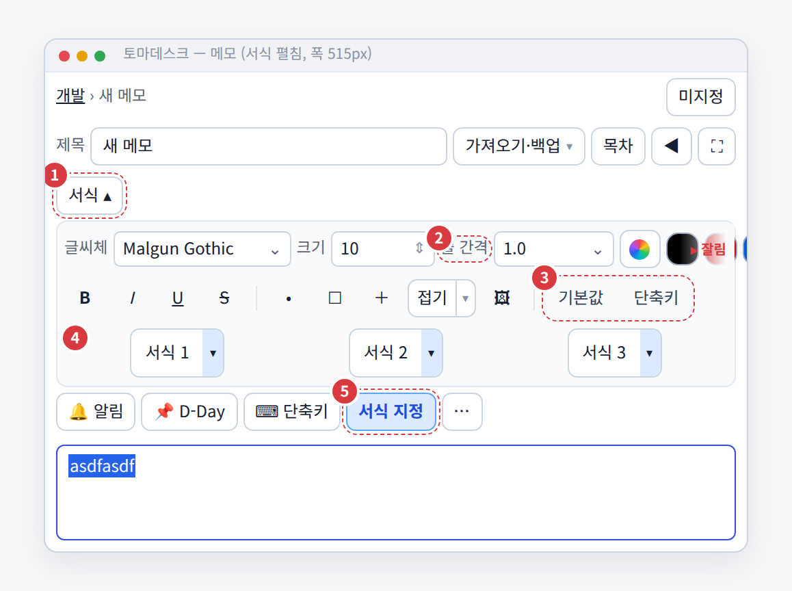
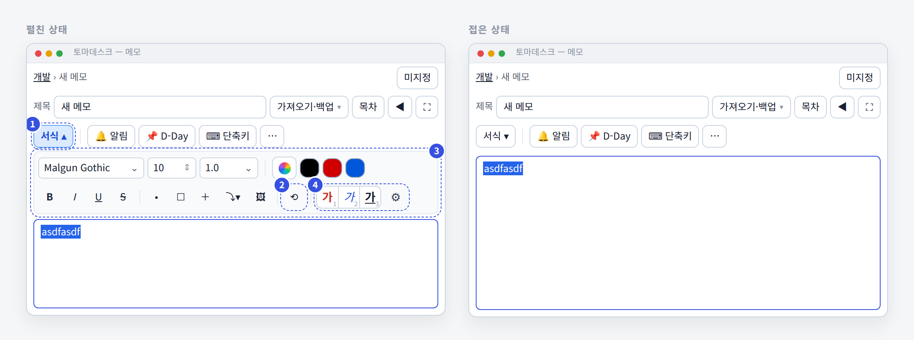
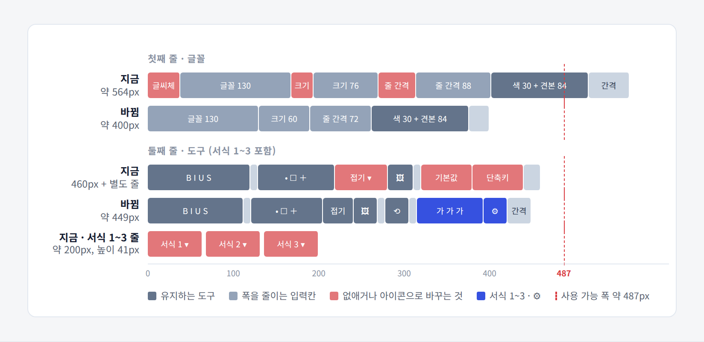
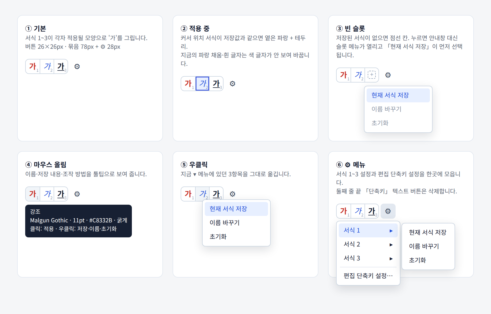
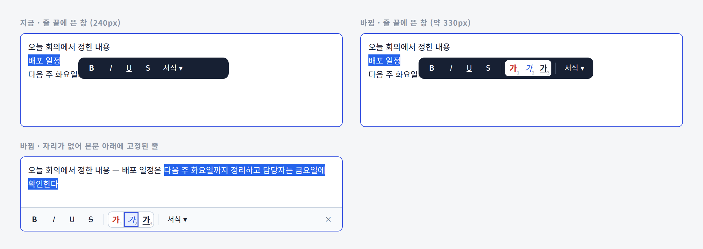

# UI 디자인 지침 — 도구 영역을 좁고 흔들리지 않게

> 툴바·서식 패널·속성 칩·설정 서랍처럼 **본문 위나 옆에 붙는 조작 영역**을 설계하거나 고칠 때 따르는 규칙입니다.
> 데스크톱 앱(PyQt·WPF·Electron 등)과 웹 앱 모두에 적용합니다. 사람이 읽는 설계 기준이자, AI 코딩 도구에 넘기는 작업 지침(`AGENTS.md`·`CLAUDE.md` 등)으로 그대로 붙여 쓸 수 있게 썼습니다.

---

## 0. 방향 전환 한 줄 요약

| 버리는 방향 (이전) | 따르는 방향 (이후) |
|---|---|
| 기능 하나당 줄 하나, 이름표 붙은 입력칸 | **줄 예산과 폭 예산**을 먼저 정하고 그 안에 넣는다 |
| 접기 버튼이 자기가 숨기는 영역 안에 있음 | 토글은 **늘 보이는 줄**에, 서랍은 그 **아래**에서 열린다 |
| 같은 기능을 여는 버튼이 여러 곳 | 기능 하나에 **진입점 하나** |
| 프리셋은 `이름 ▾` 버튼을 흩어 배치 | 프리셋은 **결과 미리보기 버튼**을 붙여서 배치 |
| 버튼마다 `▾` 설정 메뉴 | 묶음마다 **`⚙` 하나**, 개별 관리는 우클릭 |
| 안내창으로 막고 설명 | 누르면 **바로 할 수 있는 행동**을 보여 준다 |

이전 방향의 사례. ① 토글 하나가 한 줄을 차지 ② 이름표 때문에 줄이 넘침 ③ 텍스트 버튼과 중복 진입점 ④ 프리셋이 따로 한 줄에 흩어짐 ⑤ 같은 패널을 여는 두 번째 토글.

이후 방향의 사례. 토글은 칩 줄 첫 자리, 패널은 칩 줄 아래 두 줄, 프리셋은 샘플 버튼 묶음 + ⚙. 접으면 조작 영역이 한 줄로 줄어듭니다.

---

## 1. 핵심 규칙 12개

작업 전후로 이 목록만 확인해도 대부분의 문제를 막을 수 있습니다.

1. **줄 예산을 먼저 정한다.** 접힘 1줄, 펼침 +2줄 이내를 기본으로 한다.
2. **폭 예산을 먼저 정한다.** 가장 좁은 지원 폭에서 줄마다 `요소 폭 합 + 간격 ≤ 가용 폭`이어야 한다.
3. **버튼 하나만 있는 줄을 만들지 않는다.** 다른 줄의 첫 자리나 끝자리에 합친다.
4. **토글은 자기가 숨기는 영역 밖, 늘 보이는 줄에 둔다.**
5. **펼치고 접어도 다른 조작 요소의 위치가 0px 움직여야 한다.** 서랍은 트리거 줄 아래에서 연다.
6. **같은 자리를 쓰는 서랍은 한 번에 하나만 열린다.**
7. **기능 하나에 보이는 진입점은 하나다.** 단축키·우클릭은 보조로만 허용한다.
8. **값만 보고 뜻을 알 수 있는 입력칸에는 이름표를 붙이지 않는다.** 이름은 툴팁과 접근성 이름으로 옮긴다.
9. **반복 선택지(프리셋·색·스타일)는 결과를 미리 보여 주는 고정 크기 버튼으로 만든다.**
10. **관리 기능(저장·이름·초기화)은 우클릭과 묶음당 `⚙` 하나로 모은다.**
11. **적용 중 표시는 버튼 안의 내용을 가리지 않는다.** 채움 대신 옅은 배경 + 테두리.
12. **같은 기능이 여러 화면에 나오면 같은 컴포넌트를 재사용하고 상태를 동기화한다.**

---

## 2. 공간 규칙

### 2-1. 줄 예산

| 상태 | 조작 영역 줄 수 | 비고 |
|---|---|---|
| 접힘 | **1줄** | 속성 칩·토글이 함께 쓰는 줄 |
| 펼침 | **1줄 + 2줄 이하** | 서랍 내용은 최대 2줄. 넘치면 3-1의 순서대로 줄인다 |
| 본문 비율 | 펼침 상태에서도 본문이 편집 영역 높이의 **70% 이상** | 화면이 낮은 창에서 확인 |

- 하지 말 것: 토글 하나, 프리셋 3개처럼 **요소 몇 개만 담은 줄**
- 할 것: 새 요소가 생기면 먼저 **기존 줄의 빈 자리**를 찾는다. 새 줄은 마지막 수단이다

### 2-2. 폭 예산

1. 지원하는 **가장 좁은 폭**을 정한다(예: 패널 515px).
2. 가용 폭을 계산한다: `창 폭 − 바깥 여백 − 패널 여백 − 테두리`.
3. 줄마다 요소 폭을 표로 적는다. 합이 가용 폭을 넘으면 설계를 고친다.
4. 줄 끝에는 **stretch(남는 공간 흡수)** 를 둔다. 없으면 남는 폭이 요소 사이로 퍼져 버튼이 흩어져 보인다.

폭 예산 그림 사례. 붉게 칠한 요소(이름표·텍스트 버튼)를 없애거나 아이콘으로 바꿔 두 줄 모두 가용 폭(점선) 안에 넣었습니다.

### 2-3. 크기 체계

| 요소 | 기준 | 규칙 |
|---|---|---|
| 아이콘 버튼 | 28 × 28px | 한 줄 안의 아이콘 버튼은 모두 같은 크기 |
| 프리셋 샘플 버튼 | 26 × 26px, 간격 0 | 붙여서 한 묶음으로 보이게 |
| 문맥 도구 안 버튼 | 24 × 24px | 떠 있는 창은 한 단계 작게 |
| 칩·텍스트 버튼 | 높이 28px | 폭은 내용에 맞추되 **최소화** |
| 입력칸 | 내용 최대 길이 기준 고정 폭 | 숫자 입력 60px, 짧은 선택 72px 정도에서 시작 |
| 묶음 구분 | 1px 세로선 + 좌우 4px | 테두리 상자 대신 선으로 나눈다 |

> 수치는 출발점입니다. 앱 배율(100·125·150%)과 글꼴에 맞춰 조정하되, **한 화면 안에서는 하나의 체계**만 씁니다.

---

## 3. 줄이는 순서

넘칠 때는 아래 순서대로 **위에서부터** 적용합니다. 앞 단계로 해결되면 멈춥니다.

| 순서 | 방법 | 예 |
|---|---|---|
| 1 | **중복 진입점 제거** | 같은 패널을 여는 칩과 버튼 중 하나 삭제 |
| 2 | **단독 줄 합치기** | 토글만 있는 줄 → 칩 줄 첫 자리 |
| 3 | **이름표 제거** | `크기 [10]` → `[10]` + 툴팁 "크기" |
| 4 | **텍스트 버튼 → 아이콘** | `기본값` → `⟲` |
| 5 | **입력칸 폭 축소** | 76px → 60px |
| 6 | **자주 쓰지 않는 기능 → 메뉴** | 설정·관리 → `⚙` 또는 `⋯` |
| 7 | **줄 추가** | 1~6으로도 안 될 때만 |

**하지 말 것:** 넘친다고 글꼴을 줄이거나, 버튼을 잘린 채로 두거나, 가로 스크롤을 넣는 것.

---

## 4. 토글과 서랍

| 규칙 | 설명 |
|---|---|
| 토글 위치 | 늘 보이는 줄(속성 칩 줄, 제목 줄 등)의 **첫 자리**. 다른 요소와는 세로선으로 구분 |
| 토글 표시 | 닫힘 `이름 ▾` · 열림 `이름 ▴` + 눌린 모양. 접근성 이름도 "펼치기/접기"로 바꾼다 |
| 서랍 위치 | 트리거 줄 **바로 아래**, 본문 위. 위쪽 요소를 밀어내지 않는다 |
| 한 번에 하나 | 같은 자리를 쓰는 서랍(서식·알림·속성 등)은 하나를 열면 나머지를 닫는다 |
| 닫기 | `Esc` 한 번에 열린 서랍이 닫히고 모든 토글의 눌림이 풀린다 |
| 흔들림 0 | 여닫기 전후로 트리거 줄 요소의 창 기준 y좌표 차이 0px |

**하지 말 것:** 접기 버튼을 접히는 영역 안에 두기 / 같은 서랍을 두 버튼이 여닫기 / 서랍을 트리거 **위**에 삽입하기

---

## 5. 진입점과 이름

- 기능 하나에 **보이는 버튼은 하나**. 단축키·우클릭·명령 팔레트는 보조 경로로 추가할 수 있다.
- **서로 다른 기능에 같은 이름을 쓰지 않는다.** 예: 칩 `⌨ 단축키`(이 메모를 여는 전역 단축키)와 툴바 `단축키`(편집 단축키 설정 창)가 공존하면 한쪽을 `⚙ › 편집 단축키 설정…`처럼 구체적인 이름으로 옮긴다.
- 버튼 이름은 **사용자가 얻는 결과**로 짓는다(`서식 지정`보다 `서식 ▾`, `초기화`보다 `서식 비우기`).
- 기존 코드·테스트가 옛 위젯 이름을 쓰면, 새 위젯에 **별칭**을 걸어 호환을 유지한다.

---

## 6. 프리셋·반복 선택지

프리셋 샘플 버튼의 여섯 상태 사례: 기본 · 적용 중 · 빈 칸 · 마우스 올림 · 우클릭 · ⚙ 메뉴.

| 항목 | 규칙 |
|---|---|
| 모양 | 이름 대신 **적용 결과의 샘플**(서식이면 적용된 글자, 색이면 색 칩, 레이아웃이면 축소 도식) |
| 크기 | 고정. 사용자가 이름을 길게 바꿔도 폭이 변하지 않는다 |
| 구분 | 모서리 작은 번호(순서·단축키와 대응)는 허용. 이름은 툴팁 첫 줄 |
| 조작 | 클릭 = 적용(1클릭). 우클릭 = 그 칸의 관리 메뉴 |
| 설정 | 묶음 끝 `⚙` 하나: 칸별 하위 메뉴 + 관련 설정 창 |
| 빈 칸 | 점선 + `+`. 누르면 안내창 대신 **저장 메뉴를 바로 연다** |
| 대비 | 샘플이 배경과 비슷한 색(흰색·연노랑 등)이면 회색 외곽선을 둘러 보이게 한다 |
| 툴팁 | `이름` / `저장된 내용 요약` / `클릭: 적용 · 우클릭: 관리` |
| 데이터 | UI만 바꾸고 **저장 형식은 유지**한다 |

**선택 기준 — 샘플 버튼이 맞지 않는 경우**

| 상황 | 대신 쓸 형태 |
|---|---|
| 선택지가 5개 이상이거나 계속 늘어난다 | 미리보기가 있는 드롭다운(메뉴 안에 결과 모양으로 표시) |
| 한 가지를 반복해 쓰는 경우가 대부분이다 | 분할 버튼(앞: 마지막 사용 항목 적용 · 뒤 `▾`: 나머지) |
| 결과를 작은 크기로 그릴 수 없다 | 번호 + 짧은 이름 버튼, 폭 고정 |

---

## 7. 상태 표시

- **적용 중(checked)** 은 옅은 강조 배경 + 1~1.5px 강조 테두리. 강조색 채움 + 흰 글자는 버튼 안 색 정보를 지우므로 쓰지 않는다.
- **비어 있음**은 점선. **사용할 수 없음**은 흐리게 + 툴팁에 이유.
- **안내창(모달)으로 막지 않는다.** 필요한 행동을 바로 할 수 있는 메뉴·인라인 입력을 연다. 되돌릴 수 없는 삭제만 확인창을 쓴다.
- 요약 칩은 값이 있으면 값을 보여 준다(`🔔 09-16 14:00`), 없으면 기능 이름(`🔔 알림`).

---

## 8. 문맥 도구(선택 시 뜨는 창)

글자를 선택했을 때 뜨는 창에 프리셋 묶음을 재사용한 사례. 어두운 창에서는 묶음에 흰 바탕을 깔았습니다.

- 메인 도구와 **같은 컴포넌트**를 재사용한다. 복제해서 따로 그리지 않는다.
- 저장·적용 상태는 **시그널/이벤트로 양방향 동기화**한다(한쪽에서 저장하면 다른 쪽 샘플도 즉시 갱신).
- 창 배경이 어두우면 샘플 묶음에 밝은 바탕을 깔아 **원래 색 대비**를 유지한다.
- 폭은 고정값이 아니라 **내용 크기(sizeHint·scrollWidth)** 로 정한다. 떠 있을 자리가 없으면 본문 아래 고정 줄로 내려보낸다.
- 적용 후에는 **포커스를 본문으로 되돌린다.**
- 창이 본문 글자를 가리지 않는지 확인한다.

---

## 9. 설계안을 낼 때 포함할 것

UI 변경을 제안하거나 계획할 때 아래 네 가지를 함께 제출합니다.

1. **이전 화면 목업 + 빨간 번호 배지**: 문제 지점마다 번호, 아래에 `번호 — 한 줄 요약 — 설명 1~2문장`
2. **이후 화면 목업**: 펼침·접힘(또는 상태별) 나란히. 바뀐 지점은 강조색 번호 배지
3. **폭 예산 그림 또는 표**: 줄마다 이전/이후 폭, 가용 폭 기준선
4. **숫자 목표**: 줄 수(접힘/펼침), 절약 높이, 클릭 수, 위치 이동 0px

선택지가 둘 이상이면 **기준을 행, 옵션을 열**로 둔 표로 비교하고, 마지막에 사용자가 고를 항목을 나열합니다.

---

## 10. 검증

### 10-1. 자동 테스트 계약

화면 배치 규칙은 문장으로만 두지 말고 **테스트 하나씩**으로 고정합니다.

| 계약 | 검사 방법 (Qt 예 / 웹 예) |
|---|---|
| 줄마다 폭 초과 없음 | `row.sizeHint().width() <= panel.contentsRect().width()` / `el.scrollWidth <= el.clientWidth` |
| 잘린 요소 0 | 보이는 모든 버튼의 `visibleRegion()`이 위젯 사각형 전체 / `getBoundingClientRect()`가 부모 안 |
| 글자 잘림 0 | `fontMetrics().horizontalAdvance(text) <= 가용 폭` / `scrollWidth <= clientWidth` |
| 흔들림 0 | 토글 5회 전후 기준 요소 `mapTo(window, QPoint()).y()` 동일 / `offsetTop` 동일 |
| 서랍 하나만 | 서랍 A를 열면 B의 `isVisible()`이 False |
| 1클릭 적용 | 프리셋 클릭 한 번 후 서식 적용·체크 표시 |
| 모달 없음 | 빈 칸 클릭 시 메시지 박스 호출 0회(패치로 확인) |
| 동기화 | 메인에서 저장 → 문맥 도구 아이콘 변경 |
| 저장 형식 유지 | 이전 버전 설정 파일로 열어 결과 동일 |

- 폭 **3종 이상**(가장 좁은 폭 · 기본 폭 · 넓은 폭) × 배율 **3종**(100·125·150%)에서 실행합니다.

### 10-2. 실제 창 체크리스트

- [ ] 가장 좁은 폭에서 모든 버튼·입력칸이 한눈에 보이고 잘리지 않는다
- [ ] 토글을 여러 번 여닫아도 주변 요소가 움직이지 않는다
- [ ] 같은 기능을 여는 버튼이 화면에 두 개 이상 없다
- [ ] 이름표를 뺀 입력칸에 마우스를 올리면 이름이 보인다
- [ ] 프리셋은 한 번 클릭으로 적용되고, 흰색 계열 프리셋도 샘플이 보인다
- [ ] 문맥 도구에서 적용한 결과가 메인 도구 표시와 일치한다
- [ ] 키보드만으로 토글 열기 → 도구 이동 → `Esc` 닫기가 된다

---

## 11. 예외

- **처음 쓰는 사람이 뜻을 추측할 수 없는 값**(예: `1.0`만 보이는 줄 간격이 헷갈리는 사용자층)은 이름표 대신 **아이콘 접두**(`≡ 1.0`)를 붙인다. 그래도 모호하면 이름표를 유지한다.
- **안전과 관련된 조작**(삭제·덮어쓰기)은 공간을 아끼려고 메뉴 깊이 숨기지 않는다.
- **넓은 화면 전용 레이아웃**이 따로 있으면, 이 지침은 가장 좁은 레이아웃에 먼저 적용하고 넓은 레이아웃은 그 결과를 늘려서 쓴다.
- 기존 사용자의 **습관이 강한 위치**(수년간 같은 자리에 있던 버튼)를 옮길 때는 한 버전 동안 옛 자리에서 새 자리를 알려 주는 안내를 둔다.
