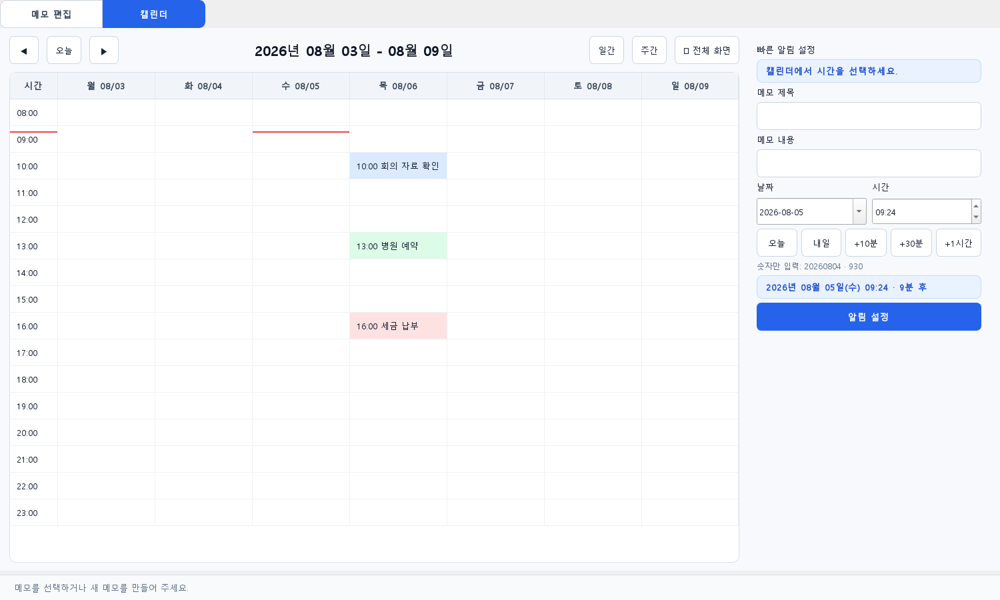

# Markdown(.md) 작성 매뉴얼

이 문서는 이 프로젝트의 안내·기록 문서를 쉽고 일관되게 작성하기 위한 간단한 기준입니다. `.md` 파일은 일반 텍스트라서 VS Code, 메모장 등으로 열 수 있고 GitHub·VS Code 미리 보기에서 서식이 적용됩니다.

## 1. 이 프로젝트에서 쓰는 문서

| 문서                                | 언제 수정하나                               | 담는 내용                        |
| ----------------------------------- | ------------------------------------------- | -------------------------------- |
| [PROJECT_INDEX.md](PROJECT_INDEX.md) | 실행 방법·중요 경로·현재 상태가 달라질 때 | 프로젝트 안내의 첫 화면 |
| [WORK_LOG.md](WORK_LOG.md) | 작업이 끝났을 때 | 요청, 실제 처리, 검증, 배포 여부 |
| [TODO.md](TODO.md) | 새 할 일이 생기거나 완료됐을 때 | 아직 남은 작업과 확인 항목 |
| [DECISIONS.md](DECISIONS.md) | 나중에 이유를 알아야 할 선택을 했을 때 | 결정, 이유, 호환성 기준 |
| [ALERT_NOTES_UI_REVIEW.md](ALERT_NOTES_UI_REVIEW.md) | UI 검토 근거가 필요할 때 | 화면 검토 항목과 최종 판정 |

같은 완료 내역을 여러 문서에 반복하지 않습니다. `WORK_LOG`에는 작업 결과, `DECISIONS`에는 장기적으로 보존할 선택 이유, `TODO`에는 남은 일만 적습니다. 완료된 TODO는 체크 항목으로 계속 쌓아 두지 않고 결과를 `WORK_LOG`에 반영한 뒤 제거합니다.

### 작업 기록 기본 형식

```md
## YYYY-MM-DD 작업명

### 요청과 목표
- 사용자가 요청한 내용 또는 해결할 문제

### 처리
- 실제로 변경하거나 수행한 내용

### 검증과 배포
- 테스트, 확인 결과, 남은 제한사항, EXE 생성 여부
```

## 2. 바로가기(링크) 만들기

### 같은 폴더의 문서 연결

대괄호에는 화면에 보일 이름, 소괄호에는 대상 파일명을 넣습니다.

```md
[통합 작업 기록](WORK_LOG.md)
[할 일](TODO.md)
```

### 하위 폴더 또는 상위 폴더 연결

```md
[알림 메모 UI 검토](ALERT_NOTES_UI_REVIEW.md)
[상위 프로젝트 목록](../../00_PROJECT_DASHBOARD/PROJECTS.md)
```

`../`는 한 단계 위 폴더를 뜻합니다. 파일명에 공백·한글이 있어도 그대로 작성하면 됩니다. 파일을 이동하거나 이름을 바꾸면 연결한 문서의 링크도 함께 수정합니다.

### 문서 안의 특정 제목으로 이동

대부분의 Markdown 뷰어는 제목을 자동 앵커로 만듭니다. 영문·숫자 제목은 다음처럼 연결할 수 있습니다.

```md
## Test

[테스트 항목으로 이동](#test)
```

한글·특수문자가 들어간 제목 앵커 규칙은 GitHub, VS Code 등 표시 프로그램마다 조금 다를 수 있습니다. 이 프로젝트에서는 제목 내부 링크보다 **파일 링크를 우선** 쓰고, 꼭 필요하면 VS Code 미리 보기와 실제 사용할 서비스에서 눌러 확인합니다.

### 웹사이트·파일·이미지 연결

```md
[VS Code Markdown 안내](https://code.visualstudio.com/docs/languages/markdown)
[넓은 화면 캡처](../output/alert_calendar_preview_wide.png)

```

`[이름](주소)`는 클릭 가능한 글자 링크이고, ``는 이미지를 문서에 표시합니다. Windows의 절대 경로(`D:\...`)는 다른 PC에서 깨지므로 프로젝트 안 문서에는 상대 경로를 권장합니다.

## 3. 접기·펼치기

### 제목 단위 접기: 편집할 때 가장 편리

VS Code는 Markdown 제목(`#`, `##`, `###`)을 접을 수 있습니다. 제목을 구조적으로 쓰면 긴 문서도 탐색하기 쉽습니다.

```md
# 큰 주제

## 작업 1

### 검증
```

커서를 제목 영역에 두고 다음 단축키를 사용합니다.

| 동작             | Windows VS Code 단축키 |
| ---------------- | ---------------------- |
| 현재 영역 접기   | `Ctrl+Shift+[`       |
| 현재 영역 펼치기 | `Ctrl+Shift+]`       |
| 모두 접기        | `Ctrl+K`, `Ctrl+0` |
| 모두 펼치기      | `Ctrl+K`, `Ctrl+J` |

### 읽는 사람도 누를 수 있는 접기

내용을 접은 상태로 문서에 넣고 싶으면 HTML의 `details`를 사용합니다. GitHub와 VS Code 미리 보기에서 보통 동작하지만, 일부 간단한 뷰어에서는 접히지 않을 수 있습니다.

```md
<details>
<summary>검증 명령과 결과 보기</summary>

- `python -m pytest -q` 실행
- 모든 테스트 통과

</details>
```

## 4. 자주 쓰는 Markdown 문법

```md
# 문서 제목
## 큰 항목
### 작은 항목

**굵게** / *기울임* / `파일명 또는 명령`

- 순서 없는 목록
  - 한 단계 하위 목록
1. 순서 있는 목록
2. 다음 항목

- [ ] 미완료 항목
- [x] 완료 항목

> 주의 또는 인용문

| 항목 | 내용 |
| --- | --- |
| 상태 | 완료 |
```

명령어·파일명·코드는 짧으면 `` `A_shortcut_launcher.py` ``, 여러 줄이면 아래처럼 작성합니다.

````md
```powershell
python .\A_shortcut_launcher.py
```
````

## 5. VS Code 추천 사용법과 단축키

이 프로젝트처럼 Python 소스와 문서를 함께 다룰 때는 **VS Code**를 우선 추천합니다. 이미 프로젝트 작업공간을 열어 코드·문서·검색을 한곳에서 처리할 수 있고, Markdown 미리 보기와 제목 접기를 기본 제공하기 때문입니다.

| 목적                         | 단축키                    |
| ---------------------------- | ------------------------- |
| Markdown 미리 보기 열기/닫기 | `Ctrl+Shift+V`          |
| 편집기 옆에 미리 보기        | `Ctrl+K`, `V`         |
| 파일 빠르게 열기             | `Ctrl+P`                |
| 프로젝트 전체 검색           | `Ctrl+Shift+F`          |
| 현재 문서 검색·바꾸기       | `Ctrl+F` / `Ctrl+H`   |
| 명령 찾기                    | `Ctrl+Shift+P`          |
| 줄 이동                      | `Alt+Up` / `Alt+Down` |
| 자동 줄 바꿈                 | `Alt+Z`                 |
| 문서 서식 정리               | `Shift+Alt+F`           |

제목을 작성하면 왼쪽 탐색기의 **Outline(개요)**에서 제목 목록을 보고 바로 이동할 수 있습니다. 저장은 `Ctrl+S`로 합니다. 링크는 미리 보기에서 눌러 실제 대상이 열리는지 확인합니다.

## 6. 편집 프로그램 추천

1. **VS Code — 이 프로젝트의 기본 추천**코드와 문서를 함께 편집하고, 프로젝트 전체 검색·미리 보기·제목 접기·상대 링크 확인을 한 번에 할 수 있습니다. 무료입니다.
2. **Obsidian — 개인 지식 정리 중심일 때**폴더 속 Markdown 문서를 노트처럼 연결해 읽고 싶을 때 좋습니다. Live Preview를 제공해 문법 기호를 덜 보이게 하며 작성할 수 있습니다.
3. **Typora — 문서만 깔끔하게 작성할 때**
   Markdown 기호 대신 완성된 문서처럼 보며 쓰고 싶을 때 적합합니다. 유료 제품(15일 체험 제공)이며, 프로젝트 전체 코드 검색·관리에는 VS Code보다 덜 적합합니다.

이 프로젝트의 `docs/`를 수정할 때는 VS Code를 사용하고, 개인 메모를 장기적으로 연결·축적할 때만 Obsidian을 별도로 사용하는 구성이 가장 단순합니다.

## 7. 작성 전·후 확인표

- 제목은 `#`부터 순서대로 사용했는가
- 같은 내용을 여러 문서에 반복하지 않았는가
- 링크 대상의 파일명·상대 경로가 맞는가
- 코드·명령어는 백틱 또는 코드 블록으로 구분했는가
- `WORK_LOG.md`에 요청·처리·검증·배포 여부를 한 번만 기록했는가
- `TODO.md`에는 실제로 남은 항목만 남겼는가
- 장기간 참고할 선택 이유만 `DECISIONS.md`에 남겼는가
- VS Code 미리 보기에서 표, 링크, 접기 영역이 읽기 좋은가

## 참고

- [VS Code Markdown 공식 안내](https://code.visualstudio.com/docs/languages/markdown)
- [VS Code 기본 단축키 공식 안내](https://code.visualstudio.com/docs/reference/default-keybindings)
- [VS Code 접기 기능 공식 안내](https://code.visualstudio.com/docs/editing/codebasics#_folding)
- [Obsidian 편집·읽기 모드 안내](https://help.obsidian.md/edit-and-read)
- [Typora 공식 기능·가격 안내](https://typora.io/)
