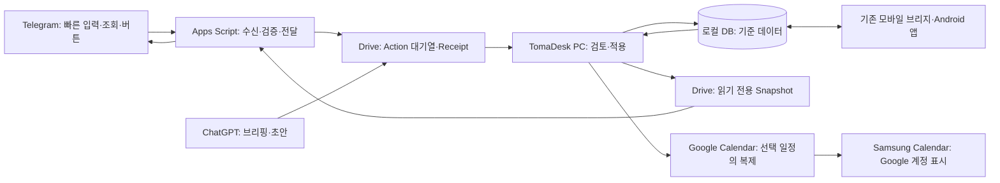

# TomaDesk 허브화: 전체 방향 및 개발 계획

> 최신 읽기용 계획과 화면 시안: [전체 계획 HTML](TOMADESK_HUB_MASTER_PLAN.html), [Telegram 상세 계획 HTML](TOMADESK_TELEGRAM_HUB_PLAN.html). 이 Markdown은 최초 초안이다. 유사 제품 비교와 Telegram 수신 방식 검증 게이트를 반영한 HTML을 기준으로 읽는다.

작성: 2026-10-02 · 상태: 구현 전 계획 · 범위: 개인용 TomaDesk와 외부 채널의 단계적 연결

> 이 문서는 **1. 허브화 전체 방향 및 개발 계획**이다. **2. Telegram 허브화 상세 계획**은 웹훅, 인증, Drive 구조, 명령, 버튼, 배포 절차를 별도 문서에서 정한다.

## 1. 목표와 사용 장면

TomaDesk를 일정·할 일·메모의 기준 저장소로 두고, 휴대폰에서 자주 하는 짧은 작업을 먼저 연결한다. 실제 사용에서 확인된 수요에 맞춰 조회, 완료, 알림, 캘린더, AI, 모바일앱을 확장한다.

| 사용 장면 | 원하는 결과 | 첫 구현 경로 |
| --- | --- | --- |
| 이동 중 `내일 오후 3시 병원` 입력 | PC 수집함에서 날짜·종류를 확인한 뒤 일정 등록 | Telegram → 작업 대기열 → Organizer |
| PC에서 할 일 등록 | 휴대폰에서 오늘 목록 조회 | TomaDesk → 읽기 전용 Snapshot → Telegram |
| 휴대폰에서 `[완료]` 선택 | PC의 해당 할 일을 정확히 한 번 완료 처리하고 결과 회신 | Telegram → Action → TomaDesk → Receipt |
| PC 일정 확인 | 삼성 휴대폰 달력에서 일정 조회 | TomaDesk → 선택한 Google Calendar → Samsung Calendar |
| 긴 메모 수정·첨부 | 기존 Android 앱에서 문서 작업 | 기존 모바일 브리지, 실사용 결과에 따라 개선 |

첫 실사용 목표는 **휴대폰 입력 1건이 PC에 안전하게 도착하고, 사용자가 검토한 뒤 한 번만 반영되며, 처리 결과를 휴대폰에서 확인하는 것**이다.

## 2. 현재 자산과 계획 변경

- `alert_notes/memo_organizer.py`에는 로컬 문장 분석기가 있고, `memo_organizer_store.py`에는 수집·검토·적용·완료 흐름이 있다. 자연어가 항상 확정 항목으로 분석되는 것은 아니다. `내일 3시 병원`과 `보고서 금요일까지`도 현재 분석기에서는 확인이 필요할 수 있으므로 자동 등록을 첫 목표로 두지 않는다. 현재 아이디어·정보는 Organizer 수집 기록에 남는다. 일반 메모 목록에 새 메모를 만드는 경로는 별도 연결이 필요하다.
- `alert_notes/sqlite_store.py`에는 DB 업그레이드 전 백업, 일정 저장, 메모의 `sync_id`·`revision`·UTC 변경 시각과 tombstone 기반이 있다. 새 연동 전에 실제 사용자 데이터의 백업·복원과 일정 식별·수정 경로를 따로 검증한다.
- `mobile_bridge/`와 `mobile/`에는 Tailscale을 이용한 로컬 네트워크 연결, 메모 동기화와 Android 앱이 이미 있다. `docs/MOBILE_RELEASE_NOTES.md`에 따르면 통합본의 실제 사용자 DB·휴대폰 연결은 아직 검증되지 않았다. 이 자산을 유지하되 허브화의 첫 실사용 채널은 Telegram으로 둔다.
- `1._PROJECT_PLAN.md`의 2026-09-18 계획은 Android 메모 조회를 우선하는 당시의 제안이다. 이 문서는 **허브화 우선순위를 갱신**한다. 기존 모바일 기능이나 기록을 삭제하거나 완료 처리하지 않는다.

## 3. 시스템 경계

**기준 데이터:** PC의 TomaDesk DB. Telegram은 조작 화면이고 Drive는 전달·조회용 저장소다. Telegram 메시지, Drive 파일, Google Calendar 이벤트가 서로 다른 최신본을 주장하지 않도록 각 데이터 종류의 소유권을 정한다.

| 데이터 | 기준 및 쓰기 규칙 | 외부로 내보내는 범위 |
| --- | --- | --- |
| 일정·할 일 | TomaDesk DB에서 최종 반영. 외부 변경은 Action으로 요청 | 허용된 제목·시각·상태만 Snapshot/Calendar에 투영 |
| 메모 | TomaDesk DB. 기존 Android 동기화는 현행 충돌 보존 계약 유지 | Telegram에는 짧은 입력과 허용된 미리보기만 |
| Action | 각 채널이 고유 ID를 부여한 불변 요청. TomaDesk가 적용 여부 결정 | 원문, 출처, 기준 시각, 처리 상태, 최소 결과 |
| Snapshot | TomaDesk가 생성하는 읽기 전용 파생물 | 생성 시각·버전·공개 허용 필드 포함 |
| Calendar 이벤트 | 처음에는 TomaDesk에서 선택한 일정의 단방향 복제 | 메모 본문·첨부·민감한 상세 설명 제외 |

PC가 꺼져 있어도 Telegram 입력은 대기열에 보관할 수 있다. PC의 확정 처리와 최신 조회는 PC가 다시 동기화한 뒤 가능하다. Telegram의 응답 문구는 `접수됨`, `검토 대기`, `반영됨`, `실패`를 구분하고 Snapshot에는 **마지막 갱신 시각**을 표시한다.

## 4. 공통 계약: Action, Receipt, Snapshot

채널별 구현 전에 최소 계약을 먼저 정한다. Telegram, ChatGPT, 향후 앱은 같은 계약을 사용하고 해석·검증·적용은 TomaDesk 쪽에서 한다.

| 계약 | 최소 필드 | 핵심 규칙 |
| --- | --- | --- |
| Action v1 | `schema_version`, `action_id`, `source`, `source_event_id`, `source_sent_at_utc`, `received_at_utc`, `base_timezone`, `kind`, `payload` | 최초에는 `capture_text`만. 원문은 수정하지 않고 보존. 출처별 중복 키를 유지 |
| Receipt v1 | `action_id`, `state`, `processed_at_utc`, `result_ref`, `error_code` | PC DB 커밋 뒤 `applied` 기록. 재시도해도 같은 결과 반환 |
| Snapshot v1 | `schema_version`, `generated_at_utc`, `source_revision`, `items`, `visibility` | 읽기 전용. 허용 필드만 포함. 업로드 완성 후 최신본 교체 |

Telegram의 원본 전송 시각인 `source_sent_at_utc`와 `base_timezone`을 보존해 `내일`을 **메시지를 보낸 날의 한국 시간**으로 해석한다. `received_at_utc`는 수신 지연을 파악하는 용도다. ID는 Telegram의 `update_id` 또는 `(chat_id, message_id)`처럼 출처에서 안정적으로 식별할 수 있는 값과 TomaDesk의 별도 `action_id`를 함께 기록한다. 날짜·시각이 모호하면 검토 대상으로 둔다.

상태는 `pending → captured → awaiting_review → applied/rejected`를 기본으로 하고, 처리 실패는 `error`와 재시도 정보를 남긴다. `pending` 파일을 옮긴 사실만으로 적용 완료로 보지 않는다. **DB 반영과 로컬 처리 영수증을 한 트랜잭션으로 기록**하고, Drive Receipt 발행이 실패해도 재시도 시 중복 반영하지 않는다. Drive의 변경 목록은 파일 변경을 찾는 최적화 수단이며 처리 완료 판정은 TomaDesk의 영수증이 한다. [Drive 변경 목록](https://developers.google.com/workspace/drive/api/guides/manage-changes)

## 5. 단계별 개발과 실사용 게이트

기간은 고정하지 않는다. 각 단계의 사용 가능 상태와 실패 조건으로 다음 단계 진입을 판단한다.

| 단계 | 구현 범위 | 이 단계부터 가능한 사용 | 다음 단계로 넘어가는 조건 |
| --- | --- | --- | --- |
| 0. 안전 기반 | 실제 DB 백업·복원 리허설, 마이그레이션 검사, 일정 식별·완료 API 조사 | 안전한 개발 기반 | 복원본에서 메모·일정·첨부·Organizer 데이터가 유지됨 |
| 1. 외부 계약 | Action/Receipt v1, DB 영수증, Drive 수신 대기열, 최소 인증·로그 | 외부 요청을 안전하게 보관 | 동일 Action 재전송·앱 재시작·네트워크 끊김에도 중복 반영 0건 |
| 2. Telegram 빠른 입력 | 개인 대화 문자 수신, 허용 사용자 검사, 수신 확인, 원문 저장 | 휴대폰에서 짧은 입력 | 실제 휴대폰에서 입력→Drive 도착·중복 차단 확인 |
| 3. TomaDesk 검토·반영 | Organizer 수집함에 출처 표시, 후보 수정·승인·거부, 일정/할 일 반영, 일반 메모 저장 경로 추가, 처리 결과 회신 | Telegram 입력을 실제 일정·할 일·메모로 반영 | 기준일·모호한 시각·메모 생성·중복·거부·재시도 사례 통과 |
| 4. 읽기 전용 Snapshot | 오늘 일정·미완료 할 일·D-Day 최소 JSON, 공개 범위, 갱신 시각 | 휴대폰에서 TomaDesk 내용 조회 준비 | 민감 항목 제외, 이전 성공본 유지, 오래된 데이터 표시 확인 |
| 5. Telegram 조회·완료·알림 | `/today`, `/task`, `/dday`, 완료 버튼, 결과 회신, 제한된 알림 | 양방향 일상 사용 | 완료 버튼 연타·PC 오프라인·오래된 버튼·알림 중복 통과 |
| 6. Calendar 표시 | 선택 일정의 TomaDesk→Google Calendar 단방향 반영, Samsung Calendar 실기기 확인 | 휴대폰 기본 달력에서 일정 확인 | 생성·수정·삭제가 한 번씩 반영되고 계정/달력 혼동 없음 |
| 7. ChatGPT 브리핑 | Snapshot의 허용 데이터로 브리핑 생성 | 일정·업무 정리 | 누락·오래된 Snapshot을 명시하고 원본과 대조 가능 |
| 8. ChatGPT 입력 | AI 제안을 Action Queue로 보내 검토 후 반영 | 자연어 AI 입력 | AI 제안이 승인 없이 DB를 바꾸지 않음 |
| 9. 모바일앱 개선 | Telegram 사용 기록을 보고 긴 메모·검색·오프라인·첨부 우선순위 결정 | 복잡한 모바일 작업 | 실제 자주 쓰는 시나리오와 기존 앱의 제약을 근거로 개선 |
| 10. 선택적 양방향 Calendar | 필요가 확인될 때만 외부 수정·충돌 규칙 설계 | Calendar에서 수정한 내용 역반영 | 동일 이벤트 대응, 삭제·충돌·토큰 만료 복구를 검증 |

### 3단계 직후의 실사용 시험

실제 개인용 입력을 1~2주 사용하며 다음을 기록한다: 입력 건수, 승인까지 걸린 시간, 확인 필요 비율, 잘못된 날짜·종류, 중복·누락 건수, PC가 꺼져 있던 시간, Telegram에서 원하는 다음 동작. 이 기록으로 4~5단계의 명령과 버튼 우선순위를 조정한다. 민감한 실제 본문은 측정 로그에 넣지 않는다.

## 6. 채널별 원칙과 주요 결정

### Telegram과 Apps Script

Telegram Bot API는 웹훅, 메시지 전송, 인라인 버튼을 지원한다. PC 상시 실행 없이 수신하려면 Apps Script 웹앱을 중간 수신자로 시험한다. 그러나 Apps Script `doPost(e)` 공식 이벤트 필드에는 요청 헤더가 제시되지 않아 Telegram의 `secret_token` 헤더를 직접 검증하는 설계는 전제하지 않는다. 2번 상세 계획에서 **비밀 경로/매개변수, 허용 chat ID, 토큰 보관·교체, 위조 요청 시험**을 구체화하고 실제 배포 URL의 웹훅 동작을 검증한다. [Telegram Bot API](https://core.telegram.org/bots/api#setwebhook), [Apps Script 웹앱](https://developers.google.com/apps-script/guides/web)

2026-10-02 추가 검토: Telegram은 웹훅 리다이렉트를 지원하지 않고 Apps Script Content Service 응답은 리다이렉트된다. 따라서 **Apps Script 직결 웹훅은 채택 확정이 아니다.** HTML 최신 계획의 0단계에서 실험으로 확인하고, 대안인 Apps Script 시간 트리거의 `getUpdates` 조회와 2xx 응답이 가능한 HTTPS 중계를 비교한다. [Telegram FAQ](https://core.telegram.org/bots/faq), [Apps Script Content Service](https://developers.google.com/apps-script/guides/content)

`/today` 같은 요청형 조회는 저장된 Snapshot으로 응답할 수 있다. 정해진 시각의 능동 알림은 Apps Script 시간 트리거 또는 PC에서 직접 Bot API를 호출하는 경로가 추가로 필요하다. 둘 중 실제 지연·운영 부담이 적은 방법을 5단계에서 선택한다.

Apps Script의 개인 계정 무료 할당량은 현재 문서상 URL Fetch 20,000회/일, 트리거 실행 90분/일이다. 개인 사용량에 충분할 가능성은 있지만 무료 범위를 보장값으로 고정하지 않고, 실행 기록·오류율·할당량을 확인한다. [Google 할당량](https://developers.google.com/apps-script/guides/services/quotas)

### Drive

첫 버전은 사람이 확인할 수 있는 전용 폴더와 작은 JSON 파일로 시작한다. `incoming`, `receipts`, `snapshots`를 논리적으로 분리한다. `pending/applied/error`는 **처리 상태**이고 파일 이동만으로 성공을 판정하지 않는다. 수가 늘어나면 Drive changes 토큰으로 증분 조회를 최적화한다. `appDataFolder`는 앱별 접근 경계가 있어 PC와 Apps Script가 같은 파일을 사용할 수 있는지 인증 모델을 먼저 확인한 뒤 결정한다. [Drive appDataFolder](https://developers.google.com/workspace/drive/api/guides/appdata)

### Google Calendar와 Samsung Calendar

초기에는 전용 Google Calendar 하나에 **선택한 일정만 단방향 게시**한다. TomaDesk 일정 ID와 Google 이벤트 ID의 대응을 DB에 기록한다. 수신 방향을 열 때는 Google의 초기·증분 동기화와 만료 토큰 복구 규칙을 따른다. Samsung Calendar는 Google 계정 동기화가 켜지고 해당 Google 달력에 저장된 이벤트를 표시하는지 실기기에서 확인한다. [Google Calendar 증분 동기화](https://developers.google.com/workspace/calendar/api/guides/sync), [Samsung 안내](https://www.samsung.com/uk/support/mobile-devices/how-to-sync-your-google-calendar-on-your-samsung-galaxy-device/)

### 기존 모바일앱

기존 앱의 메모 편집·오프라인 저장·충돌 사본 로직은 유지한다. Telegram으로 빠른 작업의 수요를 먼저 측정하되, 긴 메모·표·첨부·오프라인이 필요할 때는 기존 앱을 개선한다. 기존 모바일 브리지의 `mobile_receipts`와 새 외부 Action 영수증은 서로 다른 프로토콜이므로 ID·충돌 규칙을 대조한 뒤 연결한다.

## 7. 개인정보·장애·복구 원칙

- Telegram에는 제목·시각·짧은 할 일 수준만 보낸다. 주민등록번호, 민감한 행정자료 전문, 의료정보, 첨부 원본, 긴 메모 본문은 기본 내보내기에서 제외한다.
- `local_only` 같은 비공개 표시는 **새로운 정책 필드로 설계·검증할 대상**이다. 현행 데이터에 이미 일관되게 구현됐다고 가정하지 않는다. 구현 전에는 명시적으로 선택된 소수 항목만 외부에 내보낸다.
- 봇 토큰·Google 인증 정보는 DB 백업, Git, 일반 로그, Snapshot에 넣지 않는다. 접근은 개인 채팅과 허용 계정으로 제한하고 자격 증명 교체 절차를 둔다.
- 연결 실패 시 PC DB를 되돌리거나 덮어쓰지 않는다. 수신 실패는 재시도, 파싱 오류는 검토, 외부 게시 실패는 마지막 성공 Snapshot 유지로 처리한다.
- DB 복원이나 다른 PC로 이전한 뒤에는 `server_id`·Action 영수증·Calendar 대응표의 일치 여부를 확인하고 자동 적용을 멈춘다. 복원된 과거 상태에 새 Action을 중복 적용하지 않도록 재연결 절차를 만든다.
- 각 단계마다 실제 휴대폰·실제 계정 확인과 임시 DB 기반 재시도 시험을 구분해 기록한다. API 단위 테스트만으로 실사용 완료를 선언하지 않는다.

## 8. 2번 문서에 넘길 상세 설계 항목

Telegram 상세 계획에서는 봇 생성·웹훅 배포, Apps Script 인증과 오류 응답, Drive 파일 명명·권한·보존 기간, Action JSON 예시, PC 가져오기 주기, Organizer UI, Receipt 회신, `/today`·버튼 계약, 중복·순서·오프라인 테스트, 토큰 유출 대응, 실제 휴대폰 검증 순서를 확정한다. 이 문서는 그 구현 세부를 미리 확정하지 않는다.

## 참고 자료

- 프로젝트 코드·문서: `alert_notes/memo_organizer.py`, `alert_notes/memo_organizer_store.py`, `alert_notes/sqlite_store.py`, `mobile_bridge/service.py`, `docs/MOBILE_RELEASE_NOTES.md`, `1._PROJECT_PLAN.md`.
- [Telegram Bot API — 웹훅·메시지·버튼](https://core.telegram.org/bots/api)
- [Google Apps Script 웹앱 요청 모델](https://developers.google.com/apps-script/guides/web) 및 [할당량](https://developers.google.com/apps-script/guides/services/quotas)
- [Google Drive 변경 목록](https://developers.google.com/workspace/drive/api/guides/manage-changes) 및 [앱 데이터 폴더](https://developers.google.com/workspace/drive/api/guides/appdata)
- [Google Calendar 증분 동기화](https://developers.google.com/workspace/calendar/api/guides/sync)
- [Samsung Calendar와 Google 계정 동기화](https://www.samsung.com/uk/support/mobile-devices/how-to-sync-your-google-calendar-on-your-samsung-galaxy-device/)
